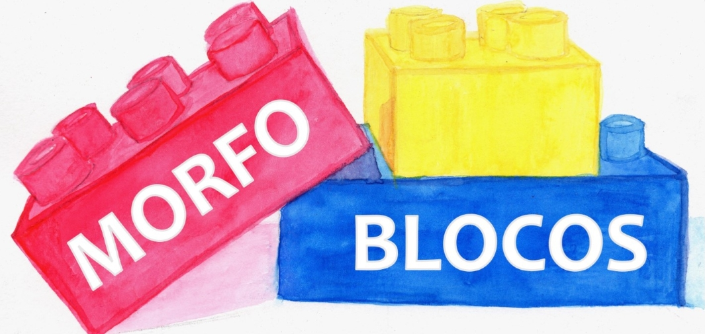

# **Projeto MorfoBlocos Digital**

## Descrição do projeto

O MorfoBlocos é uma ferramenta didática para o ensino de morfologia. Atualmente, a operação é analógica, baseada em blocos físicos. O propósito aqui é a entrega de feedback pedagógico sobre a estrutura das palavras.

O jogo é composto por peças coloridas que representam morfemas — raízes (ou radicais), prefixos, sufixos e desinências — que podem ser combinadas pelos estudantes para formar diferentes vocábulos. Cada peça traz, de um lado, o morfema em si e, do outro, a classificação do elemento e o processo de formação envolvido (flexão, derivação, derivação parassintética, composição, derivação regressiva e reduplicação). Dessa forma, ao montar palavras, o estudante visualiza não apenas o resultado, mas o processo morfológico que o gerou.

## Tabela de Integrantes

| **Integrante**       | Função | Github |                                      
| ---------- | ------ | --------------------------------------------------- | 
| Ana Beatriz | Desenvolvedor Backend   |           |  
| Artur Fernandes | Desenvolvedor Backend   |           |  
| Bruno Souza | Desenvolvedor Backend   |           |  
| Carlos Eduardo | Desenvolvedor Frontend   |           |  
| Luiz Henrique  | Desenvolvedor Frontend do projeto auxílio na parte de scrum   |           |  

## Versionamento

| **Data**       | Versão | Descrição                                           | Autor              |
| ---------- | ------ | --------------------------------------------------- | ------------------ |
| 12/04/2026 | 1.0    | Criação do documento        |   [Bruno Souza](https://github.com/youngburny)   |

