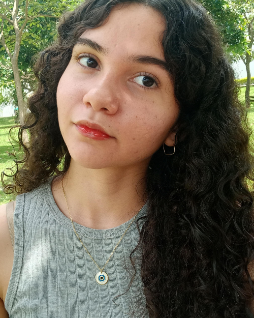
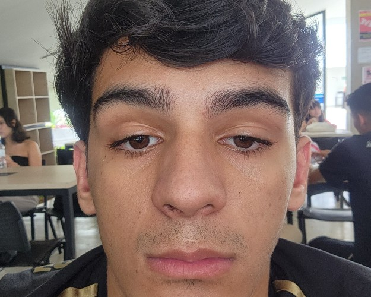
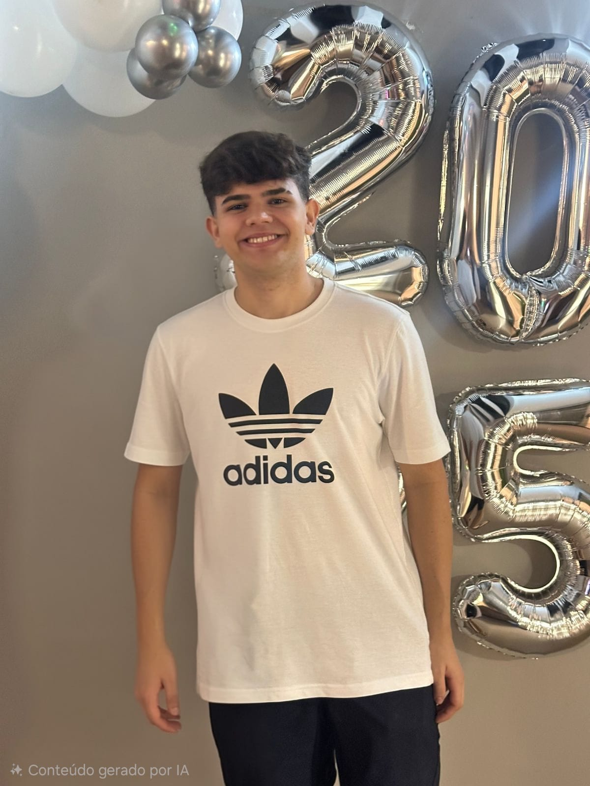

# **Projeto MorfoBlocos Digital**

## Descrição do projeto

O MorfoBlocos é uma ferramenta didática para o ensino de morfologia. Atualmente, a operação é analógica, baseada em blocos físicos. O propósito aqui é a entrega de feedback pedagógico sobre a estrutura das palavras.

O jogo é composto por peças coloridas que representam morfemas — raízes (ou radicais), prefixos, sufixos e desinências — que podem ser combinadas pelos estudantes para formar diferentes vocábulos. Cada peça traz, de um lado, o morfema em si e, do outro, a classificação do elemento e o processo de formação envolvido (flexão, derivação, derivação parassintética, composição, derivação regressiva e reduplicação). Dessa forma, ao montar palavras, o estudante visualiza não apenas o resultado, mas o processo morfológico que o gerou.

## Tabela de Integrantes

| Foto | **Integrante** | Função | Github | Matrícula |
|------|---------------|--------|--------|-----------|
|  | Ana Beatriz | Desenvolvedor Backend, Engenharia de Requisitos | [Ana Beatriz](https://github.com/AnnaBeatrizAraujo) | 241025891 |
|  | Artur Fernandes | Desenvolvedor Backend, Engenharia de Requisitos | [Artur Fernandes](https://github.com/arturalvesfn) | 232024527 |
|  | Bruno Souza | Desenvolvedor Backend, Engenharia de Requisitos | [Bruno Souza](https://github.com/youngburny) | 221029196 |
|  | Carlos Eduardo | Desenvolvedor Frontend, Engenharia de Requisitos | [Carlos Eduardo](https://github.com/cadumotta) | 241025194 |
|  | Luiz Henrique | Desenvolvedor Frontend / Scrum, Engenharia de Requisitos | [Luiz Henrique](https://github.com/Luizz97) | 241012329 |

## Versionamento

| **Data**       | Versão | Descrição                                           | Autor              |
| ---------- | ------ | --------------------------------------------------- | ------------------ |
| 12/04/2026 | 1.0    | Criação do documento        |   [Bruno Souza](https://github.com/youngburny)   |
| 13/04/2026 | 1.1    | Adiciona integrantes e suas respectivas informações (funções, matrícula, etc.)       |   [Bruno Souza](https://github.com/youngburny)   |
| 04/05/2026 | 1.2   |   Atualiza foto e informações dos integrantes.    |   [Bruno Souza](https://github.com/youngburny)   |

