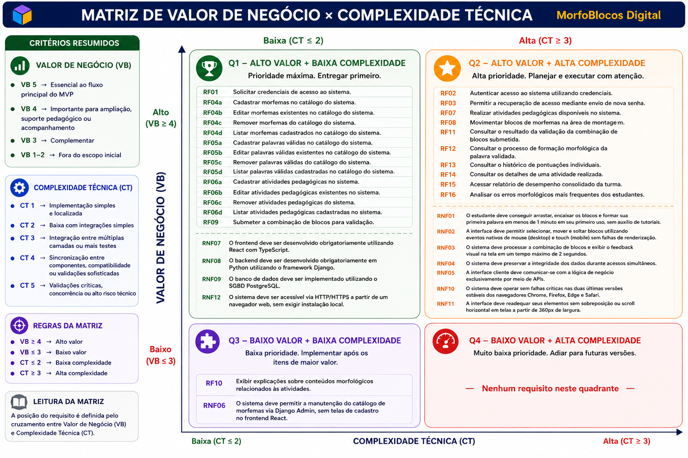

## **10. Backlog**

A presente seção apresenta o Backlog do Produto MorfoBlocos Digital, organizado a partir dos requisitos funcionais (RFs), requisitos não funcionais (RNFs) e regras de negócio (RN) elicitados e consolidados ao longo das atividades de Engenharia de Requisitos. Todas as histórias de usuário aqui declaradas derivam diretamente da lista de requisitos funcionais apresentada anteriormente neste documento, sendo acompanhadas dos respectivos Critérios de Aceitação. Trata-se de uma lista preliminar, sujeita a refinamentos durante o desenvolvimento, conforme o produto evolui e novos aprendizados emergem das interações com a cliente.
Esta versão da seção incorpora ajustes acordados ao longo das três Unidades já cumpridas, com destaque para as correções relacionadas a esta Unidade III, decorrentes da Verificação e Validação externa conduzida pelo Grupo Equipe V sobre os artefatos publicados ao final da Unidade II, e do comentário do professor sobre coexistência de técnicas de organização do backlog. As correções aplicadas são:

* Atomização total dos requisitos funcionais: as operações CRUD de manutenção do catálogo, antes registradas como sub-itens (RF04a–d, RF05a–d, RF06a–d), foram reescritas como requisitos funcionais individuais e renumerados sequencialmente (RF04 a RF15), passando o catálogo de 16 itens (com sub-letras) para 25 RFs atômicos.

* Remoção da técnica de User Story Mapping (USM) anteriormente declarada em paralelo ao backlog, mantendo o backlog como única estrutura de organização dos itens de produto.

* Resolução da contradição entre RNF05 (comunicação exclusiva por APIs) e RNF06 (manutenção via Django Admin), por meio do refinamento dos escopos de aplicação de cada um dos requisitos.

* Inclusão de versões mínimas exigidas nas restrições tecnológicas (RNF07, RNF08, RNF09), para tornar os requisitos verificáveis em tempo de configuração de ambiente.

* Criação da subseção 10.1.5 — Critérios de Aceitação, com a declaração explícita dos critérios verificáveis associados a cada User Story do backlog, no padrão proposto por Cohn (2004) e Pichler (2010).

* Quebra das User Stories que agrupavam múltiplas operações em itens atômicos (uma User Story por RF), eliminando as quatro US do tipo épico identificadas na avaliação externa (operações CRUD agrupadas).

### **10.1 Backlog Geral**

#### 10.1.1 Catálogo Consolidado de Requisitos Funcionais

O catálogo a seguir consolida os 25 requisitos funcionais (RFs) elicitados para o MorfoBlocos Digital, organizados por Característica de Produto (CP) e com a respectiva classificação MoSCoW.

As operações de manutenção do catálogo de conteúdo (morfemas, palavras válidas e atividades pedagógicas), nas versões anteriores deste documento agrupadas sob sub-letras (RF04a–d, RF05a–d, RF06a–d), foram reescritas como requisitos funcionais individuais e renumeradas sequencialmente, conforme orientação da banca sobre granularidade e independência de requisitos. A renumeração afeta todos os RFs subsequentes.

| ID   | CP  | Requisito Funcional                                                                | Ator Principal | MoSCoW      |
| ---- | --- | ---------------------------------------------------------------------------------- | -------------- | ----------- |
| RF01 | CP1 | Solicitar credenciais de acesso ao sistema.                                        | Usuário        | Must Have   |
| RF02 | CP1 | Autenticar acesso ao sistema utilizando credenciais.                               | Usuário        | Must Have   |
| RF03 | CP1 | Recuperar acesso ao sistema mediante envio de link de redefinição de senha.        | Usuário        | Should Have |
| RF04 | CP2 | Cadastrar morfemas no catálogo do sistema.                                         | Administrador  | Must Have   |
| RF05 | CP2 | Editar morfemas existentes no catálogo do sistema.                                 | Administrador  | Must Have   |
| RF06 | CP2 | Remover morfemas do catálogo do sistema.                                           | Administrador  | Must Have   |
| RF07 | CP2 | Listar morfemas cadastrados no catálogo do sistema.                                | Administrador  | Must Have   |
| RF08 | CP2 | Cadastrar palavras válidas no catálogo do sistema.                                 | Administrador  | Must Have   |
| RF09 | CP2 | Editar palavras válidas existentes no catálogo do sistema.                         | Administrador  | Must Have   |
| RF10 | CP2 | Remover palavras válidas do catálogo do sistema.                                   | Administrador  | Must Have   |
| RF11 | CP2 | Listar palavras válidas cadastradas no catálogo do sistema.                        | Administrador  | Must Have   |
| RF12 | CP2 | Cadastrar atividades pedagógicas no sistema.                                       | Administrador  | Must Have   |
| RF13 | CP2 | Editar atividades pedagógicas existentes no sistema.                               | Administrador  | Must Have   |
| RF14 | CP2 | Remover atividades pedagógicas do sistema.                                         | Administrador  | Must Have   |
| RF15 | CP2 | Listar atividades pedagógicas cadastradas no sistema.                              | Administrador  | Must Have   |
| RF16 | CP3 | Realizar atividades pedagógicas disponíveis no sistema.                            | Estudante      | Must Have   |
| RF17 | CP3 | Movimentar blocos de morfemas na área de montagem.                                 | Estudante      | Must Have   |
| RF18 | CP3 | Submeter a combinação de blocos para validação.                                    | Estudante      | Must Have   |
| RF19 | CP3 | Exibir explicações sobre conteúdos morfológicos relacionados às atividades.        | Estudante      | Could Have  |
| RF20 | CP4 | Validar a combinação de blocos submetida com base no catálogo de palavras válidas. | Sistema        | Must Have   |
| RF21 | CP4 | Consultar o processo de formação morfológica da palavra validada.                  | Estudante      | Must Have   |
| RF22 | CP5 | Consultar o histórico de pontuações individuais.                                   | Estudante      | Must Have   |
| RF23 | CP5 | Consultar os detalhes de uma atividade realizada.                                  | Estudante      | Should Have |
| RF24 | CP6 | Acessar relatório de desempenho consolidado da turma.                              | Professor      | Must Have   |
| RF25 | CP6 | Analisar os erros morfológicos mais frequentes dos estudantes.                     | Professor      | Should Have |

**Legenda de Características de Produto**

* **CP1 — Controle de Acesso:** autenticação, autorização e gestão de credenciais.
* **CP2 — Administração de Conteúdo:** curadoria de morfemas, palavras válidas e atividades pedagógicas.
* **CP3 — Espaço de Construção:** ambiente de manipulação e submissão de blocos pelo estudante.
* **CP4 — Validador de Estruturas:** validação morfológica e apresentação do processo de formação da palavra.
* **CP5 — Portfólio de Progresso:** registro e visualização individual de desempenho e tentativas realizadas.
* **CP6 — Painel de Monitoramento:** visão consolidada do desempenho da turma para o professor.

#### 10.1.2 Catálogo Consolidado de Requisitos Não Funcionais

O catálogo a seguir consolida os 12 requisitos não funcionais (RNFs) declarados para o MorfoBlocos Digital, classificados segundo o modelo URPS+ (*Usability, Reliability, Performance, Supportability* e categoria adicional de Restrições).

Cada RNF possui descrição mensurável e método de validação associado, permitindo a verificação objetiva do seu atendimento durante o desenvolvimento e a entrega do produto.

Esta versão do catálogo incorpora dois ajustes acordados na Unidade III:

1. O refinamento de escopo do RNF05 e do RNF06 para eliminar a contradição apontada na V&V externa entre comunicação exclusiva por APIs e manutenção via Django Admin;
2. A inclusão de versões mínimas exigidas nas restrições tecnológicas (RNF07, RNF08 e RNF09), de modo a torná-las verificáveis em tempo de configuração do ambiente.

| ID    | Categoria       | Descrição Mensurável                                                                                                                                                                                                                                                                                                                                           | Método de Validação                                                       |
| ----- | --------------- | -------------------------------------------------------------------------------------------------------------------------------------------------------------------------------------------------------------------------------------------------------------------------------------------------------------------------------------------------------------- | ------------------------------------------------------------------------- |
| RNF01 | Usabilidade     | O estudante deve conseguir arrastar, encaixar os blocos e formar sua primeira palavra em menos de 1 minuto em seu primeiro uso, sem auxílio de tutoriais.                                                                                                                                                                                                      | Teste de Usabilidade cronometrado com novos usuários.                     |
| RNF02 | Usabilidade     | A interface deve permitir selecionar, mover e soltar blocos utilizando eventos nativos de mouse (desktop) e touch (mobile) sem falhas de renderização.                                                                                                                                                                                                         | Teste Manual (Touch/Mouse).         |
| RNF03 | Performance     | O sistema deve processar a combinação de blocos e exibir o feedback visual na tela em um tempo máximo de 2 segundos.                                                                                                                                                                                                                                           | Monitoramento de Tempo de Resposta (Network Tab / Testes de Performance). |
| RNF04 | Confiabilidade  | O sistema deve preservar a integridade dos dados durante acessos simultâneos.                                                                                                                                                                                                                                                                                  | Teste de Carga e Concorrência no Banco de Dados (verificação ACID).       |
| RNF05 | Suportabilidade | A comunicação entre o frontend React (experiência do estudante e do professor) e o backend Django deve ocorrer exclusivamente por meio de APIs REST. Esta restrição não se aplica à interface administrativa interna (Django Admin), que opera como ferramenta operacional do administrador e está regulamentada pelo RNF06.                                   | Inspeção de Arquitetura e Code Review.                                    |
| RNF06 | Suportabilidade | A manutenção do catálogo de conteúdo (morfemas, palavras válidas e atividades pedagógicas) deve ser realizada pelo Administrador por meio da interface Django Admin, sem necessidade de telas dedicadas de cadastro no frontend React. Esta operação é interna e não constitui exceção ao RNF05, que rege a comunicação cliente-aplicação dos usuários finais. | Teste de Inserção via Django Admin.                                       |
| RNF07 | Restrições      | O frontend deve ser desenvolvido obrigatoriamente utilizando React 18 ou superior com TypeScript 5 ou superior.                                                                                                                                                                                                                                                | Inspeção de Código / Configuração do `package.json`.                      |
| RNF08 | Restrições      | O backend deve ser desenvolvido obrigatoriamente em Python 3.11 ou superior utilizando o framework Django 4.2 ou superior.                                                                                                                                                                                                                                     | Inspeção de Código / Configuração do `requirements.txt`.                  |
| RNF09 | Restrições      | O banco de dados deve ser implementado utilizando o SGBD PostgreSQL 15 ou superior.                                                                                                                                                                                                                                                                            | Validação da Infraestrutura / Configuração de Banco.                      |
| RNF10 | Suportabilidade | O sistema deve operar sem falhas críticas nas duas últimas versões estáveis dos navegadores Chrome, Firefox, Edge e Safari, sendo considerada falha crítica qualquer erro de JavaScript não tratado, quebra de layout ou indisponibilidade de funcionalidade essencial do MVP.                                                                                 | Teste de Compatibilidade Cross-browser.                                   |
| RNF11 | Usabilidade     | A interface deve readequar seus elementos sem sobreposição ou scroll horizontal em telas a partir de 360px de largura.                                                                                                                                                                                                                                         | Teste Cross-device (Emuladores mobile / DevTools).                        |
| RNF12 | Restrições      | O sistema deve ser acessível via HTTP/HTTPS a partir de um navegador web, sem exigir instalação local.                                                                                                                                                                                                                                                         | Teste de Implantação e Acesso URL.                                        |

**Observação sobre a resolução da contradição RNF05 × RNF06**

A versão anterior deste documento declarava no RNF05 uma exigência de comunicação exclusivamente por APIs, que entrava em conflito direto com o RNF06, que prescreve o uso do Django Admin para manutenção de catálogo.

A V&V externa conduzida pelo Grupo Dionísio identificou corretamente essa contradição. A reescrita acima delimita o escopo de cada requisito:

* O **RNF05** rege a comunicação entre os clientes do produto (frontend de estudantes e professores) e o backend.
* O **RNF06** rege a ferramenta administrativa interna, operada apenas pelo Administrador, fora do fluxo cliente-aplicação principal.

#### 10.1.3 Catálogo de Regras de Negócio

As Regras de Negócio (RN) representam restrições e políticas do domínio do MorfoBlocos Digital que orientam o comportamento do sistema, independentemente de implementação tecnológica.

Diferentemente dos RFs (que descrevem o que o sistema faz) e dos RNFs (que descrevem como o sistema deve se comportar em termos de qualidade), as RNs estabelecem o que é permitido, obrigatório ou vedado no contexto pedagógico e operacional do produto.

| ID   | Regra de Negócio                                                                                                          |
| ---- | ------------------------------------------------------------------------------------------------------------------------- |
| RN01 | Apenas usuários autenticados podem acessar o sistema.                                                                     |
| RN02 | Apenas professores podem acessar relatórios de desempenho consolidados da turma.                                          |
| RN03 | Apenas administradores podem cadastrar, editar e remover morfemas, palavras válidas e atividades pedagógicas.             |
| RN04 | Apenas palavras previamente cadastradas no catálogo podem ser consideradas válidas pelo validador morfológico.            |
| RN05 | Toda tentativa realizada pelo estudante (válida ou inválida) deve ser registrada no histórico de atividades.              |
| RN06 | A pontuação obtida pelo estudante deve ser salva automaticamente ao finalizar uma atividade.                              |
| RN07 | O acesso a níveis superiores de dificuldade só é liberado mediante atingimento de pontuação mínima definida pelo sistema. |
| RN08 | Todo resultado de atividade finalizada deve ser armazenado de forma persistente no histórico do estudante.                |

#### 10.1.4 User Stories Derivadas dos Requisitos Funcionais

A tabela a seguir apresenta cada RF declarado utilizando a técnica de User Story no formato **"Como [ator], quero [objetivo], para [benefício]"**, conforme proposto por Cohn (2004) e adotado pela equipe como prática de Declaração de Requisitos (seção 4.1).

Após a V&V externa conduzida pelo Grupo Dionísio, as User Stories que agrupavam múltiplas operações sob uma mesma estimativa (épicos) foram desmembradas em itens atômicos. Cada User Story corresponde agora a exatamente um RF, totalizando 25 User Stories rastreáveis.

A coluna **RNFs Relacionados** estabelece a rastreabilidade entre as histórias e os requisitos não funcionais aplicáveis. Os Critérios de Aceitação correspondentes a cada US estão declarados na subseção 10.1.5.

| RF   | User Story Derivada                                                                                                                                                 | RNFs Relacionados |
| ---- | ------------------------------------------------------------------------------------------------------------------------------------------------------------------- | ----------------- |
| RF01 | **US01** — Como usuário, quero solicitar credenciais de acesso ao sistema, para que minha conta seja criada e eu possa entrar na plataforma.                        | RNF04             |
| RF02 | **US02** — Como usuário, quero autenticar meu acesso ao sistema utilizando minhas credenciais, para entrar na plataforma de forma segura.                           | RNF03, RNF04      |
| RF03 | **US03** — Como usuário, quero recuperar meu acesso mediante envio de um link de redefinição de senha, para retomar o uso da plataforma caso esqueça minha senha.   | RNF04             |
| RF04 | **US04** — Como administrador, quero cadastrar novos morfemas no catálogo, para disponibilizar peças para a montagem de palavras pelos estudantes.                  | RNF04, RNF06      |
| RF05 | **US05** — Como administrador, quero editar morfemas existentes no catálogo, para corrigir grafias, classificações ou cores associadas.                             | RNF04, RNF06      |
| RF06 | **US06** — Como administrador, quero remover morfemas do catálogo, para retirar peças que não devem mais estar disponíveis aos estudantes.                          | RNF04, RNF06      |
| RF07 | **US07** — Como administrador, quero listar os morfemas cadastrados, para consultar o conteúdo atual do catálogo.                                                   | RNF04, RNF06      |
| RF08 | **US08** — Como administrador, quero cadastrar palavras válidas no catálogo, para definir as combinações de morfemas reconhecidas pelo validador.                   | RNF04, RNF06      |
| RF09 | **US09** — Como administrador, quero editar palavras válidas existentes, para corrigir registros ou ajustar processos morfológicos associados.                      | RNF04, RNF06      |
| RF10 | **US10** — Como administrador, quero remover palavras válidas do catálogo, para retirar registros que não devem mais ser aceitos pelo validador.                    | RNF04, RNF06      |
| RF11 | **US11** — Como administrador, quero listar as palavras válidas cadastradas, para consultar a base utilizada pelo validador morfológico.                            | RNF04, RNF06      |
| RF12 | **US12** — Como administrador, quero cadastrar atividades pedagógicas, para disponibilizar exercícios contextualizados às necessidades pedagógicas dos estudantes.  | RNF04, RNF06      |
| RF13 | **US13** — Como administrador, quero editar atividades pedagógicas existentes, para corrigir enunciados, níveis de dificuldade ou conjuntos de morfemas associados. | RNF04, RNF06      |
| RF14 | **US14** — Como administrador, quero remover atividades pedagógicas, para retirar exercícios que não devem mais estar disponíveis aos estudantes.                                  | RNF04, RNF06               |
| RF15 | **US15** — Como administrador, quero listar as atividades cadastradas, para consultar o catálogo de exercícios disponíveis.                                                        | RNF04, RNF06               |
| RF16 | **US16** — Como estudante, quero realizar as atividades pedagógicas disponíveis no sistema, para praticar e desenvolver minha compreensão sobre morfologia.                        | RNF01, RNF02, RNF03, RNF11 |
| RF17 | **US17** — Como estudante, quero movimentar blocos de morfemas na área de montagem, para combinar prefixos, radicais e sufixos livremente.                                         | RNF01, RNF02, RNF03, RNF11 |
| RF18 | **US18** — Como estudante, quero submeter a combinação de blocos que montei, para que ela seja avaliada pelo sistema.                                                              | RNF03, RNF04               |
| RF19 | **US19** — Como estudante, quero visualizar explicações sobre conteúdos morfológicos relacionados às atividades, para aprender enquanto pratico.                                   | RNF01                      |
| RF20 | **US20** — Como estudante, quero que minha combinação de blocos seja validada com base no catálogo de palavras válidas, para receber um resultado correto sobre a palavra formada. | RNF03, RNF04               |
| RF21 | **US21** — Como estudante, quero consultar o processo de formação morfológica da palavra validada, para compreender como os morfemas se combinam.                                  | RNF01, RNF03               |
| RF22 | **US22** — Como estudante, quero consultar o histórico das minhas pontuações individuais, para acompanhar minha evolução ao longo do tempo.                                        | RNF01, RNF04               |
| RF23 | **US23** — Como estudante, quero consultar os detalhes de uma atividade que já realizei, para revisar quais blocos utilizei, quais palavras formei e onde acertei ou errei.        | RNF01, RNF04               |
| RF24 | **US24** — Como professor, quero acessar o relatório de desempenho consolidado da turma, para monitorar o progresso coletivo dos estudantes.                                       | RNF01, RNF03, RNF04        |
| RF25 | **US25** — Como professor, quero analisar os erros morfológicos mais frequentes dos estudantes da turma, para direcionar intervenções pedagógicas mais eficazes.                   | RNF03, RNF04               |

## Observação sobre RNFs transversais

Os RNFs de restrição tecnológica e arquitetural — **RNF05** (comunicação por APIs no fluxo cliente-aplicação), **RNF07** (React/TypeScript), **RNF08** (Django), **RNF09** (PostgreSQL), **RNF10** (compatibilidade cross-browser) e **RNF12** (acesso via navegador) — aplicam-se de forma transversal a todas as User Stories deste backlog.

Embora não estejam repetidos linha a linha, devem ser considerados válidos e obrigatórios para todos os RFs do produto.

#### 10.1.5 Critérios de Aceitação

Esta subseção declara os Critérios de Aceitação (CA) associados a cada User Story do backlog. Os CAs estabelecem as condições objetivas e verificáveis que devem ser satisfeitas para que uma US seja considerada concluída e aceita pelo Product Owner, conforme proposto por Cohn (2004) e Pichler (2010). 

Sua declaração explícita responde diretamente à lacuna apontada pela V&V externa conduzida pelo Grupo Dionísio, que identificou ausência de critérios formais como principal limitação da testabilidade das User Stories anteriores.

Os CAs foram declarados com calibração proporcional à complexidade de cada US: operações CRUD simples receberam um único critério essencial (focado nos campos obrigatórios da operação e na rastreabilidade com RNs/RNFs aplicáveis); operações de consulta receberam dois critérios (campos exibidos e regras de ordenação/filtragem); operações críticas do núcleo do produto, com regras de negócio relevantes ou dependências entre US, receberam dois ou três critérios. A formulação dos CAs incorpora as decisões registradas nas reuniões com a Profª. Pilar (PO), em especial as decisões sobre fluxo de jogo, padrão de blocos por cor e modalização do feedback de erro, registradas na Reunião #2 (07/05/2026).

**Convenções de identificação**:

* ID no formato CA-USxx-yy, onde xx é o número da User Story e yy é o número sequencial do critério dentro da US.
* Quando um CA depende de um RNF ou RN específico para sua verificação, a referência é declarada entre colchetes ao final do enunciado.
* Quando um CA depende de outra US (dependência funcional), a referência também é declarada entre colchetes.

# Característica de Produto 1 — Controle de Acesso

**US01 — Como usuário, quero solicitar credenciais de acesso ao sistema, para que minha conta seja criada e eu possa entrar na plataforma.**

| ID         | Critério de Aceitação                                                                                                                                                         |
| ---------- | ----------------------------------------------------------------------------------------------------------------------------------------------------------------------------- |
| CA-US01-01 | O sistema deve solicitar como campos obrigatórios: Nome Completo, E-mail, Senha e Confirmação de Senha, recusando o cadastro caso qualquer um esteja em branco.               |
| CA-US01-02 | O sistema não deve permitir o cadastro de um e-mail já existente na base de dados, exibindo mensagem de erro específica e mantendo os demais campos preenchidos pelo usuário. |
| CA-US01-03 | A senha deve ser armazenada de forma criptografada no banco de dados, jamais em texto puro [RNF04].                                                                           |

**US02 — Como usuário, quero autenticar meu acesso ao sistema utilizando minhas credenciais, para entrar na plataforma de forma segura.**

| ID         | Critério de Aceitação                                                                                                                                                                                               |
| ---------- | ------------------------------------------------------------------------------------------------------------------------------------------------------------------------------------------------------------------- |
| CA-US02-01 | O usuário deve fornecer e-mail válido e senha correspondente para acessar o sistema; o login somente é considerado bem-sucedido quando ambos os dados coincidirem com um registro persistido no banco.              |
| CA-US02-02 | Caso as credenciais estejam incorretas, o sistema deve exibir uma mensagem de erro genérica (por exemplo, "E-mail ou senha incorretos"), sem indicar qual dos dois campos está incorreto, por motivos de segurança. |
| CA-US02-03 | Após login bem-sucedido, o sistema deve emitir um token de autenticação (JWT) e redirecionar o usuário para a tela inicial correspondente ao seu perfil (estudante, professor ou administrador) [RN01, RNF03].      |

**US03 — Como usuário, quero recuperar meu acesso mediante envio de um link de redefinição de senha, para retomar o uso da plataforma caso esqueça minha senha.**

| ID         | Critério de Aceitação                                                                                                                                                                |
| ---------- | ------------------------------------------------------------------------------------------------------------------------------------------------------------------------------------ |
| CA-US03-01 | O sistema deve enviar um link de redefinição de senha (e não a senha em texto puro) para o e-mail cadastrado do usuário, mediante solicitação na tela de login.                      |
| CA-US03-02 | O link de redefinição deve ter validade limitada de no máximo 24 horas e ser invalidado após o primeiro uso, exibindo mensagem específica caso o usuário tente reutilizá-lo [RNF04]. |

# Característica de Produto 2 — Administração de Conteúdo

**US04 — Como administrador, quero cadastrar morfemas no catálogo do sistema, para disponibilizar peças para a montagem de palavras pelos estudantes.**

| ID         | Critério de Aceitação                                                                                                                                                                                                                                      |
| ---------- | ---------------------------------------------------------------------------------------------------------------------------------------------------------------------------------------------------------------------------------------------------------- |
| CA-US04-01 | O cadastro de um morfema deve exigir, obrigatoriamente, a informação da grafia do morfema, seu tipo morfológico (prefixo, radical ou sufixo) e a cor associada ao tipo, recusando o salvamento caso qualquer um desses dados esteja ausente [RN03, RNF06]. |

---

**US05 — Como administrador, quero editar morfemas existentes no catálogo, para corrigir grafias, classificações ou cores associadas.**

| ID         | Critério de Aceitação                                                                                                                                                                                |
| ---------- | ---------------------------------------------------------------------------------------------------------------------------------------------------------------------------------------------------- |
| CA-US05-01 | A edição de um morfema deve permitir alterar sua grafia, tipo morfológico e cor associada, refletindo as alterações imediatamente nas próximas atividades que utilizarem esse morfema [RN03, RNF06]. |

---

**US06 — Como administrador, quero remover morfemas do catálogo, para retirar peças que não devem mais estar disponíveis aos estudantes.**

| ID         | Critério de Aceitação                                                                                                                                                                                                 |
| ---------- | --------------------------------------------------------------------------------------------------------------------------------------------------------------------------------------------------------------------- |
| CA-US06-01 | O sistema deve impedir a remoção de um morfema que esteja associado a palavras válidas cadastradas, exibindo mensagem explicando a dependência existente e orientando a remoção prévia das associações [RN03, RNF06]. |

---

**US07 — Como administrador, quero listar os morfemas cadastrados, para consultar o conteúdo atual do catálogo.**

| ID         | Critério de Aceitação                                                                                                                                    |
| ---------- | -------------------------------------------------------------------------------------------------------------------------------------------------------- |
| CA-US07-01 | A listagem deve exibir, no mínimo, a grafia do morfema, seu tipo morfológico e a cor associada, permitindo ordenação e busca textual por grafia [RNF06]. |

---

**US08 — Como administrador, quero cadastrar palavras válidas no catálogo, para definir as combinações de morfemas reconhecidas pelo validador.**

| ID         | Critério de Aceitação                                                                                                                                                                                                                                                            |
| ---------- | -------------------------------------------------------------------------------------------------------------------------------------------------------------------------------------------------------------------------------------------------------------------------------- |
| CA-US08-01 | O cadastro de uma palavra válida deve exigir, obrigatoriamente, sua grafia completa, os morfemas que a compõem e a descrição do processo de formação morfológica correspondente, recusando o salvamento caso qualquer uma dessas informações esteja ausente [RN03, RN04, RNF06]. |

---

**US09 — Como administrador, quero editar palavras válidas existentes, para corrigir registros ou ajustar processos morfológicos associados.**

| ID         | Critério de Aceitação                                                                                                                                                                                            |
| ---------- | ---------------------------------------------------------------------------------------------------------------------------------------------------------------------------------------------------------------- |
| CA-US09-01 | A edição deve permitir alterar a grafia da palavra, sua composição morfológica e a descrição do processo de formação associado, mantendo a consistência das referências utilizadas pelo validador [RN03, RNF06]. |

---

**US10 — Como administrador, quero remover palavras válidas do catálogo, para retirar registros que não devem mais ser aceitos pelo validador.**

| ID         | Critério de Aceitação                                                                                                                                                                    |
| ---------- | ---------------------------------------------------------------------------------------------------------------------------------------------------------------------------------------- |
| CA-US10-01 | O sistema deve impedir a exclusão de palavras válidas que estejam vinculadas a atividades pedagógicas ativas, exibindo mensagem informativa sobre a dependência existente [RN03, RNF06]. |

---

**US11 — Como administrador, quero listar palavras válidas cadastradas, para consultar a base utilizada pelo validador morfológico.**

| ID         | Critério de Aceitação                                                                                                                                               |
| ---------- | ------------------------------------------------------------------------------------------------------------------------------------------------------------------- |
| CA-US11-01 | A listagem deve exibir, no mínimo, a grafia da palavra, sua composição morfológica e o processo de formação associado, permitindo consulta e busca textual [RNF06]. |

---

**US12 — Como administrador, quero cadastrar atividades pedagógicas no sistema, para disponibilizar exercícios contextualizados às necessidades pedagógicas dos estudantes.**

| ID         | Critério de Aceitação                                                                                                                                                                                                                                            |
| ---------- | ---------------------------------------------------------------------------------------------------------------------------------------------------------------------------------------------------------------------------------------------------------------- |
| CA-US12-01 | O cadastro de uma atividade deve exigir, obrigatoriamente, título, nível de dificuldade, conjunto de morfemas disponíveis para montagem e pontuação mínima para progressão, recusando o salvamento caso qualquer campo obrigatório esteja ausente [RN03, RNF06]. |

---

**US13 — Como administrador, quero editar atividades pedagógicas existentes no sistema, para corrigir enunciados, níveis de dificuldade ou conjuntos de morfemas associados.**

| ID         | Critério de Aceitação                                                                                                                                                                                      |
| ---------- | ---------------------------------------------------------------------------------------------------------------------------------------------------------------------------------------------------------- |
| CA-US13-01 | A edição deve permitir alterar título, nível de dificuldade, conjunto de morfemas disponíveis e pontuação mínima para progressão, preservando o histórico das execuções já realizadas [RN03, RNF06, RN08]. |

---

**US14 — Como administrador, quero remover atividades pedagógicas do sistema, para retirar exercícios que não devem mais estar disponíveis aos estudantes.**

| ID         | Critério de Aceitação                                                                                                                                                                             |
| ---------- | ------------------------------------------------------------------------------------------------------------------------------------------------------------------------------------------------- |
| CA-US14-01 | A remoção de uma atividade deve torná-la indisponível para novas execuções, sem excluir os registros históricos de tentativas e pontuações previamente realizadas pelos estudantes [RN08, RNF06]. |

---

**US15 — Como administrador, quero listar atividades pedagógicas cadastradas no sistema, para consultar o catálogo de exercícios disponíveis.**

| ID         | Critério de Aceitação                                                                                                                                           |
| ---------- | --------------------------------------------------------------------------------------------------------------------------------------------------------------- |
| CA-US15-01 | A listagem deve exibir, no mínimo, título da atividade, nível de dificuldade e quantidade de morfemas associados, permitindo ordenação e busca textual [RNF06]. |

# Característica de Produto 3 — Espaço de Construção

**US16 — Como estudante, quero realizar atividades pedagógicas disponíveis no sistema, para praticar e desenvolver minha compreensão sobre morfologia.**

| ID         | Critério de Aceitação                                                                                                                                                                                               |
| ---------- | ------------------------------------------------------------------------------------------------------------------------------------------------------------------------------------------------------------------- |
| CA-US16-01 | O sistema deve apresentar ao estudante apenas as atividades compatíveis com seu nível de progressão atual, bloqueando visualmente atividades ainda não liberadas conforme as regras de progressão definidas [RN07]. |
| CA-US16-02 | Ao selecionar uma atividade, o sistema deve carregar o enunciado, os blocos de morfemas disponíveis e a área de montagem em tempo compatível com o RNF03, sem exigir recarregamento manual da página [RNF03].       |

---

**US17 — Como estudante, quero movimentar blocos de morfemas na área de montagem, para combinar prefixos, radicais e sufixos livremente.**

| ID         | Critério de Aceitação                                                                                                                                                                         |
| ---------- | --------------------------------------------------------------------------------------------------------------------------------------------------------------------------------------------- |
| CA-US17-01 | O estudante deve conseguir selecionar, arrastar e soltar blocos de morfemas utilizando mouse em computadores e toque em dispositivos móveis, sem falhas de interação ou renderização [RNF02]. |
| CA-US17-02 | O sistema deve permitir reordenar livremente os blocos já posicionados na área de montagem antes da submissão, atualizando visualmente a sequência formada em tempo real [RNF01, RNF02].      |

---

**US18 — Como estudante, quero submeter a combinação de blocos para validação, para verificar se a palavra formada está correta.**

| ID         | Critério de Aceitação                                                                                                                                                                        |
| ---------- | -------------------------------------------------------------------------------------------------------------------------------------------------------------------------------------------- |
| CA-US18-01 | O botão de submissão deve permanecer desabilitado enquanto não houver pelo menos um bloco posicionado na área de montagem.                                                                   |
| CA-US18-02 | Ao acionar a submissão, o sistema deve concatenar os morfemas conforme a ordem definida pelo estudante e encaminhar a palavra formada para o processo de validação descrito na US20 [RNF03]. |

---

**US19 — Como estudante, quero visualizar explicações sobre conteúdos morfológicos relacionados às atividades, para aprender enquanto pratico.**

| ID         | Critério de Aceitação                                                                                                                                                          |
| ---------- | ------------------------------------------------------------------------------------------------------------------------------------------------------------------------------ |
| CA-US19-01 | O sistema deve disponibilizar explicações textuais relacionadas aos conceitos morfológicos abordados na atividade atual, acessíveis sem interromper a realização da atividade. |
| CA-US19-02 | As explicações devem apresentar profundidade compatível com o nível de dificuldade da atividade, utilizando linguagem adequada ao público-alvo do ensino básico [RNF01].       |

# Característica de Produto 4 — Validador de Estruturas

**US20 — Como estudante, quero que minha combinação de blocos seja validada com base no catálogo de palavras válidas, para receber um resultado correto sobre a palavra formada.**

| ID         | Critério de Aceitação                                                                                                                                                                                                                                                                                 |
| ---------- | ----------------------------------------------------------------------------------------------------------------------------------------------------------------------------------------------------------------------------------------------------------------------------------------------------- |
| CA-US20-01 | O sistema deve validar a palavra formada consultando exclusivamente o catálogo de palavras válidas previamente cadastrado, considerando inválida qualquer combinação inexistente nesse catálogo [RN04].                                                                                               |
| CA-US20-02 | Quando a combinação submetida corresponder a uma palavra válida cadastrada, o sistema deve retornar feedback positivo ao estudante, apresentando a palavra reconhecida e disponibilizando as informações necessárias para consulta do processo de formação morfológica correspondente [RNF03, RNF04]. |
| CA-US20-03 | Toda submissão realizada pelo estudante, independentemente de resultar em palavra válida ou inválida, deve ser registrada no histórico da atividade, preservando a rastreabilidade das tentativas para posterior consulta individual e análise pelo professor [RN05, RN08].                           |

---

**US21 — Como estudante, quero consultar o processo de formação morfológica da palavra validada, para compreender como os morfemas se combinam.**

| ID         | Critério de Aceitação                                                                                                                                                                                                                                       |
| ---------- | ----------------------------------------------------------------------------------------------------------------------------------------------------------------------------------------------------------------------------------------------------------- |
| CA-US21-01 | Após a validação bem-sucedida de uma palavra, o sistema deve permitir ao estudante visualizar uma explicação contendo a palavra formada, os morfemas utilizados e a descrição do processo de formação morfológica associado ao registro cadastrado [RNF01]. |
| CA-US21-02 | Caso a combinação submetida seja inválida, o sistema não deve exibir processo de formação inexistente, apresentando apenas uma mensagem informativa indicando que a palavra não foi reconhecida pelo catálogo [RNF01].                                      |

# Característica de Produto 5 — Portfólio de Progresso

**US22 — Como estudante, quero consultar o histórico das minhas pontuações individuais, para acompanhar minha evolução ao longo do tempo.**

| ID         | Critério de Aceitação                                                                                                                                                                                                                             |
| ---------- | ------------------------------------------------------------------------------------------------------------------------------------------------------------------------------------------------------------------------------------------------- |
| CA-US22-01 | O histórico deve apresentar, para cada atividade concluída pelo estudante, no mínimo: nome da atividade, data de realização, pontuação obtida e resultado final da tentativa, ordenados cronologicamente [RNF01, RN08].                           |
| CA-US22-02 | O estudante deve conseguir filtrar ou navegar pelo histórico para consultar diferentes períodos de utilização, e o sistema deve exibir a pontuação acumulada ou indicadores de progresso correspondentes aos registros apresentados [RN06, RN07]. |

---

**US23 — Como estudante, quero consultar os detalhes de uma atividade que já realizei, para revisar quais blocos utilizei, quais palavras formei e onde acertei ou errei.**

| ID         | Critério de Aceitação                                                                                                                                                                                                                |
| ---------- | ------------------------------------------------------------------------------------------------------------------------------------------------------------------------------------------------------------------------------------ |
| CA-US23-01 | Ao selecionar uma atividade presente no histórico, o sistema deve exibir os detalhes da execução, incluindo as tentativas realizadas, palavras submetidas, resultado de cada submissão e pontuação obtida na atividade.              |
| CA-US23-02 | Para cada tentativa válida registrada, o estudante deve poder consultar novamente o processo de formação morfológica associado, reutilizando as informações armazenadas no histórico sem necessidade de nova validação [RN05, RN08]. |

# Característica de Produto 6 — Painel de Monitoramento

**US24 — Como professor, quero acessar o relatório de desempenho consolidado da turma, para monitorar o progresso coletivo dos estudantes.**

| ID         | Critério de Aceitação                                                                                                                                                                                                                                                                                   |
| ---------- | ------------------------------------------------------------------------------------------------------------------------------------------------------------------------------------------------------------------------------------------------------------------------------------------------------- |
| CA-US24-01 | O relatório deve apresentar indicadores consolidados da turma, incluindo no mínimo: quantidade de atividades realizadas, média de pontuação dos estudantes, taxa de acertos e distribuição de desempenho por atividade, sendo acessível apenas a usuários com perfil de professor [RN02, RNF01, RNF04]. |
| CA-US24-02 | O relatório deve oferecer filtro por intervalo de tempo (últimos 7 dias, últimos 30 dias, semestre) e por atividade específica, com atualização da apresentação dos dados conforme os filtros aplicados [RNF03].                                                                                        |

---

**US25 — Como professor, quero analisar os erros morfológicos mais frequentes dos estudantes da turma, para direcionar intervenções pedagógicas mais eficazes.**

| ID         | Critério de Aceitação                                                                                                                                                                                                                          |
| ---------- | ---------------------------------------------------------------------------------------------------------------------------------------------------------------------------------------------------------------------------------------------- |
| CA-US25-01 | A análise de erros deve listar as palavras inválidas mais frequentemente submetidas pela turma no período selecionado, em ranking decrescente, com indicação da quantidade de ocorrências e dos estudantes envolvidos [RN02, RN05].            |
| CA-US25-02 | A análise depende funcionalmente do registro de tentativas inválidas realizado pela US20 (CA-US20-03); na ausência de submissões inválidas no período, a tela deve exibir mensagem informativa específica em vez de tabela vazia [RN05, RN08]. |
| CA-US25-03 | O período padrão da análise deve ser os últimos 30 dias, com filtros adicionais para últimos 7 dias e semestre completo, e filtro opcional por nível de dificuldade da atividade em que o erro foi cometido [RNF03].                           |

**Resumo da Cobertura de Critérios de Aceitação**

A tabela a seguir consolida a distribuição de Critérios de Aceitação por Característica de Produto, demonstrando a calibração proporcional adotada e a cobertura total do backlog.

| CP | Característica de Produto | US no CP | CAs no CP | Média CAs por US |
| :--- | :--- | :---: | :---: | :---: |
| CP1 | Controle de Acesso | 3 | 8 | 2,7 |
| CP2 | Administração de Conteúdo | 12 | 12 | 1,0 |
| CP3 | Espaço de Construção | 4 | 8 | 2,0 |
| CP4 | Validador de Estruturas | 2 | 5 | 2,5 |
| CP5 | Portfólio de Progresso | 2 | 4 | 2,0 |
| CP6 | Painel de Monitoramento | 2 | 5 | 2,5 |
| — | **Total** | **25** | **42** | **1,68** |

#### **10.1.6 Matriz de Rastreabilidade**

[Matriz de Rastreabilidade](https://www.figma.com/board/8yYBKLEMtOAvjRyc6SRAay/Matriz-de-Rastreabilidade?node-id=0-1&p=f&t=nh6i2uiwdDRRwwad-0)

<iframe style="border: 1px solid rgba(0, 0, 0, 0.1);" width="800" height="450" src="https://embed.figma.com/board/8yYBKLEMtOAvjRyc6SRAay/Matriz-de-Rastreabilidade?node-id=0-1&embed-host=share" allowfullscreen></iframe>

### 10.2 Priorização do Backlog Geral e MVP

A priorização do backlog do MorfoBlocos Digital foi conduzida combinando duas técnicas complementares declaradas pela equipe na seção 4.1 (Atividades e Técnicas de ER) como práticas da atividade de Análise e Consenso: a Priorização MoSCoW e a Matriz Avaliação Técnica × Valor de Negócio (operacionalizada como Matriz de Valor de Negócio × Complexidade Técnica). O uso conjunto preserva a coerência metodológica do projeto e amplia a capacidade de justificar as decisões de escopo perante a cliente e a banca avaliadora.

Em atendimento às recomendações da banca, esta versão da seção adota critérios objetivos para a aplicação das duas técnicas. A classificação MoSCoW de cada requisito é justificada por critérios explícitos relacionados à participação do requisito nos fluxos essenciais do MVP; e a Matriz é fundamentada por uma escala numérica de Valor de Negócio (VB, de 1 a 5) e de Complexidade Técnica (CT, de 1 a 5), cada uma com critérios objetivos próprios.

#### 10.2.1 Critérios Objetivos para a Classificação MoSCoW

O valor de negócio representa o impacto do requisito nos fluxos principais do MorfoBlocos Digital e na capacidade do sistema atender aos objetivos definidos para o MVP. Receberam maior valor de negócio os requisitos que:

* Participam diretamente dos casos de uso principais;
* Permitem a execução das atividades pedagógicas do estudante;
* Registram, recuperam ou preservam informações relacionadas ao progresso do usuário;
* Sustentam funcionalidades de acompanhamento pedagógico do professor;
* Ou comprometem a execução adequada dos fluxos principais quando ausentes.

A partir desses critérios, cada requisito foi classificado segundo o modelo MoSCoW:

| Classificação | Critério |
| --------------| ---------|
| Must Have | O requisito participa diretamente de um fluxo essencial do MVP. Sem ele, o sistema não executa o caso de uso principal ou perde sua função central. |
| Should Have | O requisito apoia um fluxo essencial ou amplia um fluxo principal com suporte pedagógico, operacional ou de acompanhamento. O MVP continua funcionando sem ele, mas com perda de cobertura, automação ou qualidade. |
| Could Have | O requisito complementa o uso do sistema, mas não altera a execução dos fluxos principais do MVP. |
| Won't Have | O requisito não entra na primeira versão do MVP. Foi postergado por baixo impacto no fluxo principal ou por custo técnico incompatível com a versão inicial. |

#### 10.2.2 Critérios Objetivos para o Valor de Negócio (VB)

Para permitir o posicionamento quantitativo dos requisitos na Matriz de Priorização, as classificações MoSCoW foram convertidas em uma escala numérica de Valor de Negócio (VB), variando de 1 a 5. A escala admite gradações de valor dentro de uma mesma categoria MoSCoW: requisitos classificados como Must Have podem assumir VB 4 ou 5 conforme sua centralidade no fluxo principal do MVP, distinguindo operações que sustentam diretamente o caso de uso central daquelas que atuam como operações de apoio indispensáveis dentro de uma característica essencial.

| Classificação MoSCoW | Valor de Negócio (VB) | Interpretação |
| :--- | :---: | :--- |
| Must Have | 4 ou 5 | Essencial para o MVP. VB 5 quando o requisito participa diretamente do fluxo central do produto (sem ele, o caso de uso principal não existe). VB 4 quando o requisito é operação de apoio indispensável dentro de uma característica essencial — por exemplo, operações secundárias de CRUDs em CP2 (Editar, Remover, Listar), que sustentam a manutenção do conteúdo cadastrado mas não disparam o fluxo principal por si só. |
| Should Have | 4 | Importante para ampliação, acompanhamento ou qualidade do fluxo principal. |
| Could Have | 3 | Complementar ao sistema, sem impacto direto no funcionamento central. |
| Won't Have | 1 ou 2 | Fora do escopo da versão inicial. |

_Observação: essa gradação interna não afeta o posicionamento dos requisitos na Matriz de Valor × Complexidade Técnica, uma vez que a regra de agregação definida na seção 10.2.4 considera de "alto valor de negócio" qualquer requisito com VB 4 ou 5. A diferenciação entre VB 4 e VB 5 dentro da categoria Must Have é utilizada apenas para sinalizar a ordem de implementação dentro de cada quadrante._

#### 10.2.3 Critérios Objetivos para a Complexidade Técnica (CT)

A Complexidade Técnica representa o nível de esforço necessário para implementar cada requisito, considerando os riscos técnicos envolvidos no desenvolvimento e na manutenção da solução. Um requisito foi considerado mais complexo quando envolve um ou mais dos seguintes fatores:

* Integração entre frontend, backend e banco de dados;
* Necessidade de persistência e manipulação estruturada de dados;
* Validações executadas em tempo real durante a interação do usuário;
* Tratamento de acessos simultâneos e integridade das informações;
* Compatibilidade entre diferentes dispositivos, resoluções ou navegadores;
* Maior volume de testes técnicos e de integração;
* Ou necessidade de alterações arquiteturais relevantes na aplicação.

A partir desses fatores, foi definida a seguinte escala de classificação:

| Nível de CT | Descrição |
| :--- | :--- |
| 1 — Muito Baixa | Implementação simples e localizada, restrita a uma única camada do sistema, sem necessidade de integrações relevantes ou regras complexas. |
| 2 — Baixa | Exige integrações básicas, regras de negócio simples ou persistência elementar de dados, utilizando soluções já conhecidas pela equipe. |
| 3 — Média | Envolve integração entre múltiplas camadas do sistema, validações adicionais, maior volume de testes ou manipulação estruturada de dados. |
| 4 — Alta | Exige sincronização entre diferentes componentes, compatibilidade entre dispositivos/navegadores, processamento mais sofisticado ou maior risco técnico. |
| 5 — Muito Alta | Envolve algoritmos complexos, validações em tempo real, concorrência, requisitos críticos de desempenho, alta dependência arquitetural ou elevado esforço de testes e manutenção. |

#### 10.2.4 Regra de Decisão da Matriz

A posição de cada requisito na Matriz foi definida pelo cruzamento entre a classificação de Valor de Negócio e o nível de Complexidade Técnica, segundo as seguintes regras 
de agregação:

* Requisitos classificados como Must Have ou Should Have (VB 4 ou 5) foram considerados de alto valor de negócio;
* Requisitos classificados como Could Have ou Won't Have (VB 3 ou inferior) foram considerados de baixo valor de negócio;
* Requisitos com CT 1 ou 2 (Muito Baixa ou Baixa) foram considerados de baixa complexidade técnica;
* Requisitos com CT 3, 4 ou 5 (Média, Alta ou Muito Alta) foram considerados de alta complexidade técnica.

A partir desse cruzamento, os requisitos foram distribuídos nos quatro quadrantes da Matriz:

| Quadrante | Interpretação |
| :--- | :--- |
| Q1 — Alto valor + Baixa complexidade técnica | Requisitos priorizados para implementação inicial. Entregam alto impacto com menor esforço técnico. |
| Q2 — Alto valor + Alta complexidade técnica | Requisitos essenciais, porém com maior risco ou custo de implementação. Devem ser planejados com atenção. |
| Q3 — Baixo valor + Baixa complexidade técnica | Requisitos complementares que agregam valor, mas não são críticos para o MVP. Podem ser incluídos conforme capacidade. |
| Q4 — Baixo valor + Alta complexidade técnica | Requisitos com baixo retorno frente ao alto custo técnico. Devem ser adiados para futuras versões. |

#### 10.2.5 Classificação Consolidada dos Requisitos

A tabela a seguir consolida a classificação final de todos os requisitos funcionais, cruzando MoSCoW, VB, CT, quadrante na matriz e decisão de inclusão no MVP. A renumeração dos RFs (RF04a–d, RF05a–d, RF06a–d → RF04 a RF15, com cascata para os demais) foi aplicada nesta tabela, mantendo as classificações originais de cada item conforme estabelecido nas versões anteriores.

| ID | Requisito | MoSCoW | VB | CT | Quadrante | MVP? |
| :--- | :--- | :--- | :---: | :---: | :---: | :---: |
| RF01 | Solicitar credenciais de acesso ao sistema. | Must Have | 5 | 1 | Q1 | Sim |
| RF02 | Autenticar acesso ao sistema utilizando credenciais. | Must Have | 5 | 3 | Q2 | Sim |
| RF03 | Recuperar acesso ao sistema mediante envio de link de redefinição de senha. | Should Have | 4 | 3 | Q2 | Sim |
| RF04 | Cadastrar morfemas no catálogo do sistema. | Must Have | 5 | 2 | Q1 | Sim |
| RF05 | Editar morfemas existentes no catálogo do sistema. | Must Have | 4 | 2 | Q1 | Sim |
| RF06 | Remover morfemas do catálogo do sistema. | Must Have | 4 | 2 | Q1 | Sim |
| RF07 | Listar morfemas cadastrados no catálogo do sistema. | Must Have | 4 | 2 | Q1 | Sim |
| RF08 | Cadastrar palavras válidas no catálogo do sistema. | Must Have | 5 | 2 | Q1 | Sim |
| RF09 | Editar palavras válidas existentes no catálogo do sistema. | Must Have | 4 | 2 | Q1 | Sim |
| RF10 | Remover palavras válidas do catálogo do sistema. | Must Have | 4 | 2 | Q1 | Sim |
| RF11 | Listar palavras válidas cadastradas no catálogo do sistema. | Must Have | 4 | 2 | Q1 | Sim |
| RF12 | Cadastrar atividades pedagógicas no sistema. | Must Have | 5 | 2 | Q1 | Sim |
| RF13 | Editar atividades pedagógicas existentes no sistema. | Must Have | 4 | 2 | Q1 | Sim |
| RF14 | Remover atividades pedagógicas do sistema. | Must Have | 4 | 2 | Q1 | Sim |
| RF15 | Listar atividades pedagógicas cadastradas no sistema. | Must Have | 4 | 2 | Q1 | Sim |
| RF16 | Realizar atividades pedagógicas disponíveis no sistema. | Must Have | 5 | 4 | Q2 | Sim |
| RF17 | Movimentar blocos de morfemas na área de montagem. | Must Have | 5 | 5 | Q2 | Sim |
| RF18 | Submeter a combinação de blocos para validação. | Must Have | 5 | 2 | Q1 | Sim |
| RF19 | Exibir explicações sobre conteúdos morfológicos relacionados às atividades. | Could Have | 3 | 2 | Q3 | Não |
| RF20 | Validar a combinação de blocos submetida com base no catálogo de palavras válidas. | Must Have | 5 | 5 | Q2 | Sim |
| RF21 | Consultar o processo de formação morfológica da palavra validada. | Must Have | 5 | 3 | Q2 | Sim |
| RF22 | Consultar o histórico de pontuações individuais. | Must Have | 5 | 3 | Q2 | Sim |
| RF23 | Consultar os detalhes de uma atividade realizada. | Should Have | 4 | 3 | Q2 | Sim |
| RF24 | Acessar relatório de desempenho consolidado da turma. | Must Have | 5 | 4 | Q2 | Sim |
| RF25 | Analisar os erros morfológicos mais frequentes dos estudantes. | Should Have | 4 | 4 | Q2 | Sim |

#### 10.2.6 Definição do MVP

O Produto Mínimo Viável do MorfoBlocos Digital foi definido como o menor conjunto de funcionalidades capaz de demonstrar, em ambiente real de uso, a hipótese central de valor do produto:

> _Um estudante consegue, de forma autônoma, realizar atividades pedagógicas de morfologia combinando blocos de morfemas, submeter sua combinação para validação automática, consultar o processo de formação morfológica da palavra validada, acompanhar seu próprio progresso e revisar atividades realizadas, e permitir que o professor monitore o desempenho coletivo da turma e identifique padrões de erros morfológicos — sem depender da mediação síncrona do professor para validação._

Aplicando a regra de decisão da matriz e os critérios MoSCoW, o MVP é composto por todos os requisitos classificados como Must Have e Should Have, totalizando 24 dos 25 requisitos funcionais declarados. O único RF excluído do MVP é o RF19 (exibição de explicações morfológicas), classificado como Could Have e posicionado no quadrante Q3 (baixo valor + baixa complexidade), o qual será planejado para uma release posterior.

A inclusão dos três Should Have (RF03, RF23 e RF25) no MVP é justificada pela regra de agregação da Matriz: todos atingem o limiar de alto valor de negócio (VB = 4) e, em conjunto, sustentam aspectos críticos do produto. O RF03 (recuperação de senha) garante a continuidade de acesso e a recuperação do progresso pelo estudante; o RF23 (consultar detalhes de uma atividade realizada) amplifica o valor pedagógico do CP5, permitindo ao estudante revisar especificamente onde acertou e onde errou em cada tentativa; e o RF25 (análise de erros frequentes) sustenta diretamente um dos Valores de Negócio principais do produto, declarado na seção 2.3 — a rastreabilidade do aprendizado, fundamental para a intervenção pedagógica do professor.

**Distribuição do MVP por Característica de Produto**:

| CP | Característica de Produto | RFs no MVP | Cobertura |
| :--- | :--- | :--- | :--- |
| CP1 | Controle de Acesso | RF01, RF02, RF03 | Total |
| CP2 | Administração de Conteúdo | RF04, RF05, RF06, RF07, RF08, RF09, RF10, RF11, RF12, RF13, RF14, RF15 | Total |
| CP3 | Espaço de Construção | RF16, RF17, RF18 | Parcial (RF19 fora) |
| CP4 | Validador de Estruturas | RF20, RF21 | Total |
| CP5 | Portfólio de Progresso | RF22, RF23 | Total |
| CP6 | Painel de Monitoramento | RF24, RF25 | Total |

**Cobertura do MVP em relação aos Objetivos Específicos**:

| OE | Objetivo Específico | Coberto pelo MVP? |
| :--- | :--- | :--- |
| OE1 | Digitalizar a mecânica e a identidade visual do MorfoBlocos. | Sim (CP2, CP3) |
| OE2 | Viabilizar a formação autônoma de palavras com feedback automático. | Sim (CP3, CP4) |
| OE3 | Estruturar um catálogo de morfemas e exercícios com progressão de dificuldade. | Sim (CP2) |
| OE4 | Registrar o histórico de interações do usuário para rastreabilidade de aprendizado. | Sim (CP5, CP6) |
| OE5 | Garantir a usabilidade móvel e a adequação da interface ao público do ensino básico. | Sim (RNF01, RNF02, RNF11) |

**Requisitos Não Funcionais aplicáveis ao MVP:**

Todos os 12 RNFs declarados no catálogo de requisitos são considerados válidos para o MVP, por descreverem propriedades transversais ao produto (usabilidade, confiabilidade, performance, suportabilidade e restrições arquiteturais). A entrega do MVP só é considerada concluída se atender, simultaneamente, aos critérios de aceitação dos 24 RFs incluídos, aos critérios mensuráveis dos 12 RNFs catalogados e aos 42 Critérios de Aceitação declarados na subseção 10.1.5.

| ID | Requisito | Motivo da Exclusão |
|----|-----------|--------------------|
| RF19 | Exibir explicações sobre conteúdos morfológicos relacionados às atividades. | Classificado como Could Have (VB=3, CT=2), posicionado no quadrante Q3. Complementa o aprendizado, mas o fluxo principal funciona sem material de apoio textual. |

