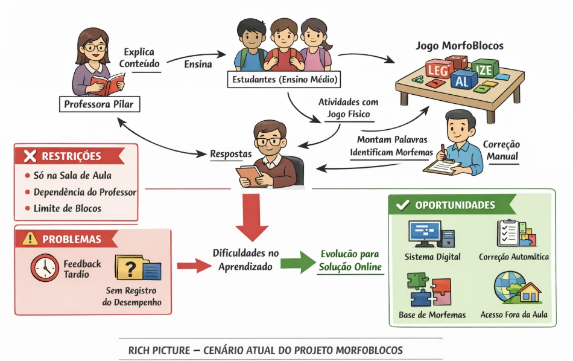
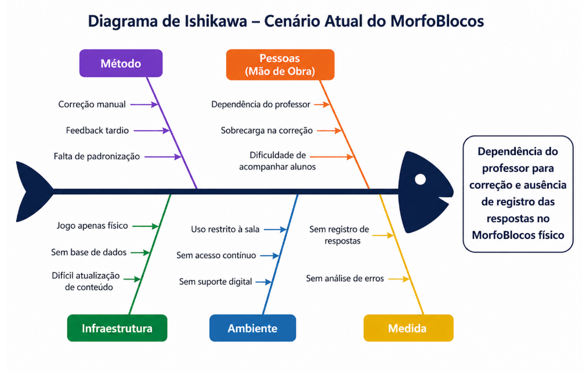

## 1. Cenário Atual do Cliente e do Negócio

### __1.1 Identificação do Cliente/Parceiro__

**Nome: Profª. María del Pilar Tobar Acosta.**

**Tipo**: Cliente individual — professora de Língua Portuguesa do Instituto Federal de Brasília (IFB), pesquisadora na área de ensino de morfologia e idealizadora do jogo didático Morfologia em Blocos (MorfoBlocos).

**Representante**: a própria professora María del Pilar Tobar Acosta, autora do jogo físico e principal parte interessada no desenvolvimento da versão digital.

**Forma de contato**: reuniões presenciais e por videoconferência, e-mail e canal de mensagens instantâneas para alinhamentos rápidos.

**Vínculo com o projeto**: cliente real e Product Owner (PO). Será responsável por fornecer o conteúdo didático (morfemas, categorias e processos de formação de palavras), validar as decisões de design e conteúdo e avaliar as entregas realizadas ao longo do desenvolvimento.

### __1.2 Introdução ao Negócio e Contexto__

O MorfoBlocos é uma ferramenta didática para o ensino de morfologia. Atualmente, a operação é analógica, baseada em blocos físicos. O propósito aqui é a entrega de feedback pedagógico sobre a estrutura das palavras. O gargalo atual reside na baixa escalabilidade do modelo físico e na latência do feedback, já que a validação depende 100% da disponibilidade síncrona do professor.

O jogo é composto por peças coloridas que representam morfemas — raízes (ou radicais), prefixos, sufixos e desinências — que podem ser combinadas pelos estudantes para formar diferentes vocábulos. Cada peça traz, de um lado, o morfema em si e, do outro, a classificação do elemento e o processo de formação envolvido (flexão, derivação, derivação parassintética, composição, derivação regressiva e reduplicação). Dessa forma, ao montar palavras, o estudante visualiza não apenas o resultado, mas o processo morfológico que o gerou.

O jogo já foi aplicado em turmas do ensino médio integrado, licenciatura e tecnólogo do IFB Campus São Sebastião, com resultados positivos relatados pela equipe e pelos estudantes participantes. No relatório final do projeto original, a própria idealizadora manifestou a intenção de desenvolver uma versão digital do jogo como forma de ampliar seu alcance e viabilizar seu uso em um número significativo de escolas.

Apesar de seu valor pedagógico, o uso do jogo apresenta limitações operacionais e financeiras. Sua aplicação depende da presença do professor para orientação e validação manual das respostas, o que reduz a autonomia dos estudantes. Além disso, o custo do jogo físico pode dificultar sua ampla adoção por estudantes e instituições de ensino. Nesse contexto, a solução digital proposta não substitui o recurso físico, mas atua como um complemento, ampliando seu alcance e possibilidades de uso.

O público-alvo principal são estudantes do ensino fundamental II e do ensino médio, mas o material também vem sendo utilizado com estudantes de licenciatura em Letras e Pedagogia, como recurso para formação de professores de língua materna.

### __1.3 Rich Picture__

Imagem 1 - Fonte: Autoria Própria via IA

O diagrama representa o funcionamento atual do projeto MorfoBlocos, no qual professores de Língua Portuguesa como a professora Pilar, apresentam o conteúdo de morfologia e os estudantes do ensino médio utilizam o jogo físico para manipular blocos com morfemas, formando palavras e analisando sua estrutura. As atividades são corrigidas manualmente pelo professor, sem registro ou acompanhamento do desempenho. Esse modelo apresenta limitações como a ausência de feedback imediato, a dependência do professor e a restrição do uso ao ambiente de sala de aula, o que dificulta a prática contínua dos alunos. Como proposta de melhoria, o diagrama indica a transição para uma solução digital baseada em uma base estruturada de morfemas, permitindo a realização de exercícios variados, correção automática, acesso fora da sala de aula e acompanhamento do desempenho dos estudantes.

### __1.4 Identificação da Oportunidade ou Problema__

O projeto surge da necessidade de superar o gargalo operacional no ensino de morfologia causado pelo uso exclusivo do jogo físico MorfoBlocos. No cenário atual, a dinâmica pedagógica apresenta uma dependência crítica da mediação do professor, responsável pela orientação e correção manual das atividades, o que impede o acompanhamento individualizado e limita a escalabilidade das práticas em sala de aula.

O fluxo de informação atual é marcado pelo feedback tardio, uma vez que o estudante não recebe validação imediata sobre a classificação de morfemas ou os processos de formação de palavras, como derivação e flexão. Além disso, a ausência de registro sistemático das respostas gera falta de rastreabilidade do aprendizado, impossibilitando que o professor identifique padrões de erro em conceitos como alomorfia e derivação parassintética ao longo do tempo.

A infraestrutura baseada no jogo físico impõe restrições de uso, limitando a prática ao ambiente escolar e à disponibilidade de blocos. Soma-se a isso o custo do material, que dificulta sua aquisição e reduz o acesso por parte dos estudantes. Como consequência, há prejuízo na continuidade do aprendizado e na consolidação dos conceitos morfológicos.

Imagem 2

### __1.5 Desafios do Projeto__

O principal desafio do projeto está na transição de um modelo de ensino baseado na manipulação de blocos físicos e na correção manual para uma solução digital estruturada e integrada. Atualmente, esse processo limita a rastreabilidade das respostas e dificulta o acompanhamento do desempenho dos alunos, devido à ausência de registro sistematizado e à centralização da validação no professor. Outro ponto a ser observado está na estruturação dos dados linguísticos. O sistema deve organizar morfemas, suas variações e relações, incluindo casos como alomorfes e processos de derivação, permitindo a validação automática das respostas de forma consistente.

Além disso, há o desafio relacionado à coleta e análise de dados educacionais. A solução deve registrar as respostas dos alunos, possibilitando a identificação de padrões de erro e o acompanhamento da evolução individual. A usabilidade também é um fator crítico, exigindo uma interface intuitiva e de fácil utilização, sem necessidade de treinamento. Por fim, o sistema deve garantir confiabilidade, permitindo o uso em diferentes contextos e assegurando o armazenamento correto dos dados mesmo com o aumento do volume de informações.

### __1.6 Mapa de Stakeholders__

Os principais stakeholders do projeto são: a professora María del Pilar Tobar Acosta, como cliente, idealizadora do jogo físico e responsável por validar as decisões de conteúdo e pedagógicas; os estudantes do ensino básico e superior, como usuários finais do jogo digital; os professores de Língua Portuguesa que poderão adotar a solução em suas aulas; as instituições de ensino (IFB, escolas públicas e privadas) como potenciais adotantes da solução; e a equipe de desenvolvimento, responsável por construir tecnicamente a solução no contexto da disciplina.

A seguir, é apresentado o quadro-resumo dos stakeholders.

| **Stakeholder**       | **Relação com a solução** | **Interesse Principal**                                         | **Influência**              |
| ---------- | ------ | --------------------------------------------------- | ------------------ |
| Profª. María del Pilar Tobar Acosta | Cliente e idealizadora do jogo físico    | Validar conteúdo, proposta pedagógica, escopo e entregas                |    Alta   |
| Estudantes do ensino básico | Usuários finais do jogo digital    | Aprender morfologia de forma lúdica, visual e engajadora                |    Alta   |
| Professores de Língua Portuguesa | Usuários que aplicam o jogo em sala    | Dispor de recurso didático de fácil acesso e com acompanhamento do aluno                |    Média       |
| Estudantes de Licenciatura em Letras | Usuários em contexto de formação de professores    | Utilizar o jogo como recurso pedagógico em sua formação                |    Média   |
| Instituições de ensino (IFB e escolas) | Potenciais adotantes da solução    | Ampliar recursos didáticos disponíveis sem custo adicional de material físico                |    Baixa   |
| Equipe de desenvolvimento | Responsável pela construção do produto    | Entregar uma solução viável, funcional e alinhada aos objetivos da disciplina               |    Alta   |

Além do quadro-resumo, será elaborada uma matriz Poder × Interesse para classificar os stakeholders nas categorias Gerenciar de Perto, Manter Satisfeito, Manter Informado e Monitorar, orientando a estratégia de comunicação e engajamento da equipe ao longo do projeto. 

### __1.7 Segmentação de Clientes__

Embora o projeto tenha um cliente único e real (a professora María del Pilar), a solução atenderá a diferentes perfis de usuários finais, que podem ser segmentados da seguinte forma:

* Estudantes do Ensino Fundamental II (11 a 14 anos): têm seu primeiro contato mais formal com conteúdos de morfologia. Precisam de uma experiência altamente visual, lúdica e guiada, com linguagem simples e feedback imediato;

* Estudantes do Ensino Médio (15 a 18 anos): já possuem alguma familiaridade com os conceitos morfológicos e podem ser desafiados com atividades mais complexas, envolvendo diferentes processos de formação de palavras e análise de vocábulos mais sofisticados;

* Estudantes de Licenciatura em Letras e Pedagogia: utilizam o jogo tanto como recurso de estudo quanto como referência para sua futura prática docente, demandando explicações teóricas mais aprofundadas e exemplos relacionados ao ensino;

* Professores de Língua Portuguesa: atuam como mediadores do uso do jogo em sala de aula, necessitando de recursos para aplicar o material, propor atividades e, futuramente, acompanhar o desempenho dos estudantes.