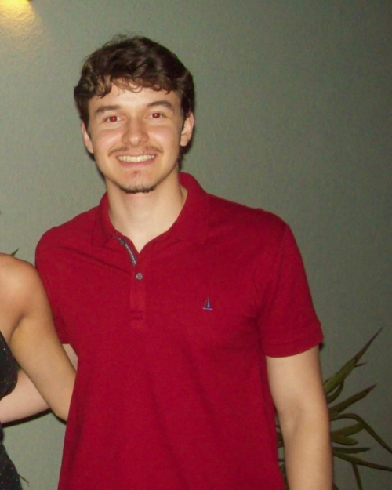
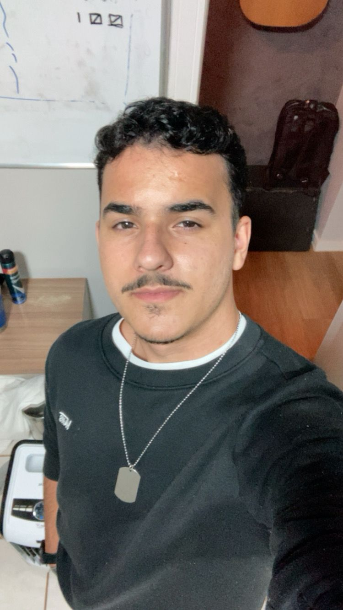

# **Projeto MorfoBlocos Digital**

## Descrição do projeto

O MorfoBlocos é uma ferramenta didática para o ensino de morfologia. Atualmente, a operação é analógica, baseada em blocos físicos. O propósito aqui é a entrega de feedback pedagógico sobre a estrutura das palavras.

O jogo é composto por peças coloridas que representam morfemas — raízes (ou radicais), prefixos, sufixos e desinências — que podem ser combinadas pelos estudantes para formar diferentes vocábulos. Cada peça traz, de um lado, o morfema em si e, do outro, a classificação do elemento e o processo de formação envolvido (flexão, derivação, derivação parassintética, composição, derivação regressiva e reduplicação). Dessa forma, ao montar palavras, o estudante visualiza não apenas o resultado, mas o processo morfológico que o gerou.

## 📚 Documentação

-   ### 📖 Visão do Produto

    Conheça o contexto do problema, a proposta de solução e os objetivos do projeto.

    [Acessar](visao-produto/cenario-atual.md)

-   ### 📋 Requisitos

    Consulte os requisitos funcionais e não funcionais definidos para o sistema.

    [Acessar](visao-produto/requisitos.md)

-   ### 📅 Cronograma

    Visualize o planejamento e o acompanhamento das entregas.

    [Acessar](visao-produto/cronograma.md)

-   ### 🚀 Sprints

    Acompanhe as atividades desenvolvidas ao longo das iterações.

    [Acessar](sprints/sprint1.md)

## Tabela de Integrantes

| Foto | **Integrante** | Função | Github | Matrícula |
|------|---------------|--------|--------|-----------|
|  | Ana Beatriz | Engenharia de Requisitos, Desenvolvedor Backend  | [Ana Beatriz](https://github.com/AnnaBeatrizAraujo) | 241025891 |
|  | Artur Fernandes | Engenharia de Requisitos, Desenvolvedor Backend | [Artur Fernandes](https://github.com/arturalvesfn) | 232024527 |
|  | Bruno Souza | Engenharia de Requisitos, Desenvolvedor Backend | [Bruno Souza](https://github.com/youngburny) | 221029196 |
|  | Carlos Eduardo | Engenharia de Requisitos, Desenvolvedor Frontend  | [Carlos Eduardo](https://github.com/cadumotta) | 241025194 |
|  | Luiz Henrique | Engenharia de Requisitos, Desenvolvedor Frontend / Scrum | [Luiz Henrique](https://github.com/Luizz97) | 241012329 |

## Versionamento

| **Data**       | Versão | Descrição                                           | Autor              |
| ---------------| -------| ----------------------------------------------------| -------------------|
| 30/06/2026 | 1.0 | Estruturação inicial e atualizações para entrega da Unidade IV. | [Bruno Souza](https://github.com/youngburny) |
| 01/06/2026 | 1.1 | Atualizações em: Requisitos, Backlog, Cronograma; criação da aba de 'Planejamento e Organização'; separação dos tipos de reunião/gravação.| [Bruno Souza](https://github.com/youngburny) |
| 01/06/2026 | 1.2 | Atualizações nas USs, adição das sprints 5 e 6. | [Bruno Souza](https://github.com/youngburny) |
| 01/06/2026 | 1.3 | Atualizações no Backlog, na Engenharia de Requisitos e Cronograma. | [Bruno Souza](https://github.com/youngburny) |
| 01/06/2026 | 1.4 | Adiciona tabela consolidada de feedback da PO. | [Bruno Souza](https://github.com/youngburny) |
| 01/06/2026 | 1.5 | Atualização nas Estratégias de ESW e linkagem no Cronograma. | [Bruno Souza](https://github.com/youngburny) |