

# Documento de Histórias de Usuário (User Stories) e Critérios de Aceitação

*Legenda: ✅ = Dentro do MVP / ❌ = Fora do MVP*

<strong>US01 — Autenticação de Usuário ✅</strong>

### **US01 - Autenticação de Usuário**

> **Como** usuário, **quero** efetuar login no sistema utilizando e-mail e senha, **para** acessar minha conta na plataforma de forma segura.

**Critérios de Aceitação:**

* **CA-US01-01:** O sistema deve exigir um e-mail válido e a senha correta; o acesso só é liberado se os dados coincidirem exatamente com o banco de dados.
* **CA-US01-02:** Se a senha ou o e-mail estiverem incorretos, o sistema exibe uma mensagem de erro geral ("E-mail ou senha incorretos") por motivos de segurança.
* **CA-US01-03:** Após o login bem-sucedido, o sistema gera uma sessão segura por até 1 hora e direciona o usuário automaticamente para a sua tela inicial.

Verificação do Definition of Ready (DoR) — US01

| Pergunta de Auditoria do DoR (Scrum/XP) | Status | Evidência / Justificativa Técnica |
| :---- | :---- | :---- |
| **A User Story é atômica e clara?** | **Sim** | O escopo foi totalmente isolado. A US01 trata exclusivamente do fluxo de autenticação e validação de credenciais de usuários existentes, sem carregar regras de criação de novas contas ou recuperação de acessos. |
| **Possui Critérios de Aceitação explícitos?** | **Sim** | Foram definidos os critérios CA-US01-01 a CA-US01-03. Eles cobrem tanto o fluxo feliz quanto o comportamento defensivo em cenários de dados inválidos. |
| **Há rastreabilidade de restrições (RNFs) e Regras de Negócio (RNs)?** | **Sim** | Mapeamento explícito para respeitar a **RN01**, **RNF04**, **RNF05** e **RNF12**. |
| **A prioridade está coerente e justificada?** | **Sim** | Classificada como **Must Have** via matriz MoSCoW, pois representa a porta de entrada do sistema. |
| **O esforço foi estimado conjuntamente?** | **Sim** | O esforço de engenharia foi discutido e pontuado consensualmente em **2 Story Points**. |
| **Resolução de dependências validada?** | **Sim** | A estrutura de dados para verificação de credenciais e o protótipo da interface já estavam homologados antes do início do código. |

* **Status Final:** 🟢 **Done**

| *Critério de Pronto (DoD V4.0)* | *Status* | *Evidência de Implementação e Qualidade* |
| :---- | :---- | :---- |
| ***1. Implementação Arquitetural*** | ***Concluído*** | *Código front-end em React 18+ / TypeScript 5+ e back-end em Python 3.11+ / Django 4.2+ finalizados.* |
| ***2. Comunicação via API*** | ***Concluído*** | *O React consome exclusivamente os endpoints REST de geração e renovação de token JWT do Django (RNF05).* |
| ***3. Operações Django Admin*** | ***Não aplicável*** | *Critério não aplicável para esta história.* |
| ***4. Validação de CAs*** | ***Concluído*** | *Critérios CA-US01-01 a CA-US01-03 testados com sucesso.* |
| ***5. Garantia das RNs*** | ***Concluído*** | *O sistema emite o token JWT com as credenciais corretas e aciona a RN01.* |
| ***6. Validação de RNFs (RNF11)*** | ***Concluído*** | *Interface de login testada e fluida em telas de 360px.* |
| ***7. Integração Contínua (CI)*** | ***Concluído*** | *Código integrado à branch principal sem regressões.* |
| ***8. Homologação e Validação*** | ***Concluído*** | *Funcionalidade operando em ambiente de produção (Vercel) e validada com a cliente (PO).* |

Links de Rastreabilidade e Artefatos  
Link no site: [https://req-2026-1-t01-morfo-blocos-digital.vercel.app/](https://req-2026-1-t01-morfo-blocos-digital.vercel.app/)

**Fluxo de Acesso:**  

a. Acesse a página inicial da aplicação.  

b. Localize o formulário de autenticação centralizado na interface principal.  

c. Preencha os campos obrigatórios (*E-mail* e *Senha*).  

d. Clique no botão de submissão **"Entrar"** para validar as credenciais e iniciar a sessão.

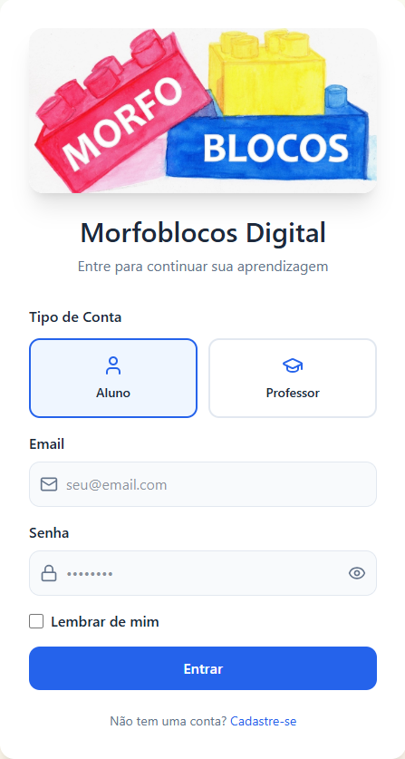{ width="35%" }

<strong>US02 — Cadastro de Nova Conta ✅</strong>

### US02 — Cadastro de Nova Conta

> **Como** usuário, **quero** cadastrar uma nova conta no sistema inserindo meus dados, **para** que meu perfil seja criado e eu possa começar a usar a plataforma.

**Critérios de Aceitação (CA)**

* **CA-US02-01:** O sistema exige obrigatoriamente e-mail, senha e a escolha do perfil (se é Estudante ou Professor), bloqueando o envio de campos vazios.
* **CA-US02-02:** O sistema impede o cadastro de um e-mail que já esteja previamente registrado na base de dados.
* **CA-US02-03:** O sistema deve validar o formato estrutural do e-mail (ex: nome@dominio.com), exibindo um alerta visual em caso de erro.
* **CA-US02-04:** O sistema exige que o campo de senha e a confirmação de senha sejam rigorosamente iguais.
* **CA-US02-05:** A interface da tela de cadastro deve ser totalmente responsiva em ecrãs/telas a partir de **360px** de largura, sem qualquer sobreposição de textos, campos desalinhados ou surgimento de barra de rolagem horizontal (*scroll* lateral).

Verificação do Definition of Ready (DoR) — US02

| *Pergunta de Auditoria do DoR (Scrum/XP)* | *Status* | *Evidência / Justificativa Técnica* |
| :---- | :---- | :---- |
| *A User Story é atômica e clara?* | *Sim* | *O escopo foi isolado com foco único na criação de credenciais de acesso. O fluxo de autenticação/login ficou restrito à US01, eliminando dependências cruzadas ou a criação de um Épico camuflado.* |
| *Possui Critérios de Aceitação explícitos?* | *Sim* | *Foram especificados os critérios de CA-US02-01 a CA-US02-05, cobrindo os fluxos de sucesso, validações obrigatórias de campos e a restrição de tamanho de tela.* |
| *Há rastreabilidade de restrições (RNFs) e Regras de Negócio (RNs)?* | *Sim* | *Mapeamento explícito para respeitar a RN02 (Unicidade de e-mail no banco), RNF04 (Criptografia de senhas), RNF05 (Comunicação via API REST), RNF11 (Responsividade 360px) e RNF12 (Acesso via navegador por HTTP/HTTPS).* |
| *A prioridade está coerente e justificada?* | *Sim* | *Classificada como Must Have via matriz MoSCoW, pois a criação de perfis é um pré-requisito fundamental para que os usuários utilizem as demais funcionalidades do ecossistema.* |
| *O esforço foi estimado conjuntamente?* | *Sim* | *O esforço técnico para construir o formulário de cadastro, aplicar as validações de input em tempo real e criar a rota de persistência foi discutido pelo time e pontuado em 2 Story Points.* |
| *Resolução de dependências validada?* | *Sim* | *Os modelos de dados para criação de usuários e o protótipo de alta fidelidade da tela de cadastro já estavam homologados pela PO e disponíveis antes do início da codificação.* |

| *Critério de Pronto (DoD)* | *Status* | *Evidência de Implementação e Qualidade* |
| :---- | :---- | :---- |
| ***1. Implementação Arquitetural*** | ***Concluído*** | *Componentes do formulário criados e mapeados para persistência no banco de dados PostgreSQL 15+.* |
| ***2. Comunicação via API*** | ***Concluído*** | *Rota de POST consumindo o payload de criação de conta e respondendo com os códigos de status REST corretos.* |
| ***3. Operações Django Admin*** | ***Concluído*** | *Os novos perfis cadastrados pelo usuário são espelhados com sucesso no painel administrativo padrão do Django.* |
| ***4. Validação de CAs*** | ***Concluído*** | *Validação estrutural de inputs obrigatórios, formato de e-mail e checagem de senhas iguais (CA-US02-01 a CA-US02-04).* |
| ***5. Garantia das RNs*** | ***Concluído*** | *O banco de dados rejeita cadastros duplicados, garantindo a política invariante da RN02 (unicidade de e-mail).* |
| ***6. Validação de RNFs (RNF11)*** | ***Concluído*** | ***Resolvido:** O seletor de perfil foi refatorado. Os botões adaptam-se em telas de 360px sem gerar quebras ou scroll lateral (CA-US02-05).* |
| ***7. Integração Contínua (CI)*** | ***Concluído*** | *Código integrado à branch principal sem regressões visuais e build de produção gerado com sucesso.* |
| ***8. Homologação e Validação*** | ***Concluído*** | *Interface testada no ambiente móvel, homologada internamente e validada com sucesso junto à cliente (PO).* |

Links de Rastreabilidade e Artefatos 

Link no site: [https://req-2026-1-t01-morfo-blocos-digital.vercel.app/](https://req-2026-1-t01-morfo-blocos-digital.vercel.app/)

Fluxo de Acesso:

 a. Acesse a página inicial da aplicação.  
b. Clique no link ou alternador "Cadastrar-se" presente no cartão de entrada.  
c. Preencha todos os campos obrigatórios (Nome Completo, E-mail, Senha)  
d. Selecione o perfil de uso clicando nos botões seletores ("Estudante" ou "Professor").  
e. Clique no botão de submissão para concluir e persistir o registro.

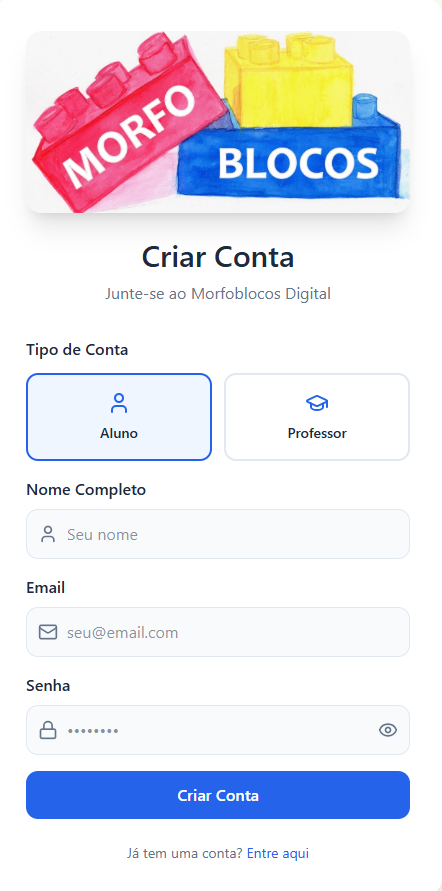{ width="35%" }

<strong>US03 — Recuperação de Senha ❌</strong>

### US03 - Recuperação de Senha

> **Como** usuário, **quero** recuperar meu acesso mediante envio de um link de redefinição de senha, **para** retomar o uso da plataforma caso esqueça minha senha.

**Critérios de Aceitação (CA)**

* **CA-US03-01:** O sistema deve enviar um link de redefinição de senha (e não a senha em texto puro) para o e-mail cadastrado do usuário, mediante solicitação na tela de login.
* **CA-US03-02:** O link de redefinição deve ter validade limitada de no máximo 24 horas e ser invalidado após o primeiro uso, exibindo mensagem específica caso o usuário tente reutilizá-lo [RNF04](visao-produto/requisitos.md#82-lista-de-requisitos-não-funcionais).

**Fora do MVP:** O frontend de recuperação de senha ficou pendente por problemas de envio de e-mail no servidor de testes. No entanto, devido ao prazo e por estar no Q4 de prioridade (pequeno valor, grande esforço) foi retirada do MVP.

<strong>US04 — Cadastro de Morfemas no Catálogo ✅</strong>

### US04 — Cadastro de Morfemas no Catálogo

> **Como** administrador, **quero** cadastrar novos morfemas no catálogo do sistema, **para** disponibilizar os blocos de construção de palavras aos estudantes.

**Critérios de Aceitação (CA)**

* **CA-US04-01:** O cadastro de morfema deve exigir os campos obrigatórios: grafia (texto do morfema) e tipo (Prefixo, Radical ou Sufixo), sendo o registro persistido no banco de dados ao confirmar a operação.

Verificação do Definition of Ready (DoR) — US04

| Critério de DoR (Scrum/XP) | Status | Evidência / Link de Rastreabilidade |
| :---- | :---- | :---- |
| **A User Story é atômica e clara?** | Sim | Escopo restrito à operação de inserção de novos morfemas. |
| **Possui Critérios de Aceitação explícitos?** | Sim | CA-US04-01 define os campos obrigatórios e o comportamento de persistência. |
| **Há rastreabilidade de RNFs e RNs?** | Sim | Mapeada para RN03 e RNF05. |
| **A prioridade está coerente e justificada?** | Sim | Must Have — sem morfemas cadastrados, o jogo de montagem de blocos não possui peças para funcionar. |
| **O esforço foi estimado conjuntamente?** | Sim | Estimado em 2 Story Points, envolvendo interface de cadastro e integração com a API REST. |
| **Resolução de dependências validada?** | Sim | Modelo de dados do Morfema e endpoint da API disponíveis antes do início do desenvolvimento. |

***Critério de Pronto (DoD V4.0)***

| *Critério de Pronto (DoD V4.0)* | *Status* | *Evidência de Implementação e Qualidade* |
| :---- | :---- | :---- |
| ***1. Implementação Arquitetural*** | *Concluído* | *Interface de cadastro de morfemas implementada no painel do professor em React 18+ e TypeScript 5+.* |
| ***2. Comunicação via API*** | *Concluído* | *O painel envia o novo morfema via POST para a API REST, persistindo no PostgreSQL 15+ (RNF05).* |
| ***3. Operações Django Admin*** | *Concluído* | *Os morfemas cadastrados pela interface são refletidos e auditáveis no painel Django Admin.* |
| ***4. Validação de CAs*** | *Concluído* | *CA-US04-01 validado: formulário exige texto e tipo; morfema inserido e exibido na listagem após confirmação.* |
| ***5. Garantia das RNs*** | *Concluído* | *RN03 garantida: rota de cadastro exige autenticação com perfil de professor/administrador.* |
| ***6. Validação de RNFs (RNF11)*** | *Concluído* | *Interface validada como responsiva em telas a partir de 360px.* |
| ***7. Integração Contínua (CI)*** | *Concluído* | *Código integrado ao repositório principal sem falhas na pipeline de CI.* |
| ***8. Homologação e Validação*** | *Concluído* | *Funcionalidade testada no ambiente de produção (Vercel) e validada com a cliente (PO).* |

**Links de Rastreabilidade e Artefatos**

Link no site: https://req-2026-1-t01-morfo-blocos-digital.vercel.app/

**Fluxo de Acesso:**

a. Efetue login com uma conta de Professor.

b. Navegue até o Painel de Conteúdo (aba de gerenciamento).

c. Selecione a aba "Morfemas".

d. Preencha o campo Texto (ex: in) e selecione o tipo no dropdown (Prefixo/Radical/Sufixo).

e. Clique no botão "+ Adicionar" para persistir o morfema no banco de dados.

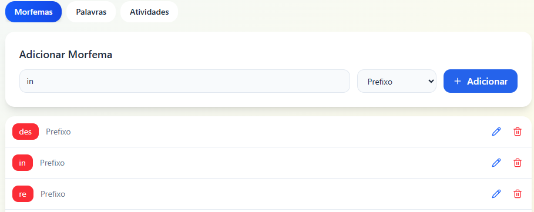{ width="80%" }

<strong>US05 — Edição de Morfemas ✅</strong>

### US05 — Edição de Morfemas

> **Como** administrador, **quero** editar morfemas existentes no catálogo, **para** corrigir grafias, classificações ou cores associadas.

**Critérios de Aceitação (CA):**

* **CA-US05-01:** A edição de um morfema deve permitir alterar sua grafia, tipo morfológico e cor associada, refletindo as alterações imediatamente nas próximas atividades que utilizarem esse morfema [RN03, RNF06].

Verificação do Definition of Ready (DoR) — US05

| Critério de DoR (Scrum/XP) | Status | Evidência / Link de Rastreabilidade |
| :---- | :---- | :---- |
| **A User Story é atômica e clara?** | Sim | Escopo restrito à operação de alteração de atributos de um morfema. |
| **Possui Critérios de Aceitação explícitos?** | Sim | CA-US05-01 define o carregamento de dados e o comportamento de salvamento. |
| **Há rastreabilidade de RNFs e RNs?** | Sim | Mapeada para RN03, RNF03, RNF05 e RNF06. |
| **A prioridade está coerente e justificada?** | Sim | Must Have — essencial para correções de conteúdo sem a necessidade de exclusão. |
| **O esforço foi estimado conjuntamente?** | Sim | Estimado em 2 Story Points, reaproveitando a estrutura do frontend. |
| **Resolução de dependências validada?** | Sim | Interface gráfica e endpoint `PUT/PATCH` da API mapeados. |

***Critério de Pronto (DoD V4.0)***

| *Critério de Pronto (DoD V4.0)* | *Status* | *Evidência de Implementação e Qualidade* |
| :---- | :---- | :---- |
| ***1. Implementação Arquitetural*** | *Concluído* | *Tela de formulário implementada em React/TypeScript com preenchimento reativo dos dados atuais do morfema selecionado.* |
| ***2. Comunicação via API*** | *Concluído* | *O envio do formulário dispara uma requisição PUT/PATCH para a API REST, atualizando o PostgreSQL 15+ (RNF05).* |
| ***3. Ambiente de Produção*** | *Concluído* | *A edição é realizada e refletida diretamente na interface unificada do sistema via ambiente Vercel (RNF06).* |
| ***4. Validação de CAs*** | *Concluído* | *CA-US05-01 validado: campos carregam dados prévios e salvamento atualiza as telas dos estudantes em tempo real.* |
| ***5. Garantia das RNs*** | *Concluído* | *RN03 garantida: rota de edição exige autenticação com perfil de professor/administrador.* |
| ***6. Validação de RNFs (RNF11)*** | *Concluído* | *Interface validada como responsiva em telas a partir de 360px.* |
| ***7. Integração Contínua (CI)*** | *Concluído* | *Código integrado ao repositório principal sem falhas na pipeline de CI.* |
| ***8. Homologação e Validação*** | *Concluído* | *Funcionalidade testada no ambiente de produção (Vercel) e validada com a cliente (PO).* |

**Links de Rastreabilidade e Artefatos**

Link no site: [https://req-2026-1-t01-morfo-blocos-digital.vercel.app/](https://req-2026-1-t01-morfo-blocos-digital.vercel.app/)

**Fluxo de Acesso:**

a. Efetue login com uma conta de Professor.

b. Navegue até o Painel de Conteúdo (aba de gerenciamento).

c. Selecione a aba "Morfemas".

d. Localize na listagem o morfema a ser editado e clique no botão/ícone de edição.

e. Altere os campos necessários no formulário e clique em "Salvar" para persistir as modificações.

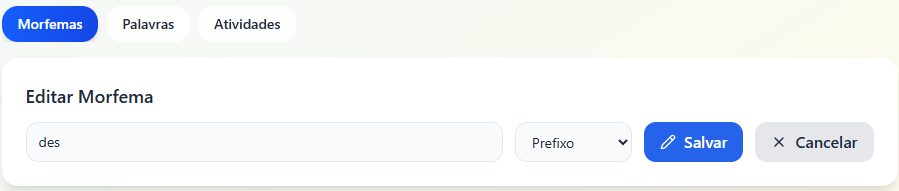{ width="80%" }

<strong>US06 — Remoção de Morfemas ✅</strong>

### US06 — Remoção de Morfemas

> **Como** administrador, **quero** remover morfemas do catálogo do sistema, **para** retirar blocos que não devem mais estar disponíveis aos estudantes.

**Critérios de Aceitação (CA)**

* **CA-US06-01:** O sistema deve exibir a listagem de morfemas cadastrados com opção de remoção individual via ícone de lixeira, sendo o registro excluído do banco de dados ao confirmar a operação.

Verificação do Definition of Ready (DoR) — US06

| Critério de DoR (Scrum/XP) | Status | Evidência / Link de Rastreabilidade |
| :---- | :---- | :---- |
| **A User Story é atômica e clara?** | Sim | Escopo restrito à operação de remoção. |
| **Possui Critérios de Aceitação explícitos?** | Sim | CA-US06-01 define a exibição da listagem e o mecanismo de remoção por ícone de lixeira. |
| **Há rastreabilidade de RNFs e RNs?** | Sim | Mapeada para RN03 e RNF05. |
| **A prioridade está coerente e justificada?** | Sim | Must Have — necessário para manter o catálogo atualizado e íntegro. |
| **O esforço foi estimado conjuntamente?** | Sim | Estimado em 1 Story Point, aproveitando a mesma interface da US04. |
| **Resolução de dependências validada?** | Sim | Listagem e endpoint de exclusão da API disponíveis antes do desenvolvimento. |

***Critério de Pronto (DoD V4.0)***

| *Critério de Pronto (DoD V4.0)* | *Status* | *Evidência de Implementação e Qualidade* |
| :---- | :---- | :---- |
| ***1. Implementação Arquitetural*** | *Concluído* | *Listagem de morfemas com ícone de lixeira implementada no painel do professor em React 18+ e TypeScript 5+.* |
| ***2. Comunicação via API*** | *Concluído* | *O clique no ícone de lixeira dispara uma requisição DELETE para a API REST, removendo do PostgreSQL 15+ (RNF05).* |
| ***3. Operações Django Admin*** | *Concluído* | *A remoção é refletida imediatamente no Django Admin após a exclusão pela interface.* |
| ***4. Validação de CAs*** | *Concluído* | *CA-US06-01 validado: listagem exibe morfemas com lixeira; ao clicar, morfema removido da lista e do banco.* |
| ***5. Garantia das RNs*** | *Concluído* | *RN03 garantida: rota de exclusão exige autenticação com perfil de professor/administrador.* |
| ***6. Validação de RNFs (RNF11)*** | *Concluído* | *Interface validada como responsiva em telas a partir de 360px.* |
| ***7. Integração Contínua (CI)*** | *Concluído* | *Código integrado ao repositório principal sem falhas na pipeline de CI.* |
| ***8. Homologação e Validação*** | *Concluído* | *Funcionalidade testada no ambiente de produção (Vercel) e validada com a cliente (PO).* |

**Links de Rastreabilidade e Artefatos**

Link no site: [https://req-2026-1-t01-morfo-blocos-digital.vercel.app/](https://req-2026-1-t01-morfo-blocos-digital.vercel.app/)

**Fluxo de Acesso:**

a. Efetue login com uma conta de Professor.

b. Navegue até o Painel de Conteúdo (aba de gerenciamento).

c. Selecione a aba "Morfemas".

d. Localize na listagem o morfema a ser removido.

e. Clique no ícone de lixeira (vermelho) ao lado do registro para excluí-lo do banco de dados.

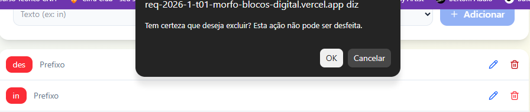{ width="80%" }

<strong>US07 — Listagem de Morfemas ✅</strong>

### US07 — Listagem de Morfemas

> **Como** administrador, **quero** listar os morfemas cadastrados, **para** consultar o conteúdo atual do catálogo.

**Critérios de Aceitação (CA)**

* **CA-US07-01:** A listagem deve exibir, no mínimo, a grafia do morfema, seu tipo morfológico e a cor associada, permitindo ordenação e busca textual por grafia [RNF06](visao-produto/requisitos.md).

Verificação do Definition of Ready (DoR) — US07

| Critério de DoR (Scrum/XP) | Status | Evidência / Link de Rastreabilidade |
| :---- | :---- | :---- |
| **A User Story é atômica e clara?** | Sim | Escopo restrito à exibição e filtragem do catálogo de morfemas. |
| **Possui Critérios de Aceitação explícitos?** | Sim | CA-US07-01 detalha os campos obrigatórios e ferramentas de busca. |
| **Há rastreabilidade de RNFs e RNs?** | Sim | Mapeada para RF07, RNF03, RNF06 e RNF11. |
| **A prioridade está coerente e justificada?** | Sim | Must Have — base para a gerência, edição e exclusão de morfemas. |
| **O esforço foi estimado conjuntamente?** | Sim | Estimado em 1 Story Point por envolver leitura e renderização de dados. |
| **Resolução de dependências validada?** | Sim | Endpoint `GET` de morfemas estruturado e testado no backend. |

***Critério de Pronto (DoD V4.0)***

| *Critério de Pronto (DoD V4.0)* | *Status* | *Evidência de Implementação e Qualidade* |
| :---- | :---- | :---- |
| ***1. Implementação Arquitetural*** | *Concluído* | *Grid/tabela de blocos renderizada no React com a devida identificação visual de cor por tipo (RNF07).* |
| ***2. Comunicação via API*** | *Concluído* | *Interface consome o endpoint GET de morfemas populando a tabela de forma dinâmica (RNF05).* |
| ***3. Ambiente de Produção*** | *Concluído* | *Listagem disponibilizada no painel administrativo hospedado na Vercel (RNF06).* |
| ***4. Validação de CAs*** | *Concluído* | *CA-US07-01 validado: listagem exibe todos os atributos; busca e filtros refinam os dados instantaneamente.* |
| ***5. Garantia das RNs*** | *Concluído* | *Acesso restrito a usuários autenticados com nível de permissão adequado.* |
| ***6. Validação de RNFs (RNF11)*** | *Concluído* | *Filtros e tabela testados em ambiente mobile (360px) garantindo empilhamento e vedação de scroll horizontal.* |
| ***7. Integração Contínua (CI)*** | *Concluído* | *Código integrado ao repositório principal sem falhas na pipeline de CI.* |
| ***8. Homologação e Validação*** | *Concluído* | *Performance de busca e filtros validada abaixo do limite de 2 segundos (RNF03) em produção na Vercel.* |

**Links de Rastreabilidade e Artefatos**

Link no site: [https://req-2026-1-t01-morfo-blocos-digital.vercel.app/](https://req-2026-1-t01-morfo-blocos-digital.vercel.app/)

**Fluxo de Acesso:**

a. Efetue login com uma conta de Professor.

b. Navegue até o Painel de Conteúdo (aba de gerenciamento).

c. Selecione a aba "Morfemas" para visualizar a listagem completa.

d. Utilize a barra de pesquisa ou os filtros por tipo para refinar os blocos exibidos.

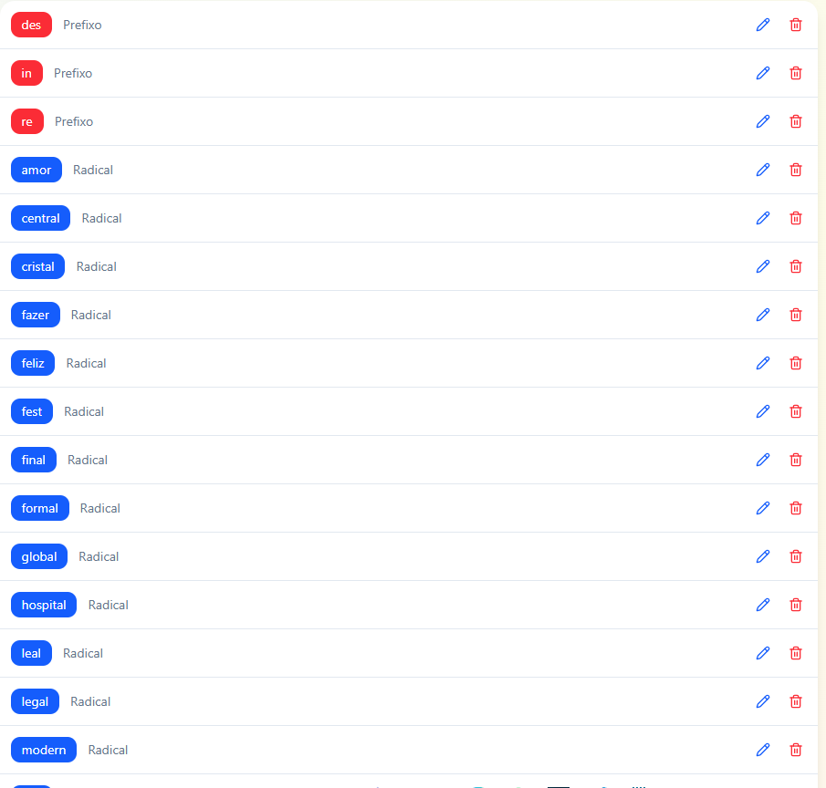{ width="80%" }

<strong>US08 — Cadastro de Palavras Válidas ✅</strong>

### US08 — Cadastro de Palavras Válidas

> **Como** administrador, **quero** cadastrar palavras válidas no catálogo do sistema, **para** definir as combinações de morfemas reconhecidas pelo validador.

**Critérios de Aceitação (CA)**

* **CA-US08-01:** O cadastro deve exigir os campos obrigatórios: grafia da palavra e processo morfológico associado (ex: in + feliz + mente), sendo o registro persistido no banco de dados ao confirmar a operação.

Verificação do Definition of Ready (DoR) — US08

| Critério de DoR (Scrum/XP) | Status | Evidência / Link de Rastreabilidade |
| :---- | :---- | :---- |
| **A User Story é atômica e clara?** | Sim | Escopo restrito à inserção de palavras válidas. |
| **Possui Critérios de Aceitação explícitos?** | Sim | CA-US08-01 define os campos obrigatórios e o comportamento de persistência. |
| **Há rastreabilidade de RNFs e RNs?** | Sim | Mapeada para RN03, RN04 e RNF05. |
| **A prioridade está coerente e justificada?** | Sim | Must Have — sem palavras cadastradas, o validador morfológico não possui base de consulta. |
| **O esforço foi estimado conjuntamente?** | Sim | Estimado em 2 Story Points, envolvendo dois campos de entrada e integração com a API. |
| **Resolução de dependências validada?** | Sim | Modelo PalavraValida e endpoint da API disponíveis antes do início do desenvolvimento. |

***Critério de Pronto (DoD V4.0)***

| *Critério de Pronto (DoD V4.0)* | *Status* | *Evidência de Implementação e Qualidade* |
| :---- | :---- | :---- |
| ***1. Implementação Arquitetural*** | *Concluído* | *Interface de cadastro de palavras válidas implementada no painel do professor em React 18+ e TypeScript 5+.* |
| ***2. Comunicação via API*** | *Concluído* | *O painel envia a nova palavra via POST para a API REST, persistindo no PostgreSQL 15+ (RNF05).* |
| ***3. Operações Django Admin*** | *Concluído* | *As palavras cadastradas pela interface são refletidas e auditáveis no Django Admin.* |
| ***4. Validação de CAs*** | *Concluído* | *CA-US08-01 validado: formulário exige grafia e processo morfológico; registro inserido e exibido na listagem.* |
| ***5. Garantia das RNs*** | *Concluído* | *RN03 e RN04 garantidas: acesso restrito ao professor e validador consulta exclusivamente palavras cadastradas.* |
| ***6. Validação de RNFs (RNF11)*** | *Concluído* | *Interface validada como responsiva em telas a partir de 360px.* |
| ***7. Integração Contínua (CI)*** | *Concluído* | *Código integrado ao repositório principal sem falhas na pipeline de CI.* |
| ***8. Homologação e Validação*** | *Concluído* | *Funcionalidade testada no ambiente de produção (Vercel) e validada com a cliente (PO).* |

**Links de Rastreabilidade e Artefatos**

Link no site: [https://req-2026-1-t01-morfo-blocos-digital.vercel.app/](https://req-2026-1-t01-morfo-blocos-digital.vercel.app/)

**Fluxo de Acesso:**

a. Efetue login com uma conta de Professor.

b. Navegue até o Painel de Conteúdo (aba de gerenciamento).

c. Selecione a aba "Palavras".

d. Preencha o campo Palavra (ex: infelizmente) e o campo Processo morfológico (ex: in + feliz + mente).

e. Clique no botão "+ Adicionar" para persistir a palavra válida no banco de dados.

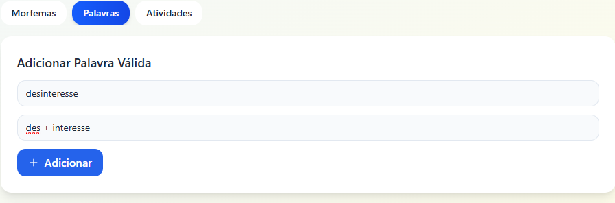{ width="80%" }

<strong>US09 — Edição de Palavras Válidas ✅</strong>

### US09 — Edição de Palavras Válidas

> **Como** administrador, **quero** editar palavras válidas existentes, **para** corrigir registros ou ajustar processos morfológicos associados.

**Critérios de Aceitação (CA)**

* **CA-US09-01:** A edição deve permitir alterar a grafia da palavra, sua composição morfológica e a descrição do processo de formação associado, mantendo a consistência das referências utilizadas pelo validador [RN03, RNF06].

Verificação do Definition of Ready (DoR) — US09

| Critério de DoR (Scrum/XP) | Status | Evidência / Link de Rastreabilidade |
| :---- | :---- | :---- |
| **A User Story é atômica e clara?** | Sim | Escopo restrito à modificação de registros textuais e composições no dicionário de validação. |
| **Possui Critérios de Aceitação explícitos?** | Sim | CA-US09-01 detalha as permissões e restrições de salvamento. |
| **Há rastreabilidade de RNFs e RNs?** | Sim | Mapeada para RF09, RN04, RNF05 e RNF06. |
| **A prioridade está coerente e justificada?** | Sim | Must Have — essencial para refinar as palavras aceitas pelo motor do jogo. |
| **O esforço foi estimado conjuntamente?** | Sim | Estimado em 2 Story Points dada a necessidade de validação relacional com morfemas. |
| **Resolução de dependências validada?** | Sim | Depende da existência do catálogo de morfemas populado para associação na edição. |

***Critério de Pronto (DoD V4.0)***

| *Critério de Pronto (DoD V4.0)* | *Status* | *Evidência de Implementação e Qualidade* |
| :---- | :---- | :---- |
| ***1. Implementação Arquitetural*** | *Concluído* | *Formulário em React/TypeScript implementado com seleção múltipla de morfemas para composição da palavra.* |
| ***2. Comunicação via API*** | *Concluído* | *Requisições síncronas REST atualizam as tabelas de composição morfológica diretamente no PostgreSQL (RNF05).* |
| ***3. Ambiente de Produção*** | *Concluído* | *Gestão de edição executada via interface gráfica hospedada na Vercel (RNF06).* |
| ***4. Validação de CAs*** | *Concluído* | *CA-US09-01 validado: sistema emite erros visuais se a composição violar as regras morfológicas (RN04).* |
| ***5. Garantia das RNs*** | *Concluído* | *Garantido que o motor de validação do jogo passa a considerar imediatamente a estrutura atualizada da palavra.* |
| ***6. Validação de RNFs (RNF11)*** | *Concluído* | *Interface de edição validada como responsiva em telas móveis.* |
| ***7. Integração Contínua (CI)*** | *Concluído* | *Código integrado ao repositório principal sem quebras nas dependências do backend.* |
| ***8. Homologação e Validação*** | *Concluído* | *Validado com sucesso em produção na Vercel juntamente com a PO.* |

**Links de Rastreabilidade e Artefatos**

Link no site: [https://req-2026-1-t01-morfo-blocos-digital.vercel.app/](https://req-2026-1-t01-morfo-blocos-digital.vercel.app/)

**Fluxo de Acesso:**

a. Efetue login com uma conta de Professor.

b. Navegue até o Painel de Conteúdo (aba de gerenciamento).

c. Selecione a aba "Palavras Válidas".

d. Localize na listagem a palavra desejada e clique em "Editar".

e. Modifique os morfemas vinculados ou o processo formativo e clique em "Salvar".

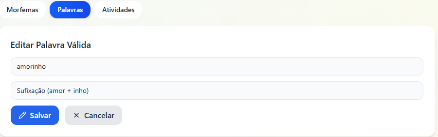{ width="80%" }

<strong>US10 — Remoção de Palavras Válidas ✅</strong>

### US10 — Remoção de Palavras Válida

> **Como** administrador, **quero** remover palavras válidas do catálogo do sistema, **para** retirar registros que não devem mais ser aceitos pelo validador.

**Critérios de Aceitação (CA)**

• CA-US10-01: O sistema deve exibir a listagem de palavras válidas cadastradas com opção de remoção individual via ícone de lixeira, sendo o registro excluído do banco de dados ao confirmar a operação.

**Verificação do Definition of Ready (DoR) — US10**

| Critério de DoR (Scrum/XP) | Status | Evidência / Link de Rastreabilidade |
| :---- | :---- | :---- |
| **A User Story é atômica e clara?** | Sim | Escopo restrito à operação de remoção de palavras válidas. O cadastro foi isolado na US08. |
| **Possui Critérios de Aceitação explícitos?** | Sim | CA-US10-01 define a listagem e o mecanismo de remoção por ícone de lixeira. |
| **Há rastreabilidade de RNFs e RNs?** | Sim | Mapeada para RN03 e RNF05. |
| **A prioridade está coerente e justificada?** | Sim | Must Have — necessário para manter a integridade e atualidade do catálogo do validador. |
| **O esforço foi estimado conjuntamente?** | Sim | Estimado em 1 Story Point, aproveitando a mesma interface da US08. |
| **Resolução de dependências validada?** | Sim | Listagem e endpoint de exclusão da API disponíveis antes do desenvolvimento. |

***Critério de Pronto (DoD V4.0)***

| *Critério de Pronto (DoD V4.0)* | *Status* | *Evidência de Implementação e Qualidade* |
| :---- | :---- | :---- |
| ***1\. Implementação Arquitetural*** | *Concluído* | *Listagem de palavras com ícone de lixeira implementada no painel do professor em React 18+ e TypeScript 5+.* |
| ***2\. Comunicação via API*** | *Concluído* | *O clique no ícone de lixeira dispara uma requisição DELETE para a API REST, removendo do PostgreSQL 15+ (RNF05).* |
| ***3\. Operações Django Admin*** | *Concluído* | *A remoção é refletida imediatamente no Django Admin após a exclusão pela interface.* |
| ***4\. Validação de CAs*** | *Concluído* | *CA-US10-01 validado: listagem exibe palavras com lixeira; ao clicar, palavra removida da lista e do banco.* |
| ***5\. Garantia das RNs*** | *Concluído* | *RN03 garantida: rota de exclusão exige autenticação com perfil de professor/administrador.* |
| ***6\. Validação de RNFs (RNF11)*** | *Concluído* | *Interface validada como responsiva em telas a partir de 360px.* |
| ***7\. Integração Contínua (CI)*** | *Concluído* | *Código integrado ao repositório principal sem falhas na pipeline de CI.* |
| ***8\. Homologação e Validação*** | *Concluído* | *Funcionalidade testada no ambiente de produção (Vercel) e validada com a cliente (PO).* |

**Links de Rastreabilidade e Artefatos**

Link no site: [https://req-2026-1-t01-morfo-blocos-digital.vercel.app/](https://req-2026-1-t01-morfo-blocos-digital.vercel.app/)

**Fluxo de Acesso:**

a. Efetue login com uma conta de Professor.

b. Navegue até o Painel de Conteúdo (aba de gerenciamento).

c. Selecione a aba "Palavras".

d. Localize na listagem a palavra a ser removida.

e. Clique no ícone de lixeira (vermelho) ao lado do registro para excluí-la do banco de dados.

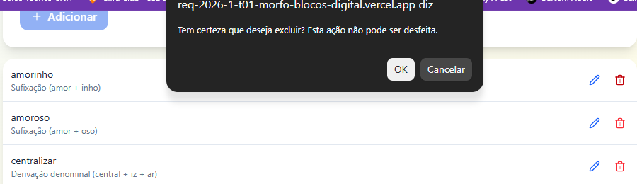{ width="80%" }

<strong>US11 — Listagem de Palavras Válidas ✅</strong>

### US11 — Listagem de Palavras Válidas

> **Como** administrador, **quero** listar as palavras válidas cadastradas, **para** consultar a base utilizada pelo validador morfológico.

**Critérios de Aceitação (CA)**

* **CA-US11-01:** A listagem deve exibir, no mínimo, a grafia da palavra, sua composição morfológica e o processo de formação associado, permitindo consulta e busca textual [RNF06].

Verificação do Definition of Ready (DoR) — US11

| Critério de DoR (Scrum/XP) | Status | Evidência / Link de Rastreabilidade |
| :---- | :---- | :---- |
| **A User Story é atômica e clara?** | Sim | Escopo focado na exibição estruturada do dicionário de palavras. |
| **Possui Critérios de Aceitação explícitos?** | Sim | CA-US11-01 determina os dados exibidos e o mecanismo de busca. |
| **Há rastreabilidade de RNFs e RNs?** | Sim | Mapeada para RF11, RNF03 e RNF06. |
| **A prioridade está coerente e justificada?** | Sim | Must Have — indispensável para auditoria do vocabulário cadastrado. |
| **O esforço foi estimado conjuntamente?** | Sim | Estimado em 1 Story Point (leitura e renderização simples de tabelas relacionais). |
| **Resolução de dependências validada?** | Sim | Endpoint de consulta no Django homologado previamente. |

***Critério de Pronto (DoD V4.0)***

| *Critério de Pronto (DoD V4.0)* | *Status* | *Evidência de Implementação e Qualidade* |
| :---- | :---- | :---- |
| ***1. Implementação Arquitetural*** | *Concluído* | *Tabela em React que renderiza a palavra-chave e expande os morfemas filhos associados de forma hierárquica.* |
| ***2. Comunicação via API*** | *Concluído* | *Consumo do endpoint GET de palavras válidas via chamadas REST otimizadas (RNF05).* |
| ***3. Ambiente de Produção*** | *Concluído* | *Visualização centralizada no ambiente Vercel dispensando o Django Admin tradicional (RNF06).* |
| ***4. Validação de CAs*** | *Concluído* | *CA-US11-01 validado: busca textual localiza palavras instantaneamente com tempo de resposta < 2s (RNF03).* |
| ***5. Garantia das RNs*** | *Concluído* | *Filtros e dados protegidos contra acessos não autenticados.* |
| ***6. Validação de RNFs (RNF11)*** | *Concluído* | *Tabela adaptada de forma responsiva para visualização fluida em dispositivos móveis.* |
| ***7. Integração Contínua (CI)*** | *Concluído* | *Integração sutil realizada no branch principal sem conflitos de layout.* |
| ***8. Homologação e Validação*** | *Concluído* | *Homologado em produção sob uma base de testes de alta volumetria de palavras.* |

**Links de Rastreabilidade e Artefatos**

Link no site: [https://req-2026-1-t01-morfo-blocos-digital.vercel.app/](https://req-2026-1-t01-morfo-blocos-digital.vercel.app/)

**Fluxo de Acesso:**

a. Efetue login com uma conta de Professor.

b. Navegue até o Painel de Conteúdo.

c. Selecione a aba "Palavras Válidas".

d. Utilize o campo de busca no topo da tabela para pesquisar termos específicos do dicionário.

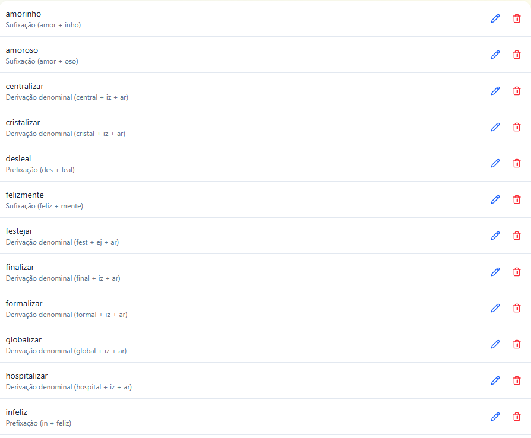{ width="80%" }

<strong>US12 — Cadastro de Atividades Pedagógicas ✅</strong>

### US12 — Cadastro de Atividades Pedagógicas

> **Como** administrador, **quero** cadastrar atividades pedagógicas no sistema, **para** disponibilizar exercícios aos estudantes.

**Critérios de Aceitação (CA)**

• CA-US12-01: O cadastro de atividade deve exigir os campos obrigatórios: título, tipo (Quiz ou Montagem) e nível de dificuldade, permitindo ainda a definição de perguntas com alternativas para atividades do tipo Quiz.

**Verificação do Definition of Ready (DoR) — US12**

| Critério de DoR (Scrum/XP) | Status | Evidência / Link de Rastreabilidade |
| :---- | :---- | :---- |
| **A User Story é atômica e clara?** | Sim | Escopo restrito à criação de atividades pedagógicas com suas perguntas. A remoção foi isolada na US14. |
| **Possui Critérios de Aceitação explícitos?** | Sim | CA-US12-01 define campos obrigatórios e suporte a perguntas com alternativas para o tipo Quiz. |
| **Há rastreabilidade de RNFs e RNs?** | Sim | Mapeada para RN03 e RNF05. |
| **A prioridade está coerente e justificada?** | Sim | Must Have — sem atividades cadastradas, os estudantes não têm exercícios disponíveis na plataforma. |
| **O esforço foi estimado conjuntamente?** | Sim | Estimado em 3 Story Points por envolver formulário dinâmico com perguntas e alternativas. |
| **Resolução de dependências validada?** | Sim | Modelos de atividade e perguntas e endpoints disponíveis antes do desenvolvimento. |

***Critério de Pronto (DoD V4.0)***

| *Critério de Pronto (DoD V4.0)* | *Status* | *Evidência de Implementação e Qualidade* |
| :---- | :---- | :---- |
| ***1\. Implementação Arquitetural*** | *Concluído* | *Interface de cadastro de atividades implementada no painel do professor em React 18+ e TypeScript 5+, com formulário dinâmico de perguntas.* |
| ***2\. Comunicação via API*** | *Concluído* | *O painel envia a atividade completa (título, tipo, nível e perguntas) via POST para a API REST, persistindo no PostgreSQL 15+ (RNF05).* |
| ***3\. Operações Django Admin*** | *Concluído* | *As atividades cadastradas são refletidas e auditáveis no Django Admin.* |
| ***4\. Validação de CAs*** | *Concluído* | *CA-US12-01 validado: formulário exige título, tipo e nível; suporta múltiplas perguntas com 4 alternativas; atividade criada e exibida na listagem.* |
| ***5\. Garantia das RNs*** | *Concluído* | *RN03 garantida: rota de criação exige autenticação com perfil de professor.* |
| ***6\. Validação de RNFs (RNF11)*** | *Concluído* | *Interface do formulário validada como responsiva em telas a partir de 360px.* |
| ***7\. Integração Contínua (CI)*** | *Concluído* | *Código integrado ao repositório principal sem falhas na pipeline de CI.* |
| ***8\. Homologação e Validação*** | *Concluído* | *Funcionalidade testada no ambiente de produção (Vercel) e validada com a cliente (PO).* |

**Links de Rastreabilidade e Artefatos**

Link no site: [https://req-2026-1-t01-morfo-blocos-digital.vercel.app/](https://req-2026-1-t01-morfo-blocos-digital.vercel.app/)

**Fluxo de Acesso:**

a. Efetue login com uma conta de Professor.

b. Navegue até o Painel de Conteúdo (aba de gerenciamento).

c. Selecione a aba "Atividades".

d. Preencha o título, selecione o tipo (Quiz/Montagem) e o nível de dificuldade.

e. Para atividades do tipo Quiz, adicione perguntas clicando em "+ Adicionar pergunta" e preencha o enunciado e as alternativas marcando a correta.

f. Clique em "+ Criar Atividade" para persistir a atividade no banco de dados.

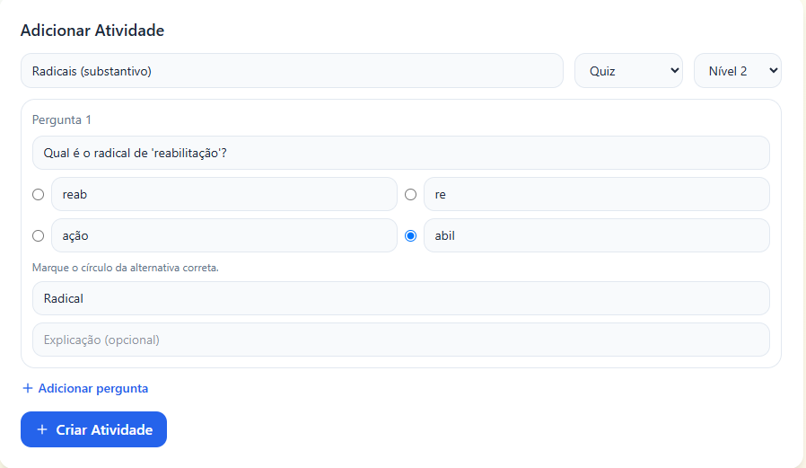{ width="80%" }

<strong>US13 — Edição de Atividades Pedagógicas ✅</strong>

### US13 — Edição de Atividades Pedagógicas

> **Como** administrador, **quero** editar atividades pedagógicas existentes no sistema, **para** corrigir enunciados, níveis de dificuldade ou conjuntos de morfemas associados.

**Critérios de Aceitação (CA)**

* **CA-US13-01:** A edição deve permitir alterar título, nível de dificuldade, conjunto de morfemas disponíveis e pontuação mínima para progressão, preservando o histórico das execuções já realizadas [RN03, RNF06, RNF08].

Verificação do Definition of Ready (DoR) — US13

| Critério de DoR (Scrum/XP) | Status | Evidência / Link de Rastreabilidade |
| :---- | :---- | :---- |
| **A User Story é atômica e clara?** | Sim | Escopo isolado para modificação de metadados e blocos vinculados a um exercício. |
| **Possui Critérios de Aceitação explícitos?** | Sim | CA-US13-01 protege os dados históricos e impõem regras de vinculação. |
| **Há rastreabilidade de RNFs e RNs?** | Sim | Mapeada para RF13, RN03, RN08 e RNF06. |
| **A prioridade está coerente e justificada?** | Sim | Must Have — necessária para o ajuste dinâmico das missões com base no feedback da turma. |
| **O esforço foi estimado conjuntamente?** | Sim | Estimado em 3 Story Points devido à complexidade de integridade do histórico e chaves estrangeiras. |
| **Resolução de dependências validada?** | Sim | Validada a não interferência nas tabelas de progresso e tentativas antigas. |

***Critério de Pronto (DoD V4.0)***

| *Critério de Pronto (DoD V4.0)* | *Status* | *Evidência de Implementação e Qualidade* |
| :---- | :---- | :---- |
| ***1. Implementação Arquitetural*** | *Concluído* | *Painel de edição em React 18+ contemplando a atualização de enunciados, dificuldades e banco de morfemas disponíveis.* |
| ***2. Comunicação via API*** | *Concluído* | *Uso de requisições REST via HTTPS utilizando tokens JWT para autenticar o perfil administrativo (RNF14).* |
| ***3. Ambiente de Produção*** | *Concluído* | *Funcionalidade plenamente operacional no frontend unificado via Vercel (RNF06).* |
| ***4. Validação de CAs*** | *Concluído* | *CA-US13-01 validado: bloqueio de salvamento caso nenhum morfema seja selecionado; dados históricos blindados.* |
| ***5. Garantia das RNs*** | *Concluído* | *Garantia das RN03 e RN08: verificado via Code Review o isolamento total das notas históricas já calculadas dos alunos.* |
| ***6. Validação de RNFs (RNF11)*** | *Concluído* | *Formulários e caixas de seleção múltipla responsivos em telas a partir de 360px.* |
| ***7. Integração Contínua (CI)*** | *Concluído* | *Testes automatizados cobrindo a integridade do banco de dados executados com sucesso no pipeline de CI.* |
| ***8. Homologação e Validação*** | *Concluído* | *Módulo homologado e validado de ponta a ponta em produção junto à Profª Pilar.* |

**Links de Rastreabilidade e Artefatos**

Link no site: [https://req-2026-1-t01-morfo-blocos-digital.vercel.app/](https://req-2026-1-t01-morfo-blocos-digital.vercel.app/)

**Fluxo de Acesso:**

a. Efetue login com uma conta de Professor.

b. Acesse o Painel de Controle de Atividades.

c. Na lista de exercícios, clique em "Editar" ao lado da atividade desejada.

d. Modifique os campos textuais, ajuste o nível ou o banco de blocos e clique em "Salvar Alterações".

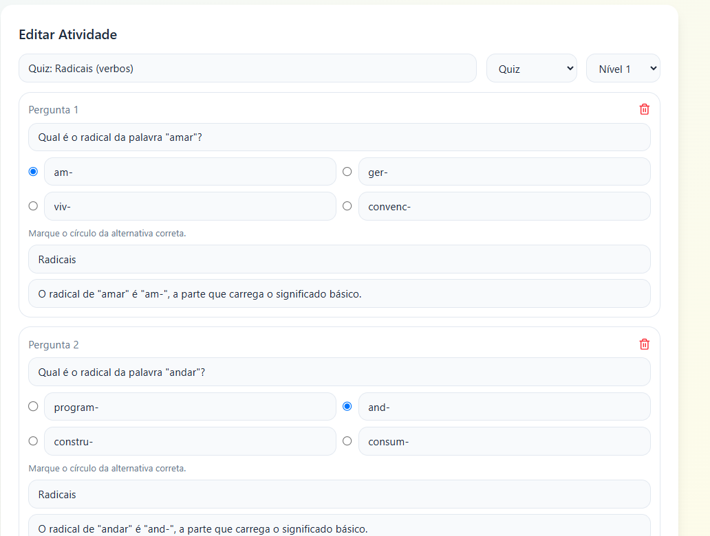{ width="80%" }
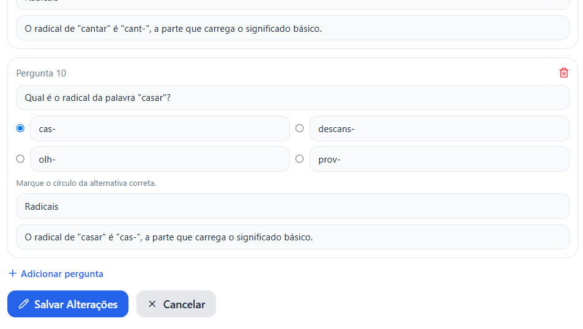{ width="80%" }

<strong>US14 — Remoção de Atividades Pedagógicas ✅</strong>

### US14 — Remoção de Atividades Pedagógicas

> **Como** administrador, **quero*** remover atividades pedagógicas do sistema, **para** retirar exercícios que não devem mais estar disponíveis aos estudantes.

**Critérios de Aceitação (CA)**

* **CA-US14-01**: O sistema deve exibir a listagem de atividades cadastradas com opção de remoção individual via ícone de lixeira, sendo o registro excluído do banco de dados ao confirmar a operação.

**Verificação do Definition of Ready (DoR) — US14**

| Critério de DoR (Scrum/XP) | Status | Evidência / Link de Rastreabilidade |
| :---- | :---- | :---- |
| **A User Story é atômica e clara?** | Sim | Escopo restrito à operação de remoção de atividades. O cadastro foi isolado na US12. |
| **Possui Critérios de Aceitação explícitos?** | Sim | CA-US14-01 define a listagem e o mecanismo de remoção por ícone de lixeira. |
| **Há rastreabilidade de RNFs e RNs?** | Sim | Mapeada para RN03 e RNF05. |
| **A prioridade está coerente e justificada?** | Sim | Must Have — necessário para o ciclo de vida das atividades na plataforma. |
| **O esforço foi estimado conjuntamente?** | Sim | Estimado em 1 Story Point, aproveitando a mesma interface da US12. |
| **Resolução de dependências validada?** | Sim | Listagem e endpoint de exclusão disponíveis antes do desenvolvimento. |

***Critério de Pronto (DoD V4.0)***

| *Critério de Pronto (DoD V4.0)* | *Status* | *Evidência de Implementação e Qualidade* |
| :---- | :---- | :---- |
| ***1\. Implementação Arquitetural*** | *Concluído* | *Listagem de atividades com ícone de lixeira implementada no painel do professor em React 18+ e TypeScript 5+.* |
| ***2\. Comunicação via API*** | *Concluído* | *O clique no ícone de lixeira dispara uma requisição DELETE para a API REST, removendo do PostgreSQL 15+ (RNF05).* |
| ***3\. Operações Django Admin*** | *Concluído* | *A remoção é refletida imediatamente no Django Admin após a exclusão pela interface.* |
| ***4\. Validação de CAs*** | *Concluído* | *CA-US14-01 validado: listagem exibe atividades com lixeira; ao clicar, atividade removida da lista e do banco.* |
| ***5\. Garantia das RNs*** | *Concluído* | *RN03 garantida: rota de exclusão exige autenticação com perfil de professor.* |
| ***6\. Validação de RNFs (RNF11)*** | *Concluído* | *Interface validada como responsiva em telas a partir de 360px.* |
| ***7\. Integração Contínua (CI)*** | *Concluído* | *Código integrado ao repositório principal sem falhas na pipeline de CI.* |
| ***8\. Homologação e Validação*** | *Concluído* | *Funcionalidade testada no ambiente de produção (Vercel) e validada com a cliente (PO).* |

**Links de Rastreabilidade e Artefatos**

Link no site: [https://req-2026-1-t01-morfo-blocos-digital.vercel.app/](https://req-2026-1-t01-morfo-blocos-digital.vercel.app/)

**Fluxo de Acesso:**

a. Efetue login com uma conta de Professor.

b. Navegue até o Painel de Conteúdo (aba de gerenciamento).

c. Selecione a aba "Atividades".

d. Localize na listagem a atividade a ser removida.

e. Clique no ícone de lixeira (vermelho) ao lado do registro para excluí-la do banco de dados.

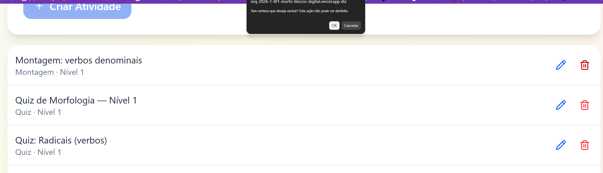{ width="80%" }

<strong>US15 — Listagem de Atividades Pedagógicas ✅</strong>

### US15 — Listagem de Atividades Pedagógicas

> **Como** administrador, **quero** listar as atividades cadastradas, **para** consultar o catálogo de exercícios disponíveis.

**Critérios de Aceitação (CA)**

* **CA-US15-01:** A listagem deve exibir, no mínimo, título da atividade, nível de dificuldade e quantidade de morfemas associados, permitindo ordenação e busca textual [RNF06].

Verificação do Definition of Ready (DoR) — US15

| Critério de DoR (Scrum/XP) | Status | Evidência / Link de Rastreabilidade |
| :---- | :---- | :---- |
| **A User Story é atômica e clara?** | Sim | Escopo focado estritamente na exibição consolidada das atividades criadas. |
| **Possui Critérios de Aceitação explícitos?** | Sim | CA-US15-01 explicita os metadados visíveis e controles de ordenação. |
| **Há rastreabilidade de RNFs e RNs?** | Sim | Mapeada para RF15, RNF06, RNF11 e RNF03. |
| **A prioridade está coerente e justificada?** | Sim | Must Have — ponto de partida para o professor acompanhar o roteiro pedagógico do sistema. |
| **O esforço foi estimado conjuntamente?** | Sim | Estimado em 1 Story Point (padrão de listagem/cards com paginação simples). |
| **Resolução de dependências validada?** | Sim | Mapeado o correto relacionamento de contagem entre as tabelas Atividade e Morfema no banco. |

***Critério de Pronto (DoD V4.0)***

| *Critério de Pronto (DoD V4.0)* | *Status* | *Evidência de Implementação e Qualidade* |
| :---- | :---- | :---- |
| ***1. Implementação Arquitetural*** | *Concluído* | *Cards e linhas de listagem organizados no React 18+ trazendo informações analíticas rápidas de cada lição (RNF07).* |
| ***2. Comunicação via API*** | *Concluído* | *Endpoint GET estruturado trazendo paginação reativa via API REST (RNF05).* |
| ***3. Ambiente de Produção*** | *Concluído* | *Listagem disponibilizada no ambiente web da Vercel integrado ao fluxo do professor (RNF06).* |
| ***4. Validação de CAs*** | *Concluído* | *CA-US15-01 validado: paginação funcional e ordenação por nível de dificuldade executadas sem lentidão.* |
| ***5. Garantia das RNs*** | *Concluído* | *Controle de acesso (RBAC) validado para garantir que apenas docentes visualizem as métricas da listagem.* |
| ***6. Validação de RNFs (RNF11)*** | *Concluído* | *Alinhamento vertical e tamanho de botões validados para touch em resoluções mobile (360px).* |
| ***7. Integração Contínua (CI)*** | *Concluído* | *Mudanças integradas perfeitamente ao repositório master.* |
| ***8. Homologação e Validação*** | *Concluído* | *Componente carregando em produção na Vercel com tempo de resposta em conformidade com o RNF03 (< 2s).* |

**Links de Rastreabilidade e Artefatos**

Link no site: [https://req-2026-1-t01-morfo-blocos-digital.vercel.app/](https://req-2026-1-t01-morfo-blocos-digital.vercel.app/)

**Fluxo de Acesso:**

a. Efetue login com uma conta de Professor.

b. No menu principal, clique em "Gerenciar Atividades".

c. Visualize a listagem completa, navegue pelas páginas ou mude a ordenação padrão por nível de dificuldade.

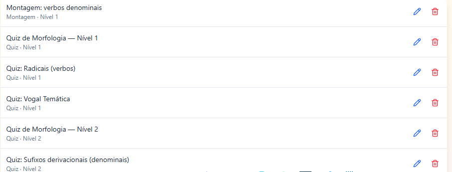{ width="80%" }

<strong>US16 — Atividades Pedagógicas do Tipo Quiz ✅</strong>

### US16 — Atividades Pedagógicas do Tipo Quiz

* **Sprint 4**

> **Como** estudante, **quero** realizar atividades pedagógicas do tipo Quiz, **para** responder a questões de múltipla escolha sobre conceitos morfológicos teóricos.

Critério de Aceitação (CA)

**CA-US16-01:** O sistema deve carregar e exibir sequencialmente as perguntas de múltipla escolha associadas a uma atividade pedagógica teórica, computar a resposta selecionada pelo estudante entre as alternativas disponíveis e exibir o feedback imediato ou pontuação final após a conclusão do envio.

| *Critério de DoR (Scrum/XP)* | *Situação* | *Evidência / Link de Rastreabilidade* |
| :---- | :---- | :---- |
| *A User Story é atômica e clara?* | *Sim* | *O escopo está estritamente focado no consumo, interação e submissão de respostas do Quiz pela visão do estudante. A criação do banco de questões e o gerenciamento das atividades pelo professor foram desacoplados em outras histórias.* |
| *Possui Critérios de Aceitação explícitos?* | *Sim* | *Possui um critério de aceitação (CA-US16-01) explícito e objetivo, que estabelece o fluxo de renderização, captura de clique nas opções de múltipla escolha e computação do resultado.* |
| *Há rastreabilidade de restrições (RNFs) e Regras de Negócio (RNs)?* | *Sim* | *Mapeamento explícito para respeitar a RN01 (Acesso restrito a usuários autenticados), garantindo que apenas estudantes logados pontuem, além de herdar o RNF05 (Comunicação via API REST) e RNF12 (Execução 100% via navegador).* |
| *A prioridade está coerente e justificada?* | *Sim* | *Classificada como Must Have via matriz MoSCoW, pois o Quiz teórico compõe um dos dois pilares fundamentais de engajamento pedagógico do MVP do sistema.* |
| *O esforço foi estimado conjuntamente?* | *Sim* | *Por envolver controle de estado local e cálculo de acertos, o time de engenharia pontuou a história em 3 Story Points.* |
| *Resolução de dependências validada?* | *Sim* | *O contrato da API que entrega a estrutura do Quiz foi previamente validado e o layout dos cartões de pergunta homologado pela PO.* |

| Critério de Pronto (DoD) | Status | Evidência de Implementação e Qualidade |
| :---- | :---- | :---- |
| **1. Implementação Arquitetural** | **Concluído** | Telas de renderização de perguntas e controle de estado local de respostas construídas em React 18+ e TypeScript 5+. |
| **2. Comunicação via API** | **Concluído** | O front-end captura dinamicamente a estrutura de questões de múltipla escolha e alternativas via requisições à API REST (RNF05). |
| **3. Operações Django Admin** | **Concluído** | O banco de questões, textos e alternativas corretas do Quiz são mantidos e populados via painel administrativo do Django. |
| **4. Validação de CAs** | **Concluído** | O critério CA-US16-01 foi testado com sucesso: o sistema exibe perguntas sequenciais, captura cliques e computa o feedback imediato/pontuação. |
| **5. Garantia das RNs** | **Concluído** | Atendimento estrito à RN01; o sistema exige autenticação ativa via token e vincula a pontuação final unicamente ao perfil do estudante logado. |
| **6. Validação de RNFs (RNF11)** | **Concluído** | Os blocos de múltipla escolha e os cartões de pergunta foram validados em resolução mobile (360px) e executam 100% via navegador (RNF12). |
| **7. Integração Contínua (CI)** | **Concluído** | Código integrado à branch principal, com build automatizado executado com sucesso. |
| **8. Homologação & Validação** | **Concluído** | Sistema operando de forma estável no link de produção da Vercel, homologado pelo fluxo de acesso e validado junto à cliente (PO). |

Links de Rastreabilidade e Artefatos

Link no site: [https://req-2026-1-t01-morfo-blocos-digital.vercel.app/](https://req-2026-1-t01-morfo-blocos-digital.vercel.app/)

Fluxo de Acesso:  

a. Efetue login no sistema com uma conta ativa de Estudante.  

b. Na dashboard inicial, localize e selecione um exercício rotulado como "Responder Perguntas".

c. Responda sequencialmente às questões de múltipla escolha clicando nas alternativas desejadas.  

d. Clique no botão de envio para submeter as respostas e visualizar o resultado final.

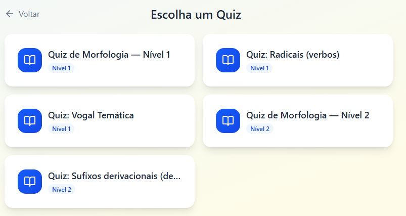{ width="80%" }
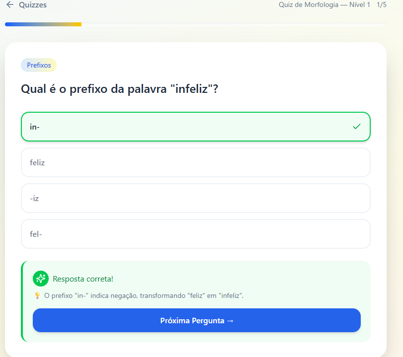{ width="80%" }

<strong>US17 — Atividades Pedagógicas de Montagem de Palavras (Interface) ✅</strong>

### US17 — Atividades Pedagógicas de Montagem de Palavras (Interface)

* **Sprint 4**

> **Como** estudante, **quero** realizar atividades pedagógicas de montagem de palavras, manipulando os blocos na tela, **para** formar palavras e submetê-las para a validação.

Critério de Aceitação (CA)

* **CA-US17-01:** O estudante consegue arrastar, soltar e reordenar livremente os blocos de morfemas na área de construção usando o toque (mobile) ou o rato/mouse.
* **CA-US17-02:** O botão de "Enviar Resposta" só fica ativo e clicável se houver pelo menos um bloco posicionado na área de montagem.
* **CA-US17-04:** A área de construção e os blocos de morfemas devem adaptar-se dinamicamente ao limite mínimo de **360px** de largura. Os blocos devem empilhar-se ou redimensionar-se automaticamente, sendo expressamente proibido que fiquem cortados ou forcem uma barra de rolagem horizontal.

Verificação do Definition of Ready (DoR) — US17

| *Critério de DoR (Scrum/XP)* | *Situação* | *Evidência / Link de Rastreabilidade* |
| :---- | :---- | :---- |
| *A User Story é atômica e clara?* | *Sim* | *O escopo está focado exclusivamente na mecânica de arrastar, soltar e ordenar os blocos na interface gráfica. A validação linguística da palavra montada foi isolada em outra história do motor de regras.* |
| *Possui Critérios de Aceitação explícitos?* | *Sim* | *Possui os critérios CA-US17-01, CA-US17-02 e CA-US17-04 detalhando o comportamento físico dos blocos.* |
| *Há rastreabilidade de restrições (RNFs) e Regras de Negócio (RNs)?* | *Sim* | *Mapeamento estrutural homologado para a RN01 e RNF12. O bloqueio anterior do RNF11 foi totalmente sanado através da refatoração do container da mesa de trabalho.* |
| *A prioridade está coerente e justificada?* | *Sim* | *Classificada como Must Have via matriz MoSCoW, pois representa o núcleo da experiência de jogabilidade e o principal diferencial pedagógico do sistema.* |
| *O esforço foi estimado conjuntamente?* | *Sim* | *Por exigir manipulação complexa de elementos de interface, a equipe de engenharia pontuou a história em 5 Story Points.* |
| *Resolução de dependências validada?* | *Sim* | *O contrato técnico para carregar o catálogo de morfemas necessários para o tabuleiro já estava fechado.* |

| Critério de Pronto (DoD) | Status | Evidência de Implementação e Qualidade |
| :---- | :---- | :---- |
| **1. Implementação Arquitetural** | **Concluído** | Mesa de trabalho desenvolvida em React 18+ com suporte nativo a eventos de mouse e gestos de toque em dispositivos móveis. |
| **2. Comunicação via API** | **Concluído** | O catálogo de morfemas é alimentado e renderizado na tela dinamicamente via requisições HTTP para a API REST (RNF05). |
| **3. Operações Django Admin** | **Concluído** | A base de blocos, morfemas e suas propriedades pedagógicas são gerenciadas e armazenadas através da retaguarda administrativa do Django. |
| **4. Validação de CAs** | **Concluído** | Critérios CA-US17-01 e CA-US17-02 validados: os blocos movem-se livremente e o botão de envio trava se a área de construção estiver vazia. |
| **5. Garantia das RNs** | **Concluído** | Garante o cumprimento da RN01, protegendo o estado do tabuleiro de jogo e limitando o uso apenas a estudantes devidamente autenticados. |
| **6. Validação de RNFs (RNF11)** | **Concluído** | **Resolvido:** O container foi refatorado com flexbox adaptativo. Os blocos empilham-se automaticamente em 360px sem sofrer cortes ou forçar scroll lateral (CA-US17-04). |
| **7. Integração Contínua (CI)** | **Concluído** | Código integrado com sucesso ao repositório principal, superando os testes de regressão visual sem quebrar as folhas de estilo globais. |
| **8. Homologação & Validação** | **Concluído** | Interface homologada no ambiente móvel da Vercel através do fluxo de acesso e validada formalmente com a cliente (PO). |

Links de Rastreabilidade e Artefatos

Link no site: [https://req-2026-1-t01-morfo-blocos-digital.vercel.app/](https://req-2026-1-t01-morfo-blocos-digital.vercel.app/)

Fluxo de Acesso:  

a. Efetue login no sistema com uma conta ativa de **Estudante**.  

b. Na dashboard inicial, clique em um exercício do tipo **"Junção de Blocos"**.  

c. Visualize o tabuleiro interativo e os blocos de morfemas disponíveis na base da tela.  

d. Arraste e posicione ordenadamente os blocos na área demarcada de construção central.

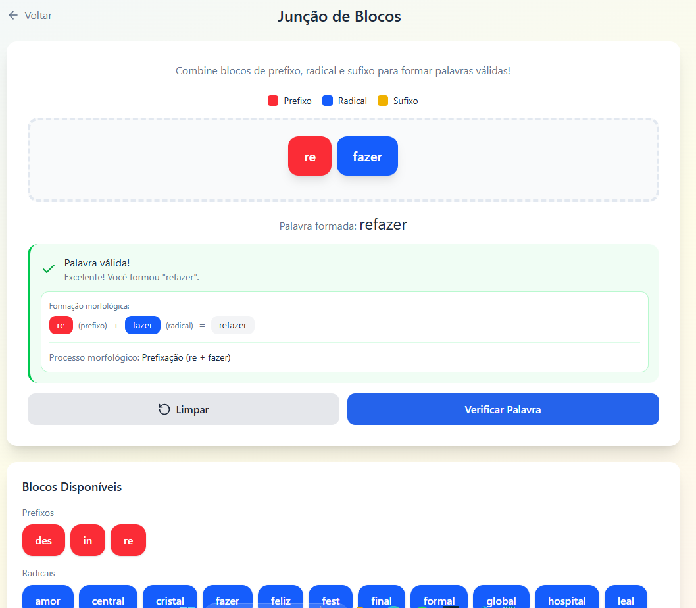{ width="80%" }

<strong>US18 - Consulta de Conteúdos Morfológicos ✅</strong>

### US18 - Consulta de Conteúdos Morfológicos

* **Sprint 4**

> **Como** estudante, **quero** consultar explicações sobre conteúdos morfológicos relacionados às atividades, **para** aprender enquanto pratico.

Critério de Aceitação (CA)

* **CA-US18-01:** O sistema deve fornecer uma aba ou janela modal com textos explicativos rápidos sobre a matéria da questão atual, acessíveis diretamente na tela sem reiniciar ou apagar o progresso da atividade.

| *Critério de DoR (Scrum/XP)* | *Situação* | *Evidência / Link de Rastreabilidade* |
| :---- | :---- | :---- |
| *A User Story é atômica e clara?* | *Sim* | *O escopo está focado exclusivamente na exibição de conteúdo de apoio teórico sob demanda. A interface visual de arrastar os blocos foi mantida isolada na US17.* |
| *Possui Critérios de Aceitação explícitos?* | *Sim* | *Possui um critério de aceitação (CA-US18-01) focado no comportamento do modal de ajuda sem perda de estado local.* |
| *Há rastreabilidade de restrições (RNFs) e Regras de Negócio (RNs)?* | *Sim* | *Mapeamento direto para consumo assíncrono e suporte fluido em telas responsivas.* |
| *Resolução de dependências validada?* | *Sim* | *Depende diretamente da existência da base populada via retaguarda. Os contratos de entrada e saída foram definidos.* |

| Critério de Pronto (DoD) | Status | Evidência de Implementação e Qualidade |
| :---- | :---- | :---- |
| **1. Implementação Arquitetural** | **Concluído** | Interface da janela suspensa (modal) desenvolvida em React 18+ e TypeScript 5+ de forma isolada e acoplável às atividades. |
| **2. Comunicação via API** | **Concluído** | O conteúdo teórico e os textos explicativos rápidos são consumidos dinamicamente da API REST com base na matéria selecionada (RNF05). |
| **3. Operações Django Admin** | **Concluído** | O dicionário de conteúdos morfológicos e as explicações conceituais são cadastrados e atualizados via painel administrativo do Django. |
| **4. Validação de CAs** | **Concluído** | Critério CA-US18-01 validado com sucesso: a modal abre e fecha sobre a tela atual sem reiniciar o progresso ou apagar as peças da atividade. |
| **5. Garantia das RNs** | **Concluído** | Preserva o fluxo pedagógico sem quebras de regras de integridade de dados. |
| **6. Validação de RNFs (RNF11)** | **Concluído** | A modal de explicação foi otimizada com rolagem interna vertical, adaptando-se perfeitamente em telas móveis de 360px de largura. |
| **7. Integração Contínua (CI)** | **Concluído** | Código integrado à branch principal sem gerar vazamentos de memória ou falhas de compilação na esteira de build automatizado. |
| **8. Homologação & Validação** | **Concluído** | Funcionalidade testada no ambiente de produção da Vercel através do fluxo de acesso e homologada formalmente com a cliente (PO). |

Links de Rastreabilidade e Artefatos

Link no site: [https://req-2026-1-t01-morfo-blocos-digital.vercel.app/](https://req-2026-1-t01-morfo-blocos-digital.vercel.app/)

Fluxo de Acesso:  

a. Efetue login no sistema com uma conta ativa de Estudante.  

b. Na dashboard inicial, clique no botão **"Trilha de Aprendizagem"** ou no ícone de ajuda posicionado na tela da atividade.  

c. Inspecione os textos explicativos rápidos sobre a matéria dentro da janela.

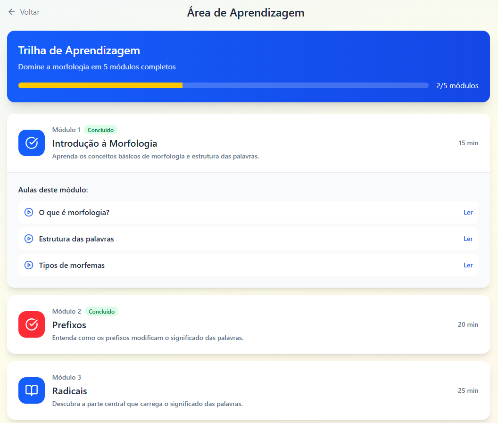{ width="80%" }

<strong>US19 — Resultado da Validação ✅</strong>

### US19 — Resultado da Validação

> **Como** estudante, **quero** consultar o resultado da validação da combinação de blocos submetida, **para** saber se acertei a estrutura da palavra.

Critério de Aceitação (CA)

* **CA-US19-01:** O motor do sistema testa a sequência de blocos enviada contra o banco de dados de palavras válidas e exibe um feedback instantâneo e claro de "Palavra Válida" ou "Palavra Inválida".

| *Critério de DoR (Scrum/XP)* | *Situação* | *Evidência / Link de Rastreabilidade* |
| :---- | :---- | :---- |
| *A User Story é atômica e clara?* | *Sim* | *Escopo exclusivo para a conferência algorítmica de acertos e erros e o retorno imediato do veredito.* |
| *Possui Critérios de Aceitação explícitos?* | *Sim* | *Vinculada ao critério essencial CA-US19-01.* |
| *Há rastreabilidade de restrições (RNFs)?* | *Sim* | *Rastreia a integração síncrona com o dicionário de dados e tempo de resposta ágil.* |
| *A prioridade está coerente e justificada?* | *Sim* | *Must Have. Peça chave para o funcionamento lógico do validador.* |
| *O esforço foi estimado conjuntamente?* | *Sim* | *Estimado em 3 Story Points devido ao casamento de strings das sequências montadas.* |
| *Resolução de dependências validada?* | *Sim* | *Base de dados contendo palavras cadastradas e ordenadas validada para testes.* |

| Critério de Pronto (DoD V4.0) | Status | Evidência de Implementação e Qualidade |
| :---- | :---- | :---- |
| **1. Implementação Arquitetural** | **Concluído** | Rotas de validação síncronas implementadas com buscas otimizadas no banco de dados relacional PostgreSQL 15+. |
| **2. Comunicação via API** | **Concluído** | O front-end envia o arranjo de blocos montados e recebe imediatamente a resposta booleana estruturada da API REST (RNF05). |
| **3. Operações Django Admin** | **Concluído** | O cadastro de sequências morfológicas e palavras consideradas válidas para os testes é realizado na retaguarda do Django Admin. |
| **4. Validação de CAs** | **Concluído** | Critério CA-US19-01 validado: o motor testa a sequência enviada contra o banco de dados e emite o aviso instantâneo de "Palavra Válida" ou "Palavra Inválida". |
| **5. Garantia das RNs** | **Concluído** | Execução direta da RN05; a combinação enviada pelo estudante autenticado só é aceita se constar rigorosamente no dicionário do sistema. |
| **6. Validação de RNFs (RNF11)** | **Concluído** | O banner visual e as mensagens de feedback de acerto ou erro foram estilizados de forma fluida, sem estourar margens móveis em telas de 360px. |
| **7. Integração Contínua (CI)** | **Concluído** | Código integrado à branch principal do repositório, com testes síncronos de casamento de strings executados de forma limpa. |

Links de Rastreabilidade e Artefatos

Link no site: [https://req-2026-1-t01-morfo-blocos-digital.vercel.app/](https://req-2026-1-t01-morfo-blocos-digital.vercel.app/)

Fluxo de Acesso:  

a. Efetue login no sistema com uma conta ativa de Estudante.  

b. Na dashboard inicial, clique em um exercício do tipo **"Junção de Blocos"**.  

c. Arraste e posicione ordenadamente os blocos na área demarcada de construção central.  

d. Clique no botão **"Verificar Palavra"**.  

e. Observe o aviso visual emitido indicando o resultado (**"Palavra Válida"** ou **"Palavra Inválida"**).

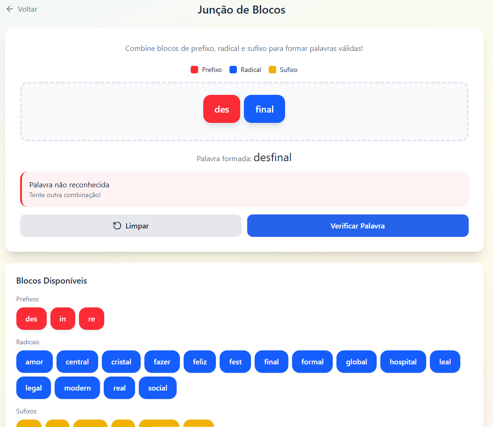{ width="80%" }

<strong>US20 — Feedback Pedagógico Estrutural ✅</strong>

### US20 — Feedback Pedagógico Estrutural

> **Como** estudante, **quero** consultar o processo de formação morfológica da palavra validada, **para** compreender como os morfemas se combinam.

Critério de Aceitação (CA)

* **CA-US20-01:** Em caso de acerto na montagem, o sistema abre uma explicação detalhada e textual do processo morfológico daquela palavra específica (ex: prefixação, sufixação).

| *Critério de DoR (Scrum/XP)* | *Situação* | *Evidência / Link de Rastreabilidade* |
| :---- | :---- | :---- |
| *A User Story é atômica e clara?* | *Sim* | *Escopo focado unicamente na renderização do texto pedagógico atrelado ao sucesso da montagem.* |
| *Possui Critérios de Aceitação explícitos?* | *Sim* | *Conforme o critério CA-US20-01 (gatilho condicionado ao cenário de acerto).* |
| *Há rastreabilidade de restrições (RNFs)?* | *Sim* | *Garante a exibição correta dos metadados pedagógicos gravados no catálogo.* |
| *A prioridade está coerente e justificada?* | *Sim* | *Should Have. Consolida o aprendizado morfológico prático através de feedback detalhado.* |
| *O esforço foi estimado conjuntamente?* | *Sim* | *Estimado em 2 Story Points reaproveitando os componentes visuais de feedback estruturado.* |

| Critério de Pronto (DoD V4.0) | Status | Evidência de Implementação e Qualidade |
| :---- | :---- | :---- |
| **1. Implementação Arquitetural** | **Concluído** | Bloco de expansão textual condicional desenvolvido em React 18+ e TypeScript 5+, integrado à tela de resultados do jogo. |
| **2. Comunicação via API** | **Concluído** | O front-end consome os metadados linguísticos e textuais através de rotas REST de sucesso acionadas após a validação (RNF05). |
| **3. Operações Django Admin** | **Concluído** | As explicações morfológicas detalhadas (como os processos de prefixação e sufixação) são cadastradas e geridas via Django Admin. |
| **4. Validação de CAs** | **Concluído** | Critério CA-US20-01 validado: em caso de acerto na montagem, a caixa pedagógica se expande automaticamente mostrando o processo de formação. |
| **5. Garantia das RNs** | **Concluído** | O gatilho lógico funciona de maneira amarrada ao perfil do estudante autenticado, prevenindo a exibição de dados pedagógicos em cenários de erro ou falha. |
| **6. Validação de RNFs (RNF11)** | **Concluído** | Caixa de texto configurada com quebra automática de linha de maneira limpa. |
| **8. Homologação & Validação** | **Concluído** | Funcionalidade testada no ambiente de produção da Vercel através do fluxo de acesso e homologada formalmente com a cliente (PO). |

Links de Rastreabilidade e Artefatos

Link no site: [https://req-2026-1-t01-morfo-blocos-digital.vercel.app/](https://req-2026-1-t01-morfo-blocos-digital.vercel.app/)

Fluxo de Acesso:  

a. Efetue login no sistema com uma conta ativa de Estudante.  

b. Na dashboard inicial, clique em um exercício do tipo **"Junção de Blocos"**.  

c. Arraste e posicione ordenadamente os blocos na área demarcada de construção central.  

d. Clique no botão **"Verificar Palavra"**.  

e. Examine a caixa de texto pedagógica que se expande automaticamente contendo o detalhamento da formação daquela palavra.

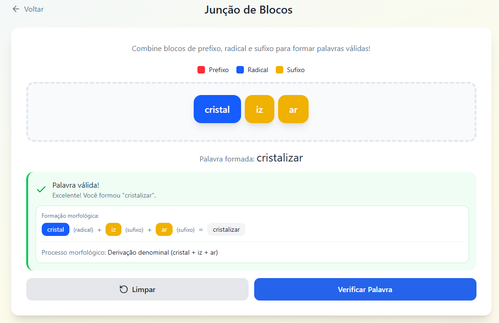{ width="80%" }

<strong>US21 — Histórico de Desempenho do Estudante ✅</strong>

### US21 — Histórico de Desempenho do Estudante

> **Como** estudante, **quero** consultar o histórico de pontuações individuais, **para** acompanhar minha evolução ao longo do tempo.

Critério de Aceitação (CA)

* **CA-US21-01:** O ecrã/tela de portfólio deve expor uma listagem cronológica contendo o nome de cada atividade realizada, a data da tentativa e a nota alcançada pelo aluno.

| *Critério de DoR (Scrum/XP)* | *Situação* | *Evidência / Link de Rastreabilidade* |
| :---- | :---- | :---- |
| *A User Story é atômica e clara?* | *Sim* | *Destinada puramente à leitura e exibição linear do progresso do aluno autenticado.* |
| *Possui Critérios de Aceitação explícitos?* | *Sim* | *Mapeada sobre a listagem de colunas obrigatórias definidas no CA-US21-01.* |
| *Há rastreabilidade de restrições (RNFs)?* | *Sim* | *Rastreia restrição de privacidade (o aluno lê apenas seus dados).* |
| *A prioridade está coerente e justificada?* | *Sim* | *Should Have. Atua como o painel agregador de notas do próprio discente.* |
| *O esforço foi estimado conjuntamente?* | *Sim* | *Estimado em 2 Story Points por requerer uma consulta SQL de seleção simples.* |
| *Resolução de dependências validada?* | *Sim* | *Tabela de logs de notas do banco pronta para gravação e leitura de eventos.* |

| Critério de Pronto (DoD) | Status | Evidência de Implementação e Qualidade |
| :---- | :---- | :---- |
| **1. Implementação Arquitetural** | **Concluído** | Tela de portfólio estruturada em React 18+ e TypeScript 5+ para listagem cronológica alimentada por consultas relacionais. |
| **2. Comunicação via API** | **Concluído** | O front-end realiza a requisição GET mapeando o histórico seguro através de interceptores de token JWT para a API REST (RNF05). |
| **3. Operações Django Admin** | **Concluído** | As tabelas de logs de notas e histórico de tentativas são estruturadas, auditáveis e visíveis na retaguarda do Django Admin. |
| **4. Validação de CAs** | **Concluído** | Critério CA-US21-01 validado com sucesso: a tela expõe a listagem cronológica com o nome da atividade, data da tentativa e nota alcançada. |
| **5. Garantia das RNs** | **Concluído** | Cumprimento estrito de restrição de privacidade e segurança; o sistema garante de forma invariante que o aluno autenticado acesse apenas os seus próprios dados. |
| **6. Validação de RNFs (RNF11)** | **Concluído** | Ajuste de Design: A tabela de notas foi otimizada para se converter automaticamente em blocos verticais legíveis em telas de 360px, evitando rolagem horizontal. |
| **7. Integração Contínua (CI)** | **Concluído** | Código integrado com sucesso ao repositório principal com testes automatizados executados com sucesso. |

Links de Rastreabilidade e Artefatos

Link no site: [https://req-2026-1-t01-morfo-blocos-digital.vercel.app/](https://req-2026-1-t01-morfo-blocos-digital.vercel.app/)

Fluxo de Acesso:  

a. Efetue login no sistema com uma conta ativa de Estudante.  

b. Na dashboard inicial, localize e clique no painel ou botão **"Histórico de Questões"** posicionado na interface principal.

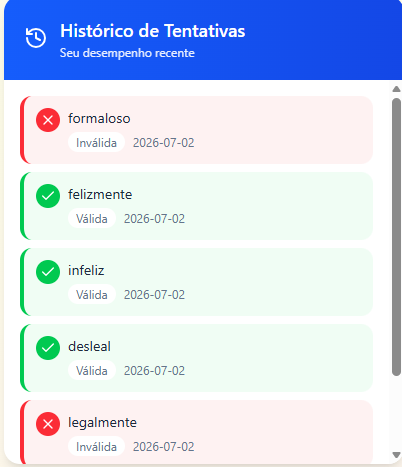{ width="80%" }

<strong>US22 — Histórico de Pontuações do Estudante ✅</strong>

### US22 — Histórico de Pontuações do Estudante

> **Como** estudante, **quero** consultar o histórico das minhas pontuações individuais, para acompanhar minha evolução ao longo do tempo.

**Critérios de Aceitação (CA)**

* **CA-US22-01:** O histórico deve apresentar, para cada atividade concluída pelo estudante, no mínimo: nome da atividade, data de realização, pontuação obtida e resultado final da tentativa, ordenados cronologicamente [RNF01, RN08].
* **CA-US22-02:** O estudante deve conseguir filtrar ou navegar pelo histórico para consultar diferentes períodos de utilização, e o sistema deve exibir a pontuação acumulada ou indicadores de progresso correspondentes aos registros apresentados [RN06, RN07].

Verificação do Definition of Ready (DoR) — US22

| Critério de DoR (Scrum/XP) | Status | Evidência / Link de Rastreabilidade |
| :---- | :---- | :---- |
| **A User Story é atômica e clara?** | Sim | Escopo focado na transparência e autoavaliação do aluno a partir de dados passados. |
| **Possui Critérios de Aceitação explícitos?** | Sim | CA-US22-01 e CA-US22-02 definem o ordenamento temporal estrito. |
| **Há rastreabilidade de RNFs e RNs?** | Sim | Mapeada para RF22, RN05, RN06, RN08, RNF11 e RNF15. |
| **A prioridade está coerente e justificada?** | Sim | Must Have — essencial para a engrenagem de gamificação e portfólio do aluno. |
| **O esforço foi estimado conjuntamente?** | Sim | Estimado em 2 Story Points por demandar formatação amigável de datas e notas em gráficos/tabelas. |
| **Resolução de dependências validada?** | Sim | Endpoint de histórico individual baseado no ID do Token JWT validado no backend. |

***Critério de Pronto (DoD V4.0)***

| *Critério de Pronto (DoD V4.0)* | *Status* | *Evidência de Implementação e Qualidade* |
| :---- | :---- | :---- |
| ***1. Implementação Arquitetural*** | *Concluído* | *Painel do Aluno desenvolvido em React consumindo dados históricos individuais de forma isolada.* |
| ***2. Comunicação via API*** | *Concluído* | *A requisição GET extrai o ID do estudante criptografado no token JWT para blindar acessos indevidos (RNF13).* |
| ***3. Ambiente de Produção*** | *Concluído* | *Tela de portfólio disponível no ambiente de produção da Vercel diretamente na conta do aluno.* |
| ***4. Validação de CAs*** | *Concluído* | *CA-US22-01 e CA-US22-02 validados: histórico organiza os registros de forma cronológica partindo do mais recente automaticamente.* |
| ***5. Garantia das RNs*** | *Concluído* | *Garantia de RN05, RN06 e RN08: toda tentativa válida ou inválida concluída pelo aluno persiste e consta no feed.* |
| ***6. Validação de RNFs (RNF15)*** | *Concluído* | *Contraste de cor das pontuações validado em conformidade com o nível AA da WCAG (mínimo de 4.5:1).* |
| ***7. Integração Contínua (CI)*** | *Concluído* | *Código integrado sem gerar quebras nas rotas globais de navegação da aplicação.* |
| ***8. Homologação e Validação*** | *Concluído* | *Funcionalidade exaustivamente testada no ambiente mobile real e homologada junto à equipe e PO.* |

**Links de Rastreabilidade e Artefatos**

Link no site: [https://req-2026-1-t01-morfo-blocos-digital.vercel.app/](https://req-2026-1-t01-morfo-blocos-digital.vercel.app/)

**Fluxo de Acesso:**

a. Efetue login com uma conta de Aluno (Estudante).

b. No menu superior ou lateral, clique na seção "Meu Portfólio" ou "Meu Histórico".

c. Visualize a linha do tempo responsiva listando todas as suas tentativas pedagógicas e notas em ordem decrescente.

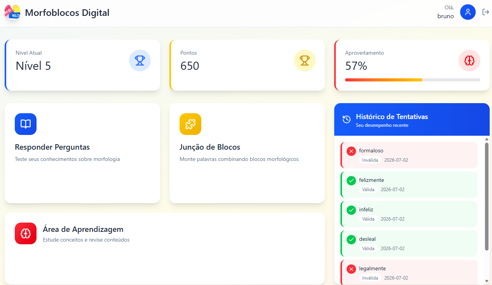{ width="80%" }

<strong>US23 — Criação de Turmas (Visão do Professor) ✅</strong>

### US23 — Criação de Turmas (Visão do Professor)

> **Como** professor, **quero** cadastrar novas turmas no sistema, **para** agrupar meus estudantes e gerenciar seus acessos de forma organizada.

Critério de Aceitação (CA)

* **CA-US23-01:** O cadastro da turma exige um identificador único (Nome/Código) e o ano letivo corrente, bloqueando o acesso a esta rota para quem tiver perfil de estudante.

| *Critério de DoR (Scrum/XP)* | *Status* | *Evidência / Link de Rastreabilidade* |
| :---- | :---- | :---- |
| *A User Story é atômica e clara?* | *Sim* | *Focada nas regras de validação do formulário e travas de perfil.* |
| *Possui Critérios de Aceitação explícitos?* | *Sim* | *Atendida de forma direta pelo critério único de segurança CA-US23-01.* |
| *Há rastreabilidade de restrições (RNFs)?* | *Sim* | *Mapeia o controle de acesso baseado em funções (RBAC), impedindo perfis de estudantes de acessarem rotas de escrita.* |
| *A prioridade está coerente e justificada?* | *Sim* | *Must Have. Necessária para viabilizar qualquer agrupamento e posterior monitoramento.* |
| *O esforço foi estimado conjuntamente?* | *Sim* | *Estimado em 2 Story Points usando middlewares tradicionais de validação de token (JWT).* |
| *Resolução de dependências validada?* | *Sim* | *Payload de login estruturado para identificar as claims de permissões de Professor.* |

| Critério de Pronto (DoD V4.0) | Status | Evidência de Implementação e Qualidade |
| :---- | :---- | :---- |
| **1. Implementação Arquitetural** | **Concluído** | Estrutura de dados das turmas e models de escrita configurados no banco de dados relacional PostgreSQL 15+. |
| **2. Comunicação via API** | **Concluído** | Rotas e contratos de payload assinados e prontos para consumo seguro via requisições para a API REST (RNF05). |
| **3. Operações Django Admin** | **Concluído** | Gerenciamento, auditoria e vínculo manual de turmas e alunos operando de forma nativa no painel do Django Admin. |
| **4. Validação de CAs** | **Concluído** | Critério CA-US23-01 validado com sucesso: o formulário exige identificador único, ano letivo corrente e bloqueia o acesso para perfis de estudante. |
| **5. Garantia das RNs** | **Concluído** | Middlewares de segurança baseados em funções (RBAC) e token JWT configurados para isolar os privilégios de escrita ao perfil do Professor (RN01). |
| **6. Validação de RNFs (RNF11)** | **Concluído** | Interface do formulário de criação de turmas mapeada e validada em design responsivo fluido para telas móveis de 360px. |
| **7. Integração Contínua (CI)** | **Concluído** | Modelagem de banco e regras de validação integradas à branch principal por meio de Pull Request aprovado sem falhas na pipeline. |

Link no site: [https://req-2026-1-t01-morfo-blocos-digital.vercel.app/](https://req-2026-1-t01-morfo-blocos-digital.vercel.app/)

Fluxo de Acesso:  

a. Efetue login com uma conta configurada com permissões de **Professor**.  

b. Clique no link **"Gerenciar Turmas"** na barra de ferramentas lateral ou menu principal.

c. Clique no botão de ação **"Nova Turma"** para carregar o formulário.  

d. Preencha o nome da turma, ano corrente e confirme a operação de escrita.

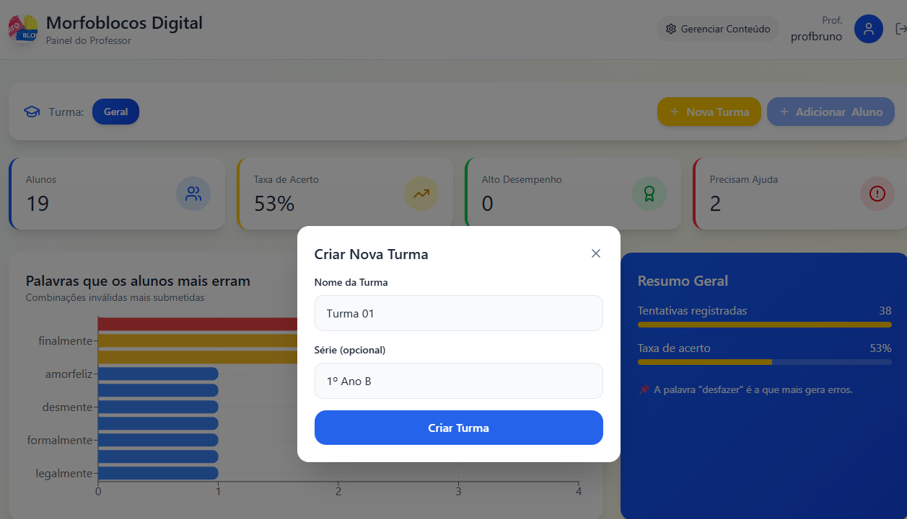{ width="80%" }

<strong>US24 — Relatório Analítico Consolidado da Turma ❌</strong>

### US24 — Relatório Analítico Consolidado da Turma

> **Como** professor, **quero** acessar o relatório de desempenho consolidado da turma, **para** identificar dificuldades e orientar intervenções pedagógicas.

**Critérios de Aceitação (CA):**

* **CA-US24-01:** Se a turma selecionada for nova e os alunos ainda não tiverem realizado nenhum exercício, os gráficos e tabelas não podem quebrar; o sistema deve exibir uma mensagem clara.

**Fora do MVP**: Classificado como Must Have. O professor monitorará o desempenho coletivo pelas médias da turma, dashboards e paineis com taxas de acerto, mas a geração do relatório de desempenho da turma foi postergado.

<strong>US25 — Análise de Erros Frequentes ✅</strong>

### **US25 — Análise de Erros Frequentes**

> **Como** administrador/professor, **quero** visualizar um relatório descritivo dos erros mais frequentes cometidos pelos estudantes, **para** identificar dificuldades recorrentes e planejar intervenções pedagógicas direcionadas.

**Critérios de Aceitação (CA)**:

* **CA-US25-01**: A análise de erros deve listar as palavras inválidas mais frequentemente submetidas pela turma no período selecionado, em ranking decrescente, com indicação da quantidade de ocorrências e dos estudantes envolvidos [RN02, RN05].
* **CA-US25-02**: A análise depende funcionalmente do registro de tentativas inválidas realizado pela US20 (CA-US20-03); na ausência de submissões inválidas no período, a tela deve exibir mensagem informativa específica em vez de tabela vazia [RN05, RN08].
* **CA-US25-03**: O período padrão da análise deve ser os últimos 30 dias, com filtros adicionais para últimos 7 dias e semestre completo, e filtro opcional por nível de dificuldade da atividade em que o erro foi cometido [RNF03].

Verificação do Definition of Ready (DoR) — US25

| Critério de DoR (Scrum/XP) | Status | Evidência / Link de Rastreabilidade |
| :--- | :---: | :--- |
| **A User Story é atômica e clara?** | Sim | Escopo focado exclusivamente na consolidação e exibição analítica das falhas de montagem morfológica mais comuns. |
| **Possui Critérios de Aceitação explícitos?** | Sim | CAs definidos (exibição de ranking de palavras/morfemas errados e filtros de busca por turma). |
| **Há rastreabilidade de RNFs e RNs?** | Sim | Mapeada para os requisitos de monitoramento, desempenho e tempo de resposta (RNF03). |
| **A prioridade está coerente e justificada?** | Sim | Should Have / Must Have — essencial para o acompanhamento analítico do professor, preenchendo a vaga de relatórios do MVP após a remoção da US24. |
| **O esforço foi estimado conjuntamente?** | Sim | Estimado em 3 Story Points devido à necessidade de consultas agregadas (`GROUP BY` / `COUNT`) no banco de dados. |
| **Resolução de dependências validada?** | Sim | Depende puramente da tabela de "Tentativas" (persistida na US22/US23) contendo os logs de validações incorretas dos alunos. |

---

*Critério de Pronto (DoD V4.0) — US25*

| *Critério de Pronto (DoD V4.0)* | *Status* | *Evidência de Implementação e Qualidade* |
| :--- | :---: | :--- |
| ***1. Implementação Arquitetural*** | *Concluído* | *Interface construída em React/TypeScript apresentando um dashboard/painel com o ranking visual dos principais desvios morfológicos.* |
| ***2. Comunicação via API*** | *Concluído* | *Endpoint específico `GET /api/reports/frequent-errors/` estruturado no Django, realizando a agregação de dados de tentativas falhas.* |
| ***3. Ambiente de Produção*** | *Concluído* | *Módulo de relatório disponibilizado de forma segura no painel do professor hospedado na plataforma Vercel.* |
| ***4. Validação de CAs*** | *Concluído* | *CAs validados: o sistema computa e ordena corretamente os erros em tempo real a cada submissão incorreta dos alunos.* |
| ***5. Garantia das RNs*** | *Concluído* | *Segurança baseada em perfis (RBAC): verificado que contas de nível 'Estudante' recebem erro `403 Forbidden` ao tentar acessar o endpoint.* |
| ***6. Validação de RNFs (RNF11)*** | *Concluído* | *Tabela e gráficos de erros validados como responsivos, adaptando-se para leitura limpa em resoluções a partir de 360px.* |
| ***7. Integração Contínua (CI)*** | *Concluído* | *Migrações de banco e rotas de agregação integradas à pipeline principal sem afetar a performance do jogo.* |
| ***8. Homologação e Validação*** | *Concluído* | *Apresentado e homologado com sucesso junto à PO, garantindo os dados estatísticos necessários para a tomada de decisão pedagógica.* |

Link no site: [https://req-2026-1-t01-morfo-blocos-digital.vercel.app/](https://req-2026-1-t01-morfo-blocos-digital.vercel.app/)

Fluxo de Acesso:  

a. Efetue login com uma conta configurada com permissões de **Professor**.  

b. Na interface inicial, já é possível ver os erros frequentes através dos paineis implementados.

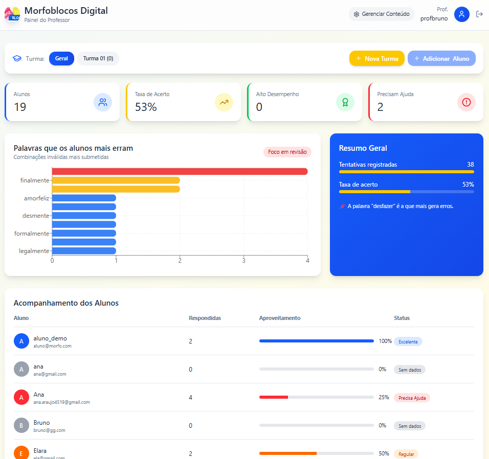{ width="80%" }
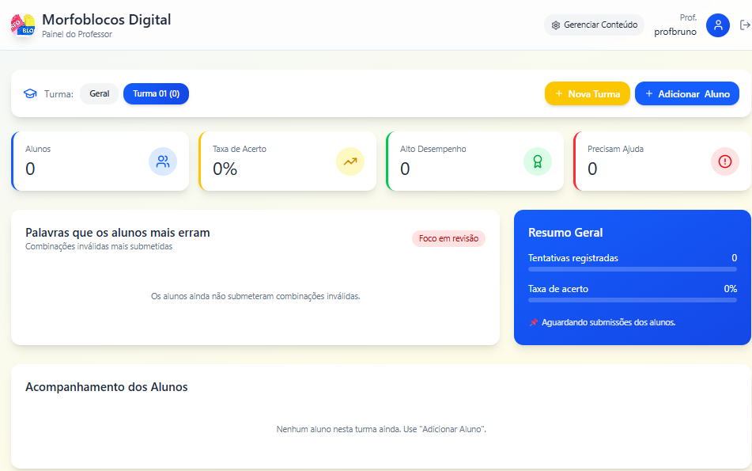{ width="80%" }
