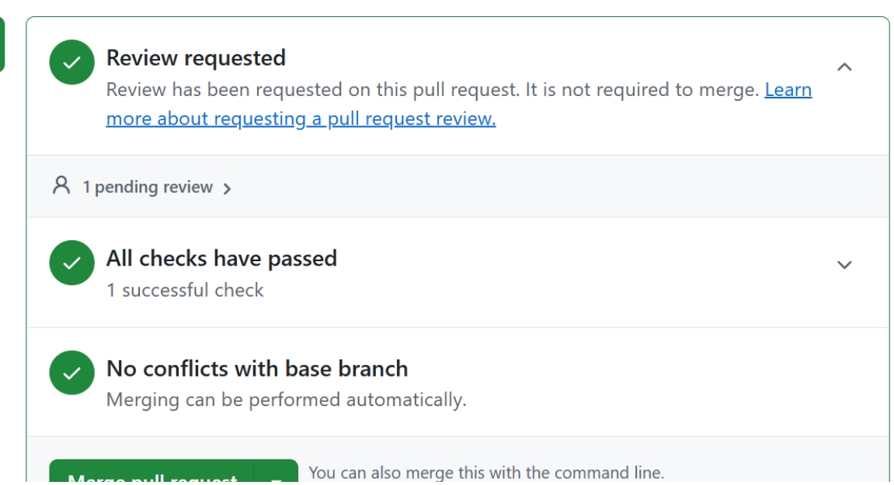

## __4. Estratégias de Engenharia de Software__

Para o desenvolvimento do MorfoBlocos Digital, foram definidas estratégias de engenharia de software que permitam organizar o trabalho da equipe, acompanhar a evolução do sistema e garantir entregas ao longo do semestre, considerando as limitações de tempo e o contexto acadêmico do projeto.

### __4.1 Estratégia Priorizada__

O projeto adota uma abordagem ágil, com ciclo de vida iterativo e incremental, permitindo a evolução contínua dos requisitos a partir do feedback da cliente ao longo das entregas.

Para a gestão do desenvolvimento, é utilizado o Scrum, responsável pela organização do trabalho em sprints, priorização do backlog e realização de reuniões de planejamento, revisão e retrospectiva.

Complementarmente, são aplicadas práticas do XP (eXtreme Programming), como TDD, refatoração e integração contínua, especialmente devido à necessidade de garantir a corretude da lógica de validação das combinações de morfemas.

Dessa forma, Scrum e XP são utilizados de maneira complementar: o Scrum organiza o processo e a interação com a cliente, enquanto o XP orienta a implementação técnica.

### __4.2 Quadro Comparativo__

A seguir, apresenta-se uma comparação entre processos que poderiam ser utilizados no projeto.

| **Critério** | **ScrumXP** | **OpenUP (Open Unified Process)** |
| :--- | :--- | :--- | 
| **Abordagem Geral** | Abordagem ágil que combina Scrum para gestão (sprints, backlog e eventos) com práticas técnicas do XP (TDD, refatoração e integração contínua).  | Processo iterativo e incremental baseado no RUP, com maior estruturação e formalização das atividades. |
| **Organização do Trabalho** | Trabalho organizado em sprints (1–2 semanas), com planejamento, revisão e retrospectiva. Desenvolvimento orientado por backlog priorizado e histórias de usuário. | Quatro fases sequenciais (Concepção, Elaboração, Construção e Transição), cada uma contendo iterações com entregáveis definidos.  | 
| **Tratamento dos Requisitos** | Requisitos expressos como histórias de usuário, refinados continuamente com a cliente. Alta adaptação a mudanças ao longo do desenvolvimento. | Requisitos organizados em casos de uso, com maior formalização e controle de mudanças ao longo das iterações. |
| **Qualidade Técnica** | Forte ênfase em práticas do XP, como TDD, refatoração, integração contínua e design simples, promovendo validação contínua do código.  | Qualidade assegurada por validações incrementais e definição arquitetural nas fases iniciais, com menor ênfase em práticas técnicas automatizadas. | 
| **Participação do Cliente** | Alta participação: cliente envolvido continuamente nas sprints, validando incrementos e fornecendo feedback frequente. | Participação mais estruturada, concentrada nas fases e nas revisões de iteração. | 
| **Flexibilidade de Requisitos** | Alta flexibilidade, com adaptação contínua baseada no feedback da cliente. | Flexibilidade moderada, podendo ser limitada por decisões arquiteturais definidas nas fases iniciais. | 
| **Documentação** | Documentação leve, focada no essencial, com maior ênfase na comunicação contínua e nos testes como forma de validação. | Documentação estruturada, com artefatos como visão, casos de uso e planos de iteração. |
| **Adequação ao Projeto MorfoBlocos** | Alta. Adequada à equipe reduzida, à disponibilidade da cliente e à necessidade de evolução contínua e validação da lógica morfológica. | Média. Pode contribuir para organização, mas tende a ser mais rígido e demandar maior esforço documental para o contexto da disciplina. |

### __4.3 Justificativa__

Com base nas características do projeto MorfoBlocos Digital e no quadro comparativo apresentado, foi adotada uma abordagem ágil, utilizando o Scrum como framework de gestão do desenvolvimento e práticas do XP (eXtreme Programming) no desenvolvimento, por ser a alternativa mais adequada ao contexto da equipe, do cliente e do produto.

O principal fator que justifica essa escolha é a natureza evolutiva dos requisitos do projeto. O jogo digital envolve regras morfológicas complexas, validadas continuamente pela cliente, e funcionalidades interativas cujo comportamento esperado só se torna claro ao longo do desenvolvimento. O Scrum, ao organizar o trabalho em ciclos curtos (sprints) e promover feedback contínuo da cliente e validação frequente das funcionalidades desenvolvidas, responde diretamente a esse cenário. Além disso, a cliente (Profª. Pilar) possui disponibilidade para interações frequentes, o que favorece a dinâmica iterativa proposta pela abordagem ágil.

As práticas do XP também se mostram adequadas às necessidades do produto. A lógica de validação automática das combinações de morfemas, que é o núcleo do MorfoBlocos Digital, exige alta confiabilidade no código. O TDD (Test-Driven Development), a refatoração contínua e a integração contínua garantem que essa lógica seja desenvolvida com qualidade e testada de forma sistemática desde o início, reduzindo o risco de defeitos no mecanismo central do jogo.

Em comparação, o OpenUP apresenta uma estrutura de fases mais rígida e maior ênfase na documentação de artefatos formais, como casos de uso e planos de iteração. Embora adequado para projetos que necessitam de maior previsibilidade arquitetural desde o início, o OpenUP pode ser excessivo para o escopo e o prazo da disciplina, além de demandar maior esforço de documentação em um contexto onde a comunicação direta com a cliente é viável e preferível.

Dessa forma, o Scrum, em conjunto com práticas do XP, se mostra a alternativa mais adequada ao projeto, pois permite alinhar a organização do processo com a qualidade técnica do desenvolvimento, lidar com requisitos evolutivos e viabilizar entregas incrementais com validação contínua.

### **4.3 Evidências de Aplicação do eXtreme Programming (XP)** 

Para assegurar a corretude crítica da lógica de validação de combinações de morfemas (RF20), a equipe materializou as práticas do XP da seguinte forma:

* **TDD (Test-Driven Development)**: O núcleo do validador morfológico no backend (Django) foi construído orientado a testes. Foram escritos casos de teste unitários (ex: test_validador.py) contemplando submissões válidas (composição, derivação) e inválidas antes da implementação final da regra de negócio.

* **Integração Contínua (CI)**: O repositório foi configurado com GitHub Actions (ci.yml). Toda nova submissão de código (Pull Request) dispara automaticamente a suíte de testes do Django. O merge só é autorizado se 100% dos testes passarem, impedindo regressões no motor de validação.

* **Refatoração**: O código passou por ciclos de refatoração contínua, onde a lógica de concatenação e consulta ao catálogo de palavras foi extraída diretamente das views da API para uma camada de services isolada, garantindo alta coesão e facilitando a cobertura de testes.

