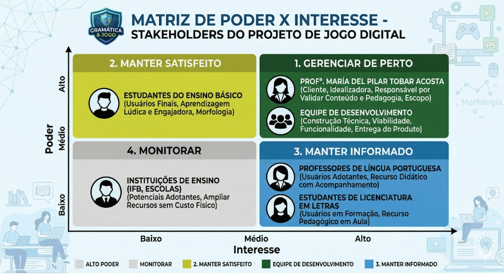
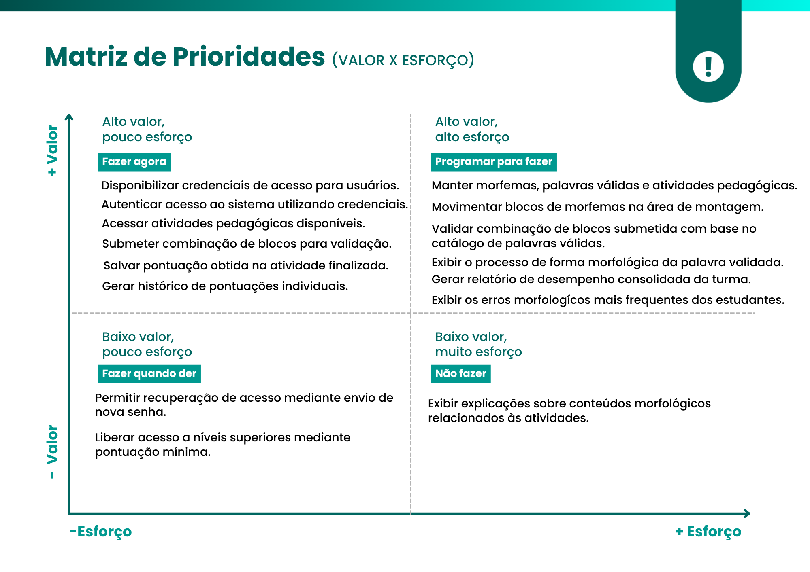

# Visao do produto

## 1. Cenário Atual do Cliente e do Negócio

### __1.1 Identificação do Cliente/Parceiro__

**Nome: Profª. María del Pilar Tobar Acosta.**

**Tipo**: Cliente individual — professora de Língua Portuguesa do Instituto Federal de Brasília (IFB), pesquisadora na área de ensino de morfologia e idealizadora do jogo didático Morfologia em Blocos (MorfoBlocos).

**Representante**: a própria professora María del Pilar Tobar Acosta, autora do jogo físico e principal parte interessada no desenvolvimento da versão digital.

**Forma de contato**: reuniões presenciais e por videoconferência, e-mail e canal de mensagens instantâneas para alinhamentos rápidos.

**Vínculo com o projeto**: cliente real e Product Owner (PO). Será responsável por fornecer o conteúdo didático (morfemas, categorias e processos de formação de palavras), validar as decisões de design e conteúdo e avaliar as entregas realizadas ao longo do desenvolvimento.

### __1.2 Introdução ao Negócio e Contexto__

O MorfoBlocos é uma ferramenta didática para o ensino de morfologia. Atualmente, a operação é analógica, baseada em blocos físicos. O propósito aqui é a entrega de feedback pedagógico sobre a estrutura das palavras. O gargalo atual reside na baixa escalabilidade do modelo físico e na latência do feedback, já que a validação depende 100% da disponibilidade síncrona do professor.

O jogo é composto por peças coloridas que representam morfemas — raízes (ou radicais), prefixos, sufixos e desinências — que podem ser combinadas pelos estudantes para formar diferentes vocábulos. Cada peça traz, de um lado, o morfema em si e, do outro, a classificação do elemento e o processo de formação envolvido (flexão, derivação, derivação parassintética, composição, derivação regressiva e reduplicação). Dessa forma, ao montar palavras, o estudante visualiza não apenas o resultado, mas o processo morfológico que o gerou.

O jogo já foi aplicado em turmas do ensino médio integrado, licenciatura e tecnólogo do IFB Campus São Sebastião, com resultados positivos relatados pela equipe e pelos estudantes participantes. No relatório final do projeto original, a própria idealizadora manifestou a intenção de desenvolver uma versão digital do jogo como forma de ampliar seu alcance e viabilizar seu uso em um número significativo de escolas.

Apesar de seu valor pedagógico, o uso do jogo apresenta limitações operacionais e financeiras. Sua aplicação depende da presença do professor para orientação e validação manual das respostas, o que reduz a autonomia dos estudantes. Além disso, o custo do jogo físico pode dificultar sua ampla adoção por estudantes e instituições de ensino. Nesse contexto, a solução digital proposta não substitui o recurso físico, mas atua como um complemento, ampliando seu alcance e possibilidades de uso.

O público-alvo principal são estudantes do ensino fundamental II e do ensino médio, mas o material também vem sendo utilizado com estudantes de licenciatura em Letras e Pedagogia, como recurso para formação de professores de língua materna.

### __1.3 Rich Picture__

Imagem 1 - Fonte: Autoria Própria via IA

O diagrama representa o funcionamento atual do projeto MorfoBlocos, no qual professores de Língua Portuguesa como a professora Pilar, apresentam o conteúdo de morfologia e os estudantes do ensino médio utilizam o jogo físico para manipular blocos com morfemas, formando palavras e analisando sua estrutura. As atividades são corrigidas manualmente pelo professor, sem registro ou acompanhamento do desempenho. Esse modelo apresenta limitações como a ausência de feedback imediato, a dependência do professor e a restrição do uso ao ambiente de sala de aula, o que dificulta a prática contínua dos alunos. Como proposta de melhoria, o diagrama indica a transição para uma solução digital baseada em uma base estruturada de morfemas, permitindo a realização de exercícios variados, correção automática, acesso fora da sala de aula e acompanhamento do desempenho dos estudantes.

### __1.4 Identificação da Oportunidade ou Problema__

O projeto surge da necessidade de superar o gargalo operacional no ensino de morfologia causado pelo uso exclusivo do jogo físico MorfoBlocos. No cenário atual, a dinâmica pedagógica apresenta uma dependência crítica da mediação do professor, responsável pela orientação e correção manual das atividades, o que impede o acompanhamento individualizado e limita a escalabilidade das práticas em sala de aula.

O fluxo de informação atual é marcado pelo feedback tardio, uma vez que o estudante não recebe validação imediata sobre a classificação de morfemas ou os processos de formação de palavras, como derivação e flexão. Além disso, a ausência de registro sistemático das respostas gera falta de rastreabilidade do aprendizado, impossibilitando que o professor identifique padrões de erro em conceitos como alomorfia e derivação parassintética ao longo do tempo.

A infraestrutura baseada no jogo físico impõe restrições de uso, limitando a prática ao ambiente escolar e à disponibilidade de blocos. Soma-se a isso o custo do material, que dificulta sua aquisição e reduz o acesso por parte dos estudantes. Como consequência, há prejuízo na continuidade do aprendizado e na consolidação dos conceitos morfológicos.

Imagem 2

### __1.5 Desafios do Projeto__

O principal desafio do projeto está na transição de um modelo de ensino baseado na manipulação de blocos físicos e na correção manual para uma solução digital estruturada e integrada. Atualmente, esse processo limita a rastreabilidade das respostas e dificulta o acompanhamento do desempenho dos alunos, devido à ausência de registro sistematizado e à centralização da validação no professor. Outro ponto a ser observado está na estruturação dos dados linguísticos. O sistema deve organizar morfemas, suas variações e relações, incluindo casos como alomorfes e processos de derivação, permitindo a validação automática das respostas de forma consistente.

Além disso, há o desafio relacionado à coleta e análise de dados educacionais. A solução deve registrar as respostas dos alunos, possibilitando a identificação de padrões de erro e o acompanhamento da evolução individual. A usabilidade também é um fator crítico, exigindo uma interface intuitiva e de fácil utilização, sem necessidade de treinamento. Por fim, o sistema deve garantir confiabilidade, permitindo o uso em diferentes contextos e assegurando o armazenamento correto dos dados mesmo com o aumento do volume de informações.

### __1.6 Mapa de Stakeholders__

Os principais stakeholders do projeto são: a professora María del Pilar Tobar Acosta, como cliente, idealizadora do jogo físico e responsável por validar as decisões de conteúdo e pedagógicas; os estudantes do ensino básico e superior, como usuários finais do jogo digital; os professores de Língua Portuguesa que poderão adotar a solução em suas aulas; as instituições de ensino (IFB, escolas públicas e privadas) como potenciais adotantes da solução; e a equipe de desenvolvimento, responsável por construir tecnicamente a solução no contexto da disciplina.

A seguir, é apresentado o quadro-resumo dos stakeholders.

| **Stakeholder**       | **Relação com a solução** | **Interesse Principal**                                         | **Influência**              |
| ---------- | ------ | --------------------------------------------------- | ------------------ |
| Profª. María del Pilar Tobar Acosta | Cliente e idealizadora do jogo físico    | Validar conteúdo, proposta pedagógica, escopo e entregas                |    Alta   |
| Estudantes do ensino básico | Usuários finais do jogo digital    | Aprender morfologia de forma lúdica, visual e engajadora                |    Alta   |
| Professores de Língua Portuguesa | Usuários que aplicam o jogo em sala    | Dispor de recurso didático de fácil acesso e com acompanhamento do aluno                |    Média       |
| Estudantes de Licenciatura em Letras | Usuários em contexto de formação de professores    | Utilizar o jogo como recurso pedagógico em sua formação                |    Média   |
| Instituições de ensino (IFB e escolas) | Potenciais adotantes da solução    | Ampliar recursos didáticos disponíveis sem custo adicional de material físico                |    Baixa   |
| Equipe de desenvolvimento | Responsável pela construção do produto    | Entregar uma solução viável, funcional e alinhada aos objetivos da disciplina               |    Alta   |

Além do quadro-resumo, será elaborada uma matriz Poder × Interesse para classificar os stakeholders nas categorias Gerenciar de Perto, Manter Satisfeito, Manter Informado e Monitorar, orientando a estratégia de comunicação e engajamento da equipe ao longo do projeto. 

### __1.7 Segmentação de Clientes__

Embora o projeto tenha um cliente único e real (a professora María del Pilar), a solução atenderá a diferentes perfis de usuários finais, que podem ser segmentados da seguinte forma:

* Estudantes do Ensino Fundamental II (11 a 14 anos): têm seu primeiro contato mais formal com conteúdos de morfologia. Precisam de uma experiência altamente visual, lúdica e guiada, com linguagem simples e feedback imediato;

* Estudantes do Ensino Médio (15 a 18 anos): já possuem alguma familiaridade com os conceitos morfológicos e podem ser desafiados com atividades mais complexas, envolvendo diferentes processos de formação de palavras e análise de vocábulos mais sofisticados;

* Estudantes de Licenciatura em Letras e Pedagogia: utilizam o jogo tanto como recurso de estudo quanto como referência para sua futura prática docente, demandando explicações teóricas mais aprofundadas e exemplos relacionados ao ensino;

* Professores de Língua Portuguesa: atuam como mediadores do uso do jogo em sala de aula, necessitando de recursos para aplicar o material, propor atividades e, futuramente, acompanhar o desempenho dos estudantes.

## __2. Solução Proposta__

### __2.1 Objetivo Geral do Produto__

Desenvolver uma plataforma web interativa (MorfoBlocos Digital) que viabilize a construção autônoma de palavras a partir de morfemas, fornecendo feedback pedagógico automatizado para os estudantes e garantindo o registro e a rastreabilidade do aprendizado para auxiliar o acompanhamento pelos professores.

### __2.2 Objetivos Específicos (OEs) do Produto__

* (OE1) Proporcionar um ambiente digital interativo que permita aos estudantes a manipulação autônoma e a combinação livre de blocos de morfemas.

* (OE2) Estruturar e disponibilizar um catálogo digital gerenciável de morfemas, palavras válidas e atividades pedagógicas.

* (OE3) Fornecer feedback pedagógico imediato e automatizado sobre a validade morfológica e os processos de formação das combinações realizadas pelo estudante.

* (OE4) Viabilizar o acompanhamento contínuo do aprendizado por meio do registro, consolidação e rastreabilidade do desempenho individual e coletivo dos estudantes.

### __2.3 Características de Produto (Mapeadas com os Objetivos Específicos)__

A solução proposta para o MorfoBlocos Digital deverá contemplar, de forma preliminar, as seguintes características de produto (CP), mapeadas aos objetivos específicos (OE) da seção 2.2 e aos valores de negócio (VN) identificados:

| ID  | Característica de Produto (CP)                         | Descrição resumida   | Contribuição Principal |
|-----|--------------------------------------------------------|--------------------------------------------------------------------------------------------------------------------------------------------------------|-------------------------------|
| CP1 | Controle de Acesso e Perfis de Usuário  | Mecanismo que garante que professores e estudantes acessem ambientes, ferramentas e dados adequados aos seus respectivos papéis no processo de aprendizagem.          | OE4                    |
| CP2 | Administração de Conteúdo Pedagógico     | Ambiente administrativo para que a professora possa gerenciar o catálogo de morfemas de forma autônoma, além de cadastrar e estruturar as atividades.  | OE2                    |
| CP3 | Espaço de Construção Morfológica      | O "tabuleiro" digital: área visual e intuitiva onde o estudante seleciona, arrasta e combina os blocos para explorar e formar palavras livremente.    | OE1                  |
| CP4 | Validador de Estruturas e Feedback em Tempo Real | Sistema que avalia instantaneamente a combinação formada, informando ao estudante se a palavra é válida e qual processo morfológico foi utilizado.   | OE3                    |
| CP5 | Portfólio de Progresso do Estudante        | Painel individualizado para que o aluno consulte suas próprias conquistas, histórico de tentativas e palavras já descobertas.                | OE4                    |
| CP6 | Painel de Monitoramento de Turmas (Dashboard)           | Área exclusiva da docência para visualização de relatórios consolidados, permitindo a identificação ágil de dificuldades recorrentes e padrões de erro das turmas.     | OE4                    |

### __2.4 Tecnologias a Serem Utilizadas__

A solução será desenvolvida com base em uma arquitetura cliente-servidor, garantindo organização e separação das responsabilidades do sistema.

Serão utilizadas as tecnologias React, TypeScript e Tailwind CSS no frontend, permitindo a construção de uma interface interativa, especialmente para a funcionalidade de arrastar blocos.

No backend, será utilizado Python com o framework Django, responsável pela lógica do sistema e validação das palavras. Para o armazenamento de dados, será utilizado o PostgreSQL, para garantir estrutura e confiabilidade.

As tecnologias foram escolhidas por serem simples de utilizar, bem documentadas e adequadas ao tempo da disciplina, permitindo o desenvolvimento de um MVP funcional de forma organizada.

| Camada | Tecnologias |
| :--- | :--- |
| **Frontend** | React + TypeScript + Tailwind CSS |
| **Backend** | Django (Python) |
| **Banco de Dados** | PostgreSQL |

### __2.5 Pesquisa de Mercado e Análise Competitiva__

Existem hoje algumas soluções digitais voltadas ao ensino de língua portuguesa, principalmente baseadas em exercícios e jogos educativos. Um exemplo é o Gramatikê, desenvolvido pela Universidade de Brasília, que funciona offline e propõe o ensino de gramática por meio de atividades interativas e jogos, com conteúdos adaptados a diferentes níveis de aprendizagem.

De modo geral, essas soluções seguem uma lógica baseada em exercícios estruturados, como responder perguntas, completar frases ou escolher alternativas. Esse modelo contribui para a prática e fixação do conteúdo, mas tende a focar mais no reconhecimento de respostas corretas, com menor ênfase na exploração ativa da formação das palavras. Outras plataformas educacionais seguem um padrão semelhante, com forte uso de repetição e memorização, especialmente no ensino de vocabulário e regras gramaticais.

Nesse cenário, ferramentas como o Gramatikê e outros aplicativos educacionais oferecem boa base para a prática, mas exploram de forma mais limitada a construção das palavras a partir de seus elementos.

O MorfoBlocos Digital se diferencia justamente nesse ponto. Enquanto essas soluções se concentram na resolução de exercícios, a proposta do sistema é permitir que o aluno monte palavras utilizando blocos que representam morfemas. Dessa forma, o aluno pode testar combinações, observar resultados e compreender melhor os processos de formação das palavras. Além disso, o sistema oferece correção automática e feedback imediato, tornando o aprendizado mais dinâmico.

Assim, o principal diferencial da solução está na mudança de abordagem: sair de um modelo centrado em respostas para um modelo que incentiva a construção ativa, com foco específico em morfologia.

### __2.6 Viabilidade da Proposta__

A proposta é viável no **contexto da disciplina**, considerando o acesso direto à cliente, o escopo definido e a possibilidade de entrega incremental de um MVP funcional ao final do semestre. Embora a **equipe seja reduzida** e ainda esteja em processo de consolidação do domínio sobre algumas tecnologias adotadas, o projeto foi estruturado de forma compatível com essa realidade, com entregas incrementais, priorização das funcionalidades essenciais e validações frequentes com a cliente.

O principal **risco técnico** está na estruturação da base de morfemas e na implementação do mecanismo de feedback automático, que exige modelagem cuidadosa das relações entre morfemas, alomorfes e processos de formação de palavras. Esse risco é mitigado pela divisão incremental das entregas, pelo uso de tecnologias amplamente documentadas como Django e PostgreSQL, e pelo acesso contínuo à cliente para validação do conteúdo linguístico.

Assim, a proposta é considerada viável, desde que:

* O escopo do MVP permaneça controlado;
* As prioridades sejam mantidas ao longo das entregas; e
* A equipe preserve a estratégia de aprendizado contínuo e validação com a cliente ao longo do desenvolvimento.

### __2.7 Benefícios Esperados__

* **Para a cliente**: ampliar o alcance pedagógico do MorfoBlocos, superando as limitações do jogo físico e viabilizando seu uso em um número significativo de escolas sem custo adicional de material. A solução permitirá ainda que a professora gerencie o conteúdo de morfemas e exercícios de forma autônoma e acompanhe a evolução do aprendizado dos estudantes ao longo do tempo.

* **Para os estudantes**: uma experiência de aprendizado de morfologia mais autônoma, interativa e acessível, com feedback imediato sobre as palavras formadas, progressão de dificuldade clara e acesso ao conteúdo a qualquer momento e lugar, sem depender do jogo físico ou da presença do professor.

* **Para os professores de Língua Portuguesa**: um recurso didático digital pronto para uso em sala de aula ou como atividade complementar, reduzindo o tempo dedicado à correção manual e oferecendo dados sobre o desempenho dos estudantes para orientar intervenções pedagógicas mais precisas.

* **Para a equipe de desenvolvimento**: a oportunidade de aplicar na prática os conceitos da disciplina de Requisitos de Software, desenvolvendo uma solução real com cliente real, utilizando tecnologias amplamente adotadas no mercado e consolidando competências em desenvolvimento web, modelagem de dados e engenharia de requisitos.

## **3. Intervenção Social**

A solução proposta pelo MorfoBlocos Digital tende a produzir uma intervenção social voltada à ampliação do acesso ao ensino de morfologia, à transformação das práticas de correção, acompanhamento e realização de atividades morfológicas, e à redução da dependência da correção manual realizada pelo professor durante as atividades de aprendizagem. 

Entre os principais impactos esperados da solução, destacam-se:

* Ampliar o acesso ao conteúdo de morfologia fora do ambiente físico da sala de aula;
* Permitir maior autonomia dos estudantes na realização das atividades;
* Oferecer feedback automático sobre as palavras formadas;
* Permitir acompanhamento básico do desempenho dos estudantes pelos professores;
* Reduzir limitações operacionais associadas ao uso exclusivo do jogo físico;
* Incentivar o uso de recursos digitais no apoio ao ensino de Língua Portuguesa.

A utilização da plataforma também pode gerar impactos não previstos inicialmente, que precisam ser considerados durante o desenvolvimento e uso do sistema, tais como:

* Dependência maior do acesso à internet e a dispositivos digitais;
* Dificuldade de utilização por usuários com menor familiaridade tecnológica;
* Risco de redução da interação presencial entre professor e estudante durante as atividades;
* Possibilidade de interpretação excessivamente automatizada de conteúdos que dependem de mediação pedagógica;
* Necessidade de cuidados com armazenamento e rastreabilidade dos dados de desempenho e histórico das atividades dos estudantes.

Por fim, a intervenção social do MorfoBlocos Digital não está apenas na digitalização do jogo físico, mas também na mudança da forma como as atividades podem ser realizadas, acompanhadas e utilizadas em diferentes contextos educacionais. Dessa forma, os requisitos do sistema devem considerar não apenas os benefícios esperados, mas também os possíveis efeitos decorrentes do uso contínuo da plataforma.

 

## __4. Engenharia de Requisitos__

### __4.1 Atividades  e Técnicas de ER__

**Elicitação e descoberta**

* **Entrevistas semiestruturadas**: encontros periódicos com a cliente para compreender o jogo físico, seus princípios pedagógicos, o corpus de morfemas e as expectativas em relação à versão digital, identificando tanto requisitos declarados quanto requisitos latentes.

* **Análise documental**: estudo do relatório final do projeto original, do material didático e das peças físicas do jogo, para reconstruir o vocabulário pedagógico e a identidade visual do MorfoBlocos.

* **Observação do contexto real de uso**: acompanhamento da aplicação do jogo físico em sala de aula, quando possível, para capturar requisitos latentes que emergem do uso real e dificilmente apareceriam em entrevistas.

* **Triangulação de fontes de informação**: cruzamento sistemático entre entrevistas, análise documental e observação, de modo a confrontar percepções e consolidar um entendimento compartilhado sobre o problema e suas causas.

**Análise e Consenso**

* **Workshops de Requisitos**: encontros colaborativos com a cliente para discutir escopo, resolver divergências de interpretação e construir entendimento compartilhado sobre aspectos pedagógicos e de conteúdo.

* **Priorização MoSCoW**: classificação das funcionalidades em Must have, Should have, Could have e Won't have for now, junto à cliente, para definir o escopo do MVP e registrar desejáveis para evolução futura.

* **Matriz Avaliação Técnica × Valor de Negócio**: posicionamento das características de produto em uma matriz que cruza valor percebido pela cliente com esforço técnico estimado, orientando a sequência de entregas.

* **Negociação e resolução de conflitos**: mediação estruturada de divergências entre requisitos — por exemplo, entre fidelidade ao jogo físico e viabilidade no prazo do semestre — com registro das decisões e suas justificativas.
Declaração de Requisitos

**Declaração de Requisitos**

* **Narrativas descritivas**: usadas para declarar requisitos de negócio em linguagem natural, articulando o problema identificado na seção 1.4, o valor esperado para a cliente e as restrições do contexto do projeto.

* **Histórias de usuário**: declaração dos requisitos de usuário no formato "Como <ator>, quero <objetivo>, para <benefício>", organizadas em backlog de produto e utilizadas no planejamento das sprints.

* **Critérios de aceitação Given/When/Then**: cada história de usuário será acompanhada por critérios de aceitação em formato estruturado, explicitando condição inicial, ação e resultado esperado de forma verificável.

* **Catálogos de RFs e RNFs**: os requisitos funcionais serão declarados no padrão "verbo no infinitivo + objeto" (por exemplo, "Combinar morfemas para formar palavras"); os requisitos não funcionais serão organizados segundo o modelo URPS+, conforme orientação do template da disciplina.

* **Catálogo de regras de negócio**: as regras morfológicas do português — quais combinações de morfemas são válidas e a qual processo de formação cada resultado corresponde — serão declaradas em catálogo próprio, distinto dos requisitos funcionais, conforme a definição de regra de negócio adotada pelo livro-texto.

**Representação de Requisitos**

* **Rich Picture no formato AS-IS / TO-BE**: representação sistêmica (contextual) utilizada na seção 1.3 para contrastar o cenário atual do jogo físico com o cenário proposto para a solução digital, capturando atores, fluxos e limitações do contexto.

* **Diagrama de Ishikawa (6M's)**: utilizado na seção 1.4 para organizar a análise das causas do problema identificado, distribuindo os fatores contribuintes pelos eixos Método, Máquina, Mão de Obra, Material, Medida e Meio Ambiente.

* **Mapa de Stakeholders e Matriz Poder × Interesse**: representações sistêmicas (contextuais) utilizadas na seção 1.6 para classificar os stakeholders conforme sua influência e interesse, orientando a estratégia de comunicação da equipe ao longo do projeto.

* **Protótipos de baixa fidelidade e storyboards**: produzidos durante as sprints para apoiar a validação de fluxos de uso com a cliente antes da implementação, mantendo-se no escopo da ER conforme a delimitação do SWEBOK v4.0.

* **Fluxos de navegação e de estados conceituais**: usados em nível conceitual para representar caminhos de uso do estudante (por exemplo, da seleção de morfemas ao recebimento de feedback), sem detalhar elementos de interface ou lógica interna.

**Verificação e Validação de Requisitos**

* **Revisão interna pela equipe**: antes de cada sprint, os requisitos refinados serão revisados pelos membros da equipe para verificar clareza, consistência, completude e testabilidade.

* **Validação com a cliente ao final de cada sprint**: nas reuniões de revisão de sprint, a cliente avaliará o incremento entregue, confirmando que os requisitos implementados atendem a suas expectativas pedagógicas e ao problema declarado na seção 1.4.

* **Definition of Ready (DoR) e Definition of Done (DoD)**: o DoR define as condições mínimas para um item entrar em sprint; o DoD define as condições para considerá-lo concluído. Atuam como filtros de qualidade antes e depois do desenvolvimento.

* **Testes de aceitação baseados em critérios declarados**: cada história de usuário será testada contra seus critérios de aceitação no formato Given/When/Then, tornando a validação objetiva e rastreável.

**Organização e Atualização de Requisitos**

* **Product Backlog único**: histórias de usuário, RFs, RNFs e regras de negócio serão mantidos em um backlog único, priorizado pela Product Owner (a cliente) e continuamente refinado.

* **Refinamento contínuo do backlog**: ao longo de cada sprint, equipe e cliente revisarão o backlog, atualizando prioridades, detalhando itens para as próximas sprints e ajustando o escopo conforme o aprendizado adquirido.

* **Aplicação do princípio DEEP**: o backlog será mantido Detalhado adequadamente, Estimado, Emergente e Priorizado, conforme prática consolidada no desenvolvimento ágil.

* **Controle de versões dos artefatos de requisitos**: a visão do produto, o backlog e os demais artefatos serão mantidos em repositório versionado, preservando histórico de decisões e rastreabilidade de mudanças.

* **Matriz de rastreabilidade**: matriz que conecta objetivos específicos, características de produto, requisitos funcionais e não funcionais, regras de negócio e critérios de aceitação, assegurando que cada decisão técnica permaneça ligada ao problema declarado na seção 1.4.

### __4.2 Engenharia de Requisitos e o XP__

As atividades da Engenharia de Requisitos, suas práticas e técnicas são mapeadas, a seguir, às cerimônias do Scrum adotadas pela equipe para a condução do projeto MorfoBlocos Digital. Embora o processo escolhido seja o ScrumXP — combinando o framework Scrum para gerenciamento com as práticas técnicas do XP para engenharia —, optou-se por organizar a tabela em torno das cerimônias do Scrum por serem os momentos formais de tomada de decisão e validação no ciclo iterativo, conforme descrito na seção 4.10 do livro-texto. 

_Importante: as atividades da ER não ocorrem de forma estritamente sequencial dentro de cada cerimônia. Conforme apresentado no capítulo 5 do livro-texto, elas são entrelaçadas e se retroalimentam ao longo do projeto, de modo que a ordem das linhas da tabela é apenas de apresentação — não de execução obrigatória._

| Cerimônia do Scrum | Atividade ER              | Prática                                                                 | Técnica                                                                                                      | Resultado esperado                                                                                  |
|-------------------|---------------------------|-------------------------------------------------------------------------|-------------------------------------------------------------------------------------------------------------|-----------------------------------------------------------------------------------------------------|
| Refinamento do Product Backlog | Elicitação e Descoberta | Levantamento contínuo de requisitos e compreensão do domínio.           | Entrevistas semiestruturadas com a cliente, análise documental do jogo físico, triangulação de fontes.      | Itens do backlog detalhados e compreensão compartilhada do problema com a cliente.                  |
|  | Análise e Consenso      | Priorização contínua e definição de escopo dos próximos itens.          | Priorização MoSCoW, Matriz Avaliação Técnica x Valor de Negócio, workshops com a cliente.    | Backlog priorizado, com trade-offs explicitados e funcionalidades críticas no topo.                 |
|  | Declaração              | Detalhamento dos itens do backlog em diferentes níveis de abstração.    | Histórias de usuário, critérios de aceitação Given/When/Then, catálogos de RFs, RNFs e regras de negócio.   | Itens do backlog declarados em linguagem compreensível, rastreáveis ao problema da seção 1.4.       |
|  | Representação           | Representação sistêmica do contexto e do problema.                      | Rich Picture AS-IS/TO-BE, Mapa de Stakeholders, Matriz Poder x Interesse, Diagrama de Ishikawa.    | Entendimento compartilhado sobre o contexto, os atores e o escopo do sistema.                       |
| Planejamento da Sprint | Análise e Consenso      | Análise de viabilidade e seleção dos itens da sprint.                   | Discussão em equipe, análise de dependências, programação em pares (XP).   | Consenso sobre a meta da sprint e os itens selecionados para o Sprint Backlog.                      |
|  | Declaração              | Refinamento final dos critérios de aceitação dos itens selecionados.    | Definition of Ready (DoR), critérios Given/When/Then.    | Histórias de usuário com critérios verificáveis e prontas para desenvolvimento (Ready).            |
|  | Representação           | Evolução de protótipos para apoiar a implementação.                     | Protótipos de baixa e média fidelidade, fluxos de navegação conceituais.       | Representações que orientam a implementação e antecipam validações com a cliente.                   |
| Daily Scrum       | Elicitação e Descoberta   | Esclarecimento pontual de dúvidas sobre requisitos em desenvolvimento.  | Conversas curtas com a cliente quando necessário, registro de impedimentos relacionados a requisitos.       | Impedimentos de ER identificados e tratados com agilidade durante a sprint.                         |
|   | Organização e Atualização | Atualização incremental do estado dos itens em desenvolvimento.         | Sincronização sobre progresso, registro de descobertas que impactam o backlog.     | Visibilidade contínua do estado dos itens da sprint frente aos requisitos declarados.               |
| Revisão da Sprint | Verificação e Validação   | Validação do incremento entregue com a cliente.      | Demonstração do incremento funcional, revisão contra critérios de aceitação, Definition of Done (DoD).      | Incremento validado pela cliente, com feedback registrado para ajuste de itens futuros.             |
|  | Organização e Atualização | Repriorização do backlog com base no aprendizado da sprint.             | Refinamento do backlog, negociação colaborativa, princípio DEEP.    | Product Backlog repriorizado e atualizado com itens de maior valor para a próxima sprint.           |
| Retrospectiva da Sprint | Organização e Atualização | Reflexão sobre o processo de ER e ajuste de práticas.             | Discussão estruturada da equipe sobre como os requisitos foram tratados, identificação de melhorias.        | Ajustes nas práticas e técnicas de ER para a próxima sprint, artefatos consistentes e rastreáveis.  |
|  | Verificação e Validação | Verificação da qualidade dos artefatos de requisitos produzidos.        | Revisão interna pela equipe dos artefatos da sprint, controle de versões.       | Artefatos de requisitos verificados e versionados ao final de cada sprint.                          |

_O mapeamento apresentado evidencia onde cada atividade da ER tem maior ênfase em cada cerimônia do Scrum, sem sugerir uma ordem rígida de execução. As práticas técnicas do XP — como programação em pares, TDD, integração contínua e refatoração — permeiam a execução da sprint e dão suporte à qualidade dos requisitos implementados, em coerência com os valores de comunicação, feedback, simplicidade e confiança que sustentam a prática da Engenharia de Requisitos descrita no capítulo 5 do livro-texto._

## __5. Cronograma e Entregas__

_Processo: ScrumXP  |  Sprints de 2 semanas  |  PO: Profª. María del Pilar Tobar Acosta_

| Sprint | Início   | Fim      | Objetivo Principal    | Entregas Esperadas     | Validação do Cliente    |
|--------|----------|----------|----------------------------------------------------------|-----------------------------------------------------------------------------------------------------------------------------------------------------------------|------------------------------------------------------------------------------------------------------|
| Sprint 1 | 14/04/2026 | 28/04/2026 | Planejamento da Release e Elicitação Inicial.             | - Backlog inicial definido com a PO. - Mapeamento preliminar de morfemas com a Profª. Pilar. - Ajuste do Rich Picture.         | Reunião com a Profª. Pilar para validar o backlog inicial e confirmar prioridades.                  |
| Sprint 2 | 29/04/2026 | 12/05/2026 | Elicitação, Prototipagem e Definição de Requisitos.       | - Entrega Unidade 2 (até 18/05). - Requisitos de Software (RF e RNF com URPS+). - DoR e DoD definidos. - Backlog priorizado e MVP definido. - Intervenção Social documentada. | Reunião com a Profª. Pilar para validar protótipos e requisitos levantados.                         |
| Sprint 3 | 13/05/2026 | 26/05/2026 | Análise, Consenso e Início do PBB.                        | - Protótipos de baixa fidelidade das telas principais. - PBB iniciado. - User Stories com critérios de aceitação (DoR verificado). - Refinamento do backlog com a PO.                                         | Reunião com a Profª. Pilar para validar User Stories e critérios de aceitação.                      |
| Sprint 4 | 27/05/2026 | 09/06/2026 | Verificação, Validação e BDD.                             | - Cenários BDD escritos (Dado/Quando/Então). - Entrega Unidade 3 (até 15/06). - Verificação e Validação de Requisitos. - Organização e Atualização de Requisitos. - PBB e BDD documentados. | Reunião com a Profª. Pilar para validar cenários BDD com a lógica pedagógica do jogo.               |
| Sprint 5 | 10/06/2026 | 23/06/2026 | User Story Mapping e Casos de Uso.                        | - User Story Mapping elaborado. - Modelos e Especificação de Casos de Uso iniciados.                                                                        | Reunião com a Profª. Pilar para validar o mapeamento da jornada do estudante.                       |
| Sprint 6 | 24/06/2026 | 07/07/2026 | Refinamento Final e Entrega.                              | - Ajustes finais nos artefatos de requisitos. - Entrega Unidade 4 (até 06/07). - User Story Mapping finalizado. - Modelos e Especificação de Casos de Uso. - Documento completo e vídeo final entregues. - DoD aplicado a todas as entregas. | Homologação final com a Profª. Pilar. DoD aplicado a todas as entregas.                             |

## __6. Interação entre Equipe e Cliente__

### __6.1 Composição da Equipe__

* Ana Beatriz Souza Araújo: Engenharia de Requisitos, Desenvolvedor backend
* Artur Fernandes: Engenharia de Requisitos, Desenvolvedor backend
* Bruno Souza: Engenharia de Requisitos, Desenvolvedor backend
* Carlos Eduardo: Engenharia de Requisitos, Desenvolvedor frontend.
* Luiz Henrique: Engenharia de Requisitos, Desenvolvedor frontend do projeto auxílio na parte de Scrum

### __6.2 Comunicação__

**Ferramentas de comunicação**:

* **WhatsApp**: Canal oficial para a troca de mensagens rápidas e comunicação do dia a dia da equipe. Será utilizado para avisos urgentes, envio de links úteis e resolução de dúvidas pontuais que não exigem debates complexos.

* **Google Meet**: Plataforma padrão para todas as chamadas de áudio e vídeo. Diretriz obrigatória: Absolutamente todas as reuniões realizadas no Meet devem ser gravadas. Isso garante a preservação do histórico de decisões e facilita o repasse de informações para membros que porventura não possam participar ao vivo.

**Rituais e Rotinas de Alinhamento**:

* **Dailies**: Reuniões rápidas de alinhamento para que a equipe compartilhe o que foi feito, o que será desenvolvido no dia e levante possíveis bloqueios ou impedimentos técnicos.
Sincronização Acadêmica: Ocorrerão momentos dedicados à comunicação durante o período das aulas e imediatamente após o encerramento das mesmas. Este tempo será aproveitado para consolidar o trabalho, integrar as tarefas dos desenvolvedores e planejar as próximas etapas com toda a equipe reunida.

* **Interações com a Cliente**: A comunicação direta com a cliente seguirá um protocolo rigoroso de rastreabilidade. Todo o contato oficial será feito de forma 100% remota via reuniões online no Google Meet, que serão integralmente gravadas. Essa prática resguarda o projeto, assegurando que todos os requisitos, feedbacks, aprovação e mudanças de escopo solicitadas pela cliente estejam registrados em vídeo e áudio para consulta futura.

### __6.3 Processo de Validação__

Para garantir que o MorfoBlocos Digital construa o produto correto e solucione o problema central de baixa eficiência e falta de rastreabilidade no ensino de morfologia, a equipe de desenvolvimento adotará uma estratégia de validação contínua. Os processos de validação foram estruturados em quatro frentes principais, mapeadas para as características do produto e perfis de _stakeholders_:

__1. Validação de Requisitos e Alinhamento de Negócio__

* __Objetivo__: Assegurar que a transição do meio físico para o digital preserve a identidade visual e os princípios pedagógicos do jogo original.

* **Stakeholders envolvidos**: Prof.ª María del Pilar Tobar Acosta (Cliente/PO).

* **Método**: Revisões conjuntas da documentação de requisitos, diagramas e, principalmente, validação de protótipos de interface (baixa e alta fidelidade) para garantir a continuidade da proposta idealizada pela autora.

__2. Validação Pedagógica e de Regras de Domínio__

* **Objetivo**: Atestar a precisão técnica e acadêmica do "motor" de correção do jogo, garantindo que o sistema classifique corretamente as construções morfológicas.

* **Stakeholders envolvidos**: Cliente/PO e estudantes de Licenciatura em Letras.

* **Método**: Baterias de testes focadas nas regras de negócio da aplicação. Será validada a exatidão do catálogo digital de morfemas e a precisão do feedback automático diante de casos reais de formação de palavras, incluindo tratamento de exceções morfológicas, ocorrências de alomorfia e derivações parassintéticas.

**3. Validação de Usabilidade e Experiência do Usuário (UX)**

* **Objetivo**: Certificar que a interface gráfica atende aos requisitos de acessibilidade e que a curva de aprendizado é adequada ao público do ensino básico.

* **Stakeholders envolvidos**: Estudantes do Ensino Fundamental II e do Ensino Médio 

* **Método**: Realização de testes de usabilidade com os usuários finais utilizando protótipos navegáveis ou versões preliminares (_releases_). A equipe avaliará, por meio de observação sistemática, a capacidade do estudante de formar palavras de maneira autônoma (seleção e combinação de morfemas) sem a necessidade de mediação externa, mitigando o risco de rejeição tecnológica.

__4. Validação Técnica do Valor de Negócio (Rastreabilidade)__

* **Objetivo**: Confirmar que a solução supera efetivamente a limitação de acompanhamento do modelo físico, gerando dados úteis para intervenções pedagógicas.

* **Stakeholders envolvidos**: Professores de Língua Portuguesa e equipe de desenvolvimento.

* **Método**: Simulação de uso em massa e testes de integração com o banco de dados. O processo validará se as interações, acertos e padrões de erro dos estudantes estão sendo armazenados de forma persistente e se as informações geradas no painel de rastreabilidade são claras e acionáveis para o professor.

### **6.4 Registro de Reuniões**

Para garantir a rastreabilidade e o alinhamento com as expectativas da cliente, todas as interações estratégicas são registradas. As mesmas estarão disponibilizadas na aba [Registro de Reuniões](./reunioes.md).

## **7. Requisitos de Software**

Esta seção detalha as especificações fundamentais para a concepção e o desenvolvimento do software. O conteúdo está organizado entre requisitos funcionais, que definem as ações e comportamentos que o sistema deve executar, e requisitos não funcionais, que estabelecem os critérios de qualidade, desempenho e restrições técnicas necessários para garantir uma experiência de uso eficiente e segura.

### **7.1 Requisitos Funcionais (RF)**

| ID | Requisito Funcional (Verbo + Objeto) | Rastreabilidade (CP) | Prioridade (MoSCoW) |
| :--- | :--- | :--- | :--- |
| **RF01** | Disponibilizar credenciais de acesso para usuários. | CP1 - Controle de Acesso | Must Have |
| **RF02** | Autenticar acesso ao sistema utilizando credenciais. | CP1 - Controle de Acesso | Must Have |
| **RF03** | Permitir a recuperação de acesso mediante envio de nova senha. | CP1 - Controle de Acesso | Should Have |
| **RF04** | Permitir operações de cadastro, edição, remoção e consulta de morfemas, palavras válidas e atividades pedagógicas. | CP2 - Admin de Conteúdo | Must Have |
| **RF05** | Permitir ao estudante acessar atividades pedagógicas disponíveis. | CP3 - Espaço de Construção | Must Have |
| **RF06** | Movimentar blocos de morfemas na área de montagem. | CP3 - Espaço de Construção | Must Have |
| **RF07** | Submeter a combinação de blocos para validação. | CP3 - Espaço de Construção | Must Have |
| **RF08** | Exibir explicações com textos, imagens ou vídeos sobre conteúdos morfológicos relacionados às atividades. | CP3 - Espaço de Construção | Could Have |
| **RF09** | Exibir feedback da validação da combinação de blocos submetida. | CP4 - Validador de Estruturas | Must Have |
| **RF10** | Exibir o processo de formação morfológica da palavra validada. | CP4 - Validador de Estruturas | Must Have |
| **RF11** | Salvar a pontuação obtida na atividade finalizada. | CP5 - Portfólio de Progresso | Must Have |
| **RF12** | Liberar acesso a níveis superiores mediante pontuação mínima. | CP5 - Portfólio de Progresso | Should Have |
| **RF13** | Gerar o histórico de pontuações individuais. | CP5 - Portfólio de Progresso | Must Have |
| **RF14** | Gerar relatório de desempenho consolidado da turma. | CP6 - Painel de Monitoramento | Must Have |
| **RF15** | Exibir os erros morfológicos mais frequentes dos estudantes para o professor. | CP6 - Painel de Monitoramento | Should Have |

### **7.2 Requisitos Não Funcionais (RNF)**

| ID | Categoria (URPS+) | Descrição Mensurável para Teste | Método de Validação / Teste |
| :--- | :--- | :--- | :--- |
| **RNF01** | Usabilidade | O estudante deve conseguir arrastar, encaixar os blocos e formar sua primeira palavra em menos de 1 minuto em seu primeiro uso, sem auxílio de tutoriais. | Teste de Usabilidade (cronometrado com novos usuários). |
| **RNF02** | Usabilidade | A interface deve permitir selecionar, mover e soltar blocos utilizando eventos nativos de mouse (desktop) e touch (mobile) sem falhas de renderização. | Teste de Interface Automático (ferramentas de E2E) e Teste Manual (Touch/Mouse). |
| **RNF03** | Confiabilidade | O sistema deve salvar corretamente as respostas e pontuações dos usuários após a finalização das atividades. | Teste de Integração (simulação de inserção, fechamento do navegador e reabertura). |
| **RNF04** | Confiabilidade | O sistema deve preservar a integridade dos dados durante acessos simultâneos. | Teste de Carga e Concorrência no Banco de Dados (verificação ACID). |
| **RNF05** | Performance | O sistema deve processar a combinação de blocos e exibir o feedback visual na tela em um tempo máximo de 2 segundos. | Monitoramento de Tempo de Resposta (Network Tab / Testes de Performance). |
| **RNF06** | Suportabilidade | A interface cliente deve comunicar-se com a lógica de negócio exclusivamente por meio de APIs. | Inspeção de Arquitetura e Code Review. |
| **RNF07** | Suportabilidade | O sistema deve permitir a carga inicial e a manutenção futura do catálogo de morfemas diretamente no banco de dados. | Teste de Inserção de Dados via script SQL ou via acesso ao painel do Django Admin. |
| **RNF08** | Implementação | O código-fonte do cliente (frontend) deve ser escrito obrigatoriamente utilizando a biblioteca React e tipagem estática com TypeScript. | Inspeção de Código / Configuração do Repositório. |
| **RNF09** | Implementação | O código-fonte do servidor (backend) deve ser escrito obrigatoriamente na linguagem Python utilizando o framework Django. | Inspeção de Código / Configuração do Repositório. |
| **RNF10** | Implementação | O modelo de dados relacionais deve ser implementado e persistido utilizando o SGBD PostgreSQL. | Validação da Infraestrutura / Configuração de Banco. |
| **RNF11** | Suportabilidade | O sistema deve operar sem falhas críticas nas duas últimas versões estáveis dos navegadores Google Chrome, Mozilla Firefox, Microsoft Edge e Safari. | Teste de Compatibilidade Cross-browser. |
| **RNF12** | Usabilidade | A interface da área de jogo deve readequar seus elementos sem sobreposição (quebra de layout) ou scroll horizontal em telas a partir de 360px de largura (smartphones comuns). | Teste de Interface Cross-device (Emuladores mobile / DevTools). |
| **RNF13** | Restrições | O sistema deve ser acessível via protocolo HTTP/HTTPS a partir de um navegador web, sem exigir qualquer tipo de instalação ou download local por parte do usuário. | Teste de Implantação e Acesso URL. |

### **7.3 Matriz de Valor e Esforço**

## **8. Definition of Ready (DoR) e Definition of Done (DoD)**

Esta seção apresenta os critérios de Definition of Ready (DoR) e Definition of Done (DoD) adotados pela equipe para o desenvolvimento do MorfoBlocos Digital. Essas definições estabelecem um acordo de trabalho claro, garantindo que os itens do Product Backlog estejam maduros o suficiente antes de entrarem em uma Sprint (DoR) e que o incremento de software gerado atenda aos padrões de qualidade exigidos antes de ser considerado finalizado (DoD).

### **8.1 Definition of Ready (DoR) - Definição de Preparado**

O DoR atua como um filtro de entrada. Um item do backlog (como uma História de Usuário ou Requisito Funcional) só será aceito para o Sprint Backlog e puxado para desenvolvimento se cumprir todos os seguintes critérios:

* **Clareza e Formato**: O item está descrito de forma clara, preferencialmente no formato de História de Usuário ("Como [ator], quero [ação] para [valor]") ou como um Requisito Funcional bem delimitado.

* **Critérios de Aceitação**: O item possui critérios de aceitação explícitos e testáveis (ex: formato Given/When/Then), garantindo que a equipe saiba exatamente como o comportamento será validado.

* **Priorização**: O item foi priorizado pela Product Owner (Profª. Pilar) e está alinhado com o objetivo do MVP.

* **Estimativa**: O esforço de desenvolvimento do item foi discutido, compreendido e estimado por toda a equipe técnica (Ana Beatriz, Artur, Bruno, Carlos e Luiz Henrique).

* **Dependências Resolvidas**: Quaisquer dependências externas ou bloqueios técnicos (ex: necessidade de definição de uma regra morfológica específica ou protótipo de interface validado) foram mapeados e resolvidos prévia ou paralelamente.

* **Rastreabilidade**: O item está associado a uma Característica de Produto (CP) e, se aplicável, seus Requisitos Não Funcionais (RNFs) restritivos estão mapeados.

### **8.2 Definition of Done (DoD) - Definição de Pronto**

O DoD atua como o filtro de saída. Um item do backlog que estava em desenvolvimento só avança para o status "Concluído" (Done) se cumprir absolutamente todos os critérios abaixo, refletindo as práticas do ScrumXP adotadas pela equipe:

* **Código Implementado**: A funcionalidade foi totalmente codificada respeitando as restrições arquiteturais definidas (React com TypeScript no Frontend; Django em Python e PostgreSQL no Backend).

* **Testes Executados e Aprovados**: A lógica desenvolvida passou pelos testes unitários e/ou testes automatizados previstos (refletindo a prática de TDD do eXtreme Programming).

* **Critérios de Aceitação Atendidos**: O incremento atende a 100% dos critérios de aceitação definidos no momento do planejamento da Sprint (DoR).

* **Requisitos Não Funcionais Validados**: O código desenvolvido respeita os RNFs aplicáveis (ex: tempo de resposta inferior a 2 segundos, interface responsiva para telas a partir de 360px).

* **Revisão de Código (Code Review)**: O código fonte passou por inspeção e foi aprovado por pelo menos um membro da equipe diferente do autor original (Pull Request aprovado).

* **Integração Bem-Sucedida**: O código foi integrado à branch principal do projeto sem gerar quebras de layout ou conflitos no restante do sistema.

* **Validação do Cliente**: A funcionalidade está funcional no ambiente de testes e pronta para ser demonstrada e validada pela Profª. Pilar na reunião de Sprint Review.

## **10. Lições Aprendidas**

### **10.1 Unidade 1**

Nesta primeira unidade, a equipe enfrentou alguns desafios importantes de organização e gestão, que exigiram ajustes no início do projeto para garantir a continuidade das atividades.

* **Reorganização da Liderança**

A saída do líder original da disciplina impactou diretamente a organização do grupo, já que várias tarefas estavam centralizadas nele. Isso gerou um período de desorganização e falta de clareza na distribuição das atividades.

Para resolver essa situação, foi necessário reorganizar a equipe e redistribuir as responsabilidades entre os membros. Um dos integrantes assumiu a coordenação das atividades, ajudando a estruturar novamente o fluxo de trabalho e garantindo que cada pessoa soubesse sua função na entrega da documentação.

* **Comunicação com a cliente e prazos**

Houve dificuldade inicial para conciliar a disponibilidade da cliente com os prazos da disciplina. Além disso, a falta de um fluxo definido de comunicação no começo levou a algumas decisões internas que ainda não tinham sido validadas.

Com a reorganização da equipe, passou-se a priorizar um contato mais frequente com a cliente e o agendamento de momentos específicos para validação. Isso ajudou a alinhar melhor as decisões do projeto com as expectativas da cliente e com os prazos acadêmicos, reduzindo riscos de retrabalho.

##  Versionamento

| **Data**       | Versão | Descrição                                           | Autor              |
| ---------- | ------ | --------------------------------------------------- | ------------------ |
| 12/04/2026 | 1.0    | Criação, elaboração e repasse do documento.         |    [Ana Beatriz](https://github.com/AnnaBeatrizAraujo), [Artur Fernandes](https://github.com/arturalvesfn), [Bruno Souza](https://github.com/youngburny), [Carlos Eduardo](https://github.com/cadumotta) e [Luiz Henrique](https://github.com/Luizz97)  |
| 12/04/2026 | 1.1    | Adiciona a seção 5 (Cronograma).         |    [Ana Beatriz](https://github.com/AnnaBeatrizAraujo), [Bruno Souza](https://github.com/youngburny)   |
| 13/04/2026 | 1.2  | Adiciona seção 4.0, 4.1, 4.2 e 6.4. | [Bruno Souza](https://github.com/youngburny) |
| 13/04/2026 | 1.3  | Correções nas seções 3.1, 3.2, 3.3, 4.1 e 4.2. | [Bruno Souza](https://github.com/youngburny) |
| 13/04/2026 | 1.4  | Correção de formatação na tabela da seção 4.2. | [Bruno Souza](https://github.com/youngburny) |
| 05/05/2026 | 1.5  | Correção nas seções 2.1, 2.2 e 2.3. | [Bruno Souza](https://github.com/youngburny) |
| 06/05/2026 | 1.6  | Correção nas seções 4.2, 5 e 6.1. | [Bruno Souza](https://github.com/youngburny) |
| 06/05/2026 | 1.7  | Correção nas seções 1.4, 3.1, 3.2 e 3.3 | [Bruno Souza](https://github.com/youngburny) |
| 12/05/2026 | 1.8  | Correção nas seções 2.2 e 2.3. | [Bruno Souza](https://github.com/youngburny) |
| 13/05/2026 | 1.9  | Correção na seção 3 e 5, e adição das seções 7, 7.1, 7.2, 7.3, 8, 8.1 e 8.2. | [Bruno Souza](https://github.com/youngburny) |
