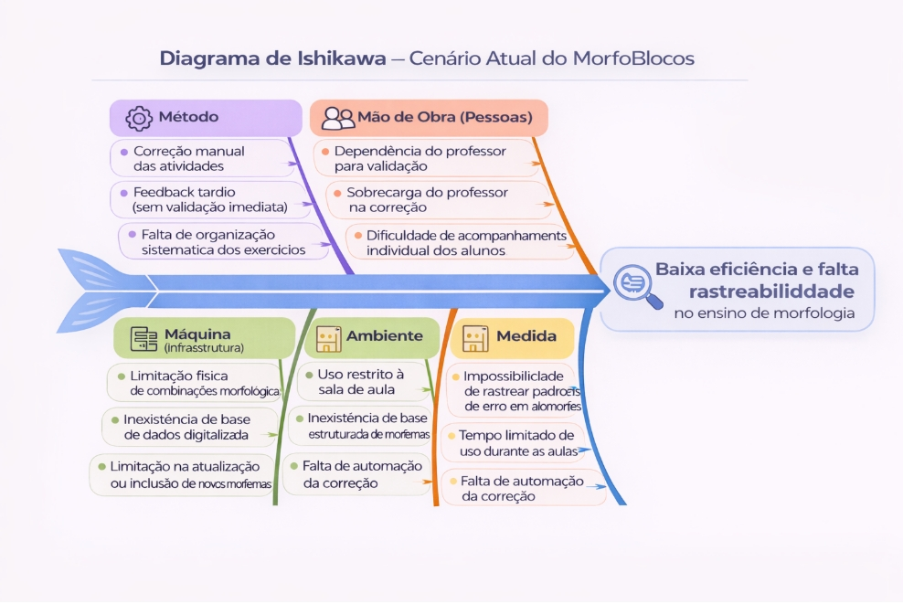

# Visao do produto

## 1. Cenário Atual do Cliente e do Negócio

### __1.1 Identificação do Cliente/Parceiro__

**Nome: Profª. María del Pilar Tobar Acosta.**

**Tipo**: Cliente individual — professora de Língua Portuguesa do Instituto Federal de Brasília (IFB), pesquisadora na área de ensino de morfologia e idealizadora do jogo didático Morfologia em Blocos (MorfoBlocos).

**Representante**: a própria professora María del Pilar Tobar Acosta, autora do jogo físico e principal parte interessada no desenvolvimento da versão digital.

**Forma de contato**: reuniões presenciais e por videoconferência, e-mail e canal de mensagens instantâneas para alinhamentos rápidos.

**Vínculo com o projeto**: cliente real e Product Owner (PO). Será responsável por fornecer o conteúdo didático (morfemas, categorias e processos de formação de palavras), validar as decisões de design e conteúdo e avaliar as entregas realizadas ao longo do desenvolvimento.

### __1.2 Introdução ao Negócio e Contexto__

O MorfoBlocos é uma ferramenta didática para o ensino de morfologia. Atualmente, a operação é analógica, baseada em blocos físicos. O propósito aqui é a entrega de feedback pedagógico sobre a estrutura das palavras. O gargalo atual reside na baixa escalabilidade do modelo físico e na latência do feedback, já que a validação depende 100% da disponibilidade síncrona do professor.

O jogo é composto por peças coloridas que representam morfemas — raízes (ou radicais), prefixos, sufixos e desinências — que podem ser combinadas pelos estudantes para formar diferentes vocábulos. Cada peça traz, de um lado, o morfema em si e, do outro, a classificação do elemento e o processo de formação envolvido (flexão, derivação, derivação parassintética, composição, derivação regressiva e reduplicação). Dessa forma, ao montar palavras, o estudante visualiza não apenas o resultado, mas o processo morfológico que o gerou.

O jogo já foi aplicado em turmas do ensino médio integrado, licenciatura e tecnólogo do IFB Campus São Sebastião, com resultados positivos relatados pela equipe e pelos estudantes participantes. No relatório final do projeto original, a própria idealizadora manifestou a intenção de desenvolver uma versão digital do jogo como forma de ampliar seu alcance e viabilizar seu uso em um número significativo de escolas.

Apesar de seu valor pedagógico, o uso do jogo apresenta limitações operacionais e financeiras. Sua aplicação depende da presença do professor para orientação e validação manual das respostas, o que reduz a autonomia dos estudantes. Além disso, o custo do jogo físico pode dificultar sua ampla adoção por estudantes e instituições de ensino. Nesse contexto, a solução digital proposta não substitui o recurso físico, mas atua como um complemento, ampliando seu alcance e possibilidades de uso.

O público-alvo principal são estudantes do ensino fundamental II e do ensino médio, mas o material também vem sendo utilizado com estudantes de licenciatura em Letras e Pedagogia, como recurso para formação de professores de língua materna.

### __1.3 Rich Picture__

Imagem 1 - Fonte: Autoria Própria via IA

O diagrama representa o funcionamento atual do projeto MorfoBlocos, no qual professores de Língua Portuguesa como a professora Pilar, apresentam o conteúdo de morfologia e os estudantes do ensino médio utilizam o jogo físico para manipular blocos com morfemas, formando palavras e analisando sua estrutura. As atividades são corrigidas manualmente pelo professor, sem registro ou acompanhamento do desempenho. Esse modelo apresenta limitações como a ausência de feedback imediato, a dependência do professor e a restrição do uso ao ambiente de sala de aula, o que dificulta a prática contínua dos alunos. Como proposta de melhoria, o diagrama indica a transição para uma solução digital baseada em uma base estruturada de morfemas, permitindo a realização de exercícios variados, correção automática, acesso fora da sala de aula e acompanhamento do desempenho dos estudantes.

### __1.4 Identificação da Oportunidade ou Problema__

O projeto surge da necessidade de superar o gargalo operacional no ensino de morfologia causado pelo uso exclusivo do jogo físico MorfoBlocos. No cenário atual, a dinâmica pedagógica apresenta uma dependência crítica da mediação do professor, responsável pela orientação e correção manual das atividades, o que impede o acompanhamento individualizado e limita a escalabilidade das práticas em sala de aula.

O fluxo de informação atual é marcado pelo feedback tardio, uma vez que o estudante não recebe validação imediata sobre a classificação de morfemas ou os processos de formação de palavras, como derivação e flexão. Além disso, a ausência de registro sistemático das respostas gera falta de rastreabilidade do aprendizado, impossibilitando que o professor identifique padrões de erro em conceitos como alomorfia e derivação parassintética ao longo do tempo.

A infraestrutura baseada no jogo físico impõe restrições de uso, limitando a prática ao ambiente escolar e à disponibilidade de blocos. Soma-se a isso o custo do material, que dificulta sua aquisição e reduz o acesso por parte dos estudantes. Como consequência, há prejuízo na continuidade do aprendizado e na consolidação dos conceitos morfológicos.

Imagem 2

### __1.5 Desafios do Projeto__

O principal desafio do projeto está na transição de um modelo de ensino baseado na manipulação de blocos físicos e na correção manual para uma solução digital estruturada e integrada. Atualmente, esse processo limita a rastreabilidade das respostas e dificulta o acompanhamento do desempenho dos alunos, devido à ausência de registro sistematizado e à centralização da validação no professor. Outro ponto a ser observado está na estruturação dos dados linguísticos. O sistema deve organizar morfemas, suas variações e relações, incluindo casos como alomorfes e processos de derivação, permitindo a validação automática das respostas de forma consistente.

Além disso, há o desafio relacionado à coleta e análise de dados educacionais. A solução deve registrar as respostas dos alunos, possibilitando a identificação de padrões de erro e o acompanhamento da evolução individual. A usabilidade também é um fator crítico, exigindo uma interface intuitiva e de fácil utilização, sem necessidade de treinamento. Por fim, o sistema deve garantir confiabilidade, permitindo o uso em diferentes contextos e assegurando o armazenamento correto dos dados mesmo com o aumento do volume de informações.

### __1.6 Mapa de Stakeholders__

Os principais stakeholders do projeto são: a professora María del Pilar Tobar Acosta, como cliente, idealizadora do jogo físico e responsável por validar as decisões de conteúdo e pedagógicas; os estudantes do ensino básico e superior, como usuários finais do jogo digital; os professores de Língua Portuguesa que poderão adotar a solução em suas aulas; as instituições de ensino (IFB, escolas públicas e privadas) como potenciais adotantes da solução; e a equipe de desenvolvimento, responsável por construir tecnicamente a solução no contexto da disciplina.

A seguir, é apresentado o quadro-resumo dos stakeholders.

| **Stakeholder**       | **Relação com a solução** | **Interesse Principal**                                         | **Influência**              |
| ---------- | ------ | --------------------------------------------------- | ------------------ |
| Profª. María del Pilar Tobar Acosta | Cliente e idealizadora do jogo físico    | Validar conteúdo, proposta pedagógica, escopo e entregas                |    Alta   |
| Estudantes do ensino básico | Usuários finais do jogo digital    | Aprender morfologia de forma lúdica, visual e engajadora                |    Alta   |
| Professores de Língua Portuguesa | Usuários que aplicam o jogo em sala    | Dispor de recurso didático de fácil acesso e com acompanhamento do aluno                |    Média       |
| Estudantes de Licenciatura em Letras | Usuários em contexto de formação de professores    | Utilizar o jogo como recurso pedagógico em sua formação                |    Média   |
| Instituições de ensino (IFB e escolas) | Potenciais adotantes da solução    | Ampliar recursos didáticos disponíveis sem custo adicional de material físico                |    Baixa   |
| Equipe de desenvolvimento | Responsável pela construção do produto    | Entregar uma solução viável, funcional e alinhada aos objetivos da disciplina               |    Alta   |

Além do quadro-resumo, será elaborada uma matriz Poder × Interesse para classificar os stakeholders nas categorias Gerenciar de Perto, Manter Satisfeito, Manter Informado e Monitorar, orientando a estratégia de comunicação e engajamento da equipe ao longo do projeto. 

### __1.7 Segmentação de Clientes__

Embora o projeto tenha um cliente único e real (a professora María del Pilar), a solução atenderá a diferentes perfis de usuários finais, que podem ser segmentados da seguinte forma:

* Estudantes do Ensino Fundamental II (11 a 14 anos): têm seu primeiro contato mais formal com conteúdos de morfologia. Precisam de uma experiência altamente visual, lúdica e guiada, com linguagem simples e feedback imediato;

* Estudantes do Ensino Médio (15 a 18 anos): já possuem alguma familiaridade com os conceitos morfológicos e podem ser desafiados com atividades mais complexas, envolvendo diferentes processos de formação de palavras e análise de vocábulos mais sofisticados;

* Estudantes de Licenciatura em Letras e Pedagogia: utilizam o jogo tanto como recurso de estudo quanto como referência para sua futura prática docente, demandando explicações teóricas mais aprofundadas e exemplos relacionados ao ensino;

* Professores de Língua Portuguesa: atuam como mediadores do uso do jogo em sala de aula, necessitando de recursos para aplicar o material, propor atividades e, futuramente, acompanhar o desempenho dos estudantes.

## __2. Solução Proposta__

### __2.1 Objetivo Geral do Produto__

Desenvolver uma plataforma web interativa (MorfoBlocos Digital) que viabilize a construção autônoma de palavras a partir de morfemas, fornecendo feedback pedagógico automatizado para os estudantes e garantindo o registro e a rastreabilidade do aprendizado para auxiliar o acompanhamento pelos professores.

### __2.2 Objetivos Específicos (OEs) do Produto__

* (OE1) Desenvolver a interface web interativa para manipulação digital dos morfemas.

* (OE2) Implementar o banco de dados para o catálogo de morfemas e atividades.

* (OE3) Construir o motor automatizado de validação morfológica e feedback.

* (OE4) Criar o módulo de registro e rastreabilidade de desempenho dos usuários.

### __2.3 Características de Produto (Mapeadas com os Objetivos Específicos)__

A solução proposta para o MorfoBlocos Digital deverá contemplar, de forma preliminar, as seguintes características de produto (CP), mapeadas aos objetivos específicos (OE) da seção 2.2 e aos valores de negócio (VN) identificados:

| ID  | Característica de Produto (CP)                         | Descrição resumida                                                                                                                                     | ID VN | Contribuição Principal |
|-----|--------------------------------------------------------|--------------------------------------------------------------------------------------------------------------------------------------------------------|-------|------------------------|
| CP1 | Gestão de Perfis e Acesso                              | Módulo de autenticação para diferenciar as permissões e visões do perfil "Professor" e do perfil "Estudante".                                        | VN4   | OE4                    |
| CP2 | Gestão do Catálogo e Atividades                        | Módulo administrativo para que o professor possa visualizar, cadastrar e organizar os morfemas e estruturar as atividades no banco de dados.         | VN5   | OE2                    |
| CP3 | Ambiente de Montagem Interativa                        | O "tabuleiro" digital: interface onde o estudante seleciona, arrasta e combina os blocos de morfemas para tentar formar palavras.                    | VN2   | OE1                    |
| CP4 | Motor de Validação e Feedback                          | O sistema interno que processa a combinação montada pelo estudante e retorna imediatamente o acerto/erro e a classificação do processo morfológico. | VN3   | OE3                    |
| CP5 | Histórico de Desempenho do Estudante                   | Painel individual onde o estudante pode consultar seu próprio progresso e o histórico de palavras que já formou.                                     | VN2   | OE4                    |
| CP6 | Painel de Acompanhamento Docente (Dashboard)           | Área exclusiva do professor para visualizar relatórios consolidados de turmas ou alunos, permitindo identificar padrões de erro morfológico.        | VN4   | OE4                    |

### __2.4 Tecnologias a Serem Utilizadas__

A solução será desenvolvida com base em uma arquitetura cliente-servidor, garantindo organização e separação das responsabilidades do sistema.

Serão utilizadas as tecnologias React, TypeScript e Tailwind CSS no frontend, permitindo a construção de uma interface interativa, especialmente para a funcionalidade de arrastar blocos.

No backend, será utilizado Python com o framework Django, responsável pela lógica do sistema e validação das palavras. Para o armazenamento de dados, será utilizado o PostgreSQL, para garantir estrutura e confiabilidade.

As tecnologias foram escolhidas por serem simples de utilizar, bem documentadas e adequadas ao tempo da disciplina, permitindo o desenvolvimento de um MVP funcional de forma organizada.

| Camada | Tecnologias |
| :--- | :--- |
| **Frontend** | React + TypeScript + Tailwind CSS |
| **Backend** | Django (Python) |
| **Banco de Dados** | PostgreSQL |

### __2.5 Pesquisa de Mercado e Análise Competitiva__

Existem hoje algumas soluções digitais voltadas ao ensino de língua portuguesa, principalmente baseadas em exercícios e jogos educativos. Um exemplo é o Gramatikê, desenvolvido pela Universidade de Brasília, que funciona offline e propõe o ensino de gramática por meio de atividades interativas e jogos, com conteúdos adaptados a diferentes níveis de aprendizagem.

De modo geral, essas soluções seguem uma lógica baseada em exercícios estruturados, como responder perguntas, completar frases ou escolher alternativas. Esse modelo contribui para a prática e fixação do conteúdo, mas tende a focar mais no reconhecimento de respostas corretas, com menor ênfase na exploração ativa da formação das palavras. Outras plataformas educacionais seguem um padrão semelhante, com forte uso de repetição e memorização, especialmente no ensino de vocabulário e regras gramaticais.

Nesse cenário, ferramentas como o Gramatikê e outros aplicativos educacionais oferecem boa base para a prática, mas exploram de forma mais limitada a construção das palavras a partir de seus elementos.

O MorfoBlocos Digital se diferencia justamente nesse ponto. Enquanto essas soluções se concentram na resolução de exercícios, a proposta do sistema é permitir que o aluno monte palavras utilizando blocos que representam morfemas. Dessa forma, o aluno pode testar combinações, observar resultados e compreender melhor os processos de formação das palavras. Além disso, o sistema oferece correção automática e feedback imediato, tornando o aprendizado mais dinâmico.

Assim, o principal diferencial da solução está na mudança de abordagem: sair de um modelo centrado em respostas para um modelo que incentiva a construção ativa, com foco específico em morfologia.

### __2.6 Viabilidade da Proposta__

A proposta é viável no **contexto da disciplina**, considerando o acesso direto à cliente, o escopo definido e a possibilidade de entrega incremental de um MVP funcional ao final do semestre. Embora a **equipe seja reduzida** e ainda esteja em processo de consolidação do domínio sobre algumas tecnologias adotadas, o projeto foi estruturado de forma compatível com essa realidade, com entregas incrementais, priorização das funcionalidades essenciais e validações frequentes com a cliente.

O principal **risco técnico** está na estruturação da base de morfemas e na implementação do mecanismo de feedback automático, que exige modelagem cuidadosa das relações entre morfemas, alomorfes e processos de formação de palavras. Esse risco é mitigado pela divisão incremental das entregas, pelo uso de tecnologias amplamente documentadas como Django e PostgreSQL, e pelo acesso contínuo à cliente para validação do conteúdo linguístico.

Assim, a proposta é considerada viável, desde que:

* O escopo do MVP permaneça controlado;
* As prioridades sejam mantidas ao longo das entregas; e
* A equipe preserve a estratégia de aprendizado contínuo e validação com a cliente ao longo do desenvolvimento.

### __2.7 Benefícios Esperados__

* **Para a cliente**: ampliar o alcance pedagógico do MorfoBlocos, superando as limitações do jogo físico e viabilizando seu uso em um número significativo de escolas sem custo adicional de material. A solução permitirá ainda que a professora gerencie o conteúdo de morfemas e exercícios de forma autônoma e acompanhe a evolução do aprendizado dos estudantes ao longo do tempo.

* **Para os estudantes**: uma experiência de aprendizado de morfologia mais autônoma, interativa e acessível, com feedback imediato sobre as palavras formadas, progressão de dificuldade clara e acesso ao conteúdo a qualquer momento e lugar, sem depender do jogo físico ou da presença do professor.

* **Para os professores de Língua Portuguesa**: um recurso didático digital pronto para uso em sala de aula ou como atividade complementar, reduzindo o tempo dedicado à correção manual e oferecendo dados sobre o desempenho dos estudantes para orientar intervenções pedagógicas mais precisas.

* **Para a equipe de desenvolvimento**: a oportunidade de aplicar na prática os conceitos da disciplina de Requisitos de Software, desenvolvendo uma solução real com cliente real, utilizando tecnologias amplamente adotadas no mercado e consolidando competências em desenvolvimento web, modelagem de dados e engenharia de requisitos.

## __3. Estratégias de Engenharia de Software__

Para o desenvolvimento do MorfoBlocos Digital, foram definidas estratégias de engenharia de software que permitam organizar o trabalho da equipe, acompanhar a evolução do sistema e garantir entregas ao longo do semestre, considerando as limitações de tempo e o contexto acadêmico do projeto.

### __3.1 Estratégia Priorizada__

A abordagem de desenvolvimento de software adotada é híbrida. 

O ciclo de vida do projeto é iterativo e incremental. 

Para a gestão do desenvolvimento, foi utilizado o framework ágil Scrum, com a organização do trabalho em sprints, uso de backlog e reuniões de acompanhamento. 

Além disso, são adotadas algumas práticas de desenvolvimento inspiradas no XP, com foco na qualidade do código e melhoria contínua.

### __3.2 Quadro Comparativo__

A seguir, apresenta-se uma comparação entre processos que poderiam ser utilizados no projeto.

| Critério | XP (eXtreme Programming) | OpenUP (Open Unified Process) |
| :--- | :--- | :--- | 
| **Abordagem Geral** | Processo ágil com foco intenso em práticas técnicas de qualidade e desenvolvimento iterativo em ciclos curtos.  | Processo iterativo e incremental, baseado no Rational Unified Process (RUP), simplificado e adaptado para equipes menores. |
| **Organização do Trabalho** | Iterações curtas (1–2 semanas) com foco técnico. Não há fases fixas; o desenvolvimento é guiado por histórias de usuário e pelo feedback contínuo | Quatro fases sequenciais: Concepção, Elaboração, Construção e Transição. Cada fase contém iterações com entregáveis definidos.  | 
| **Tratamento dos Requisitos** | Requisitos declarados como histórias de usuário, refinados continuamente pelo cliente (on-site customer). Mudanças são naturais e acolhidas a qualquer momento. | Requisitos organizados por casos de uso e refinados iterativamente. Maior formalidade na documentação; mudanças são avaliadas conforme o impacto na arquitetura. |
| **Qualidade Técnica** | Alta ênfase: TDD (Test-Driven Development), programação em pares, integração contínua, refatoração e design simples são práticas centrais do processo.  | Qualidade assegurada por revisões arquiteturais nas fases iniciais e validações incrementais. Não prescreve práticas técnicas específicas como TDD. | 
| **Participação do Cliente** | Cliente presente e integrado ao time (on-site customer). Participação frequente e contínua, validando histórias e fornecendo feedback a cada iteração. | Envolvimento do cliente nas fases de Concepção e nas revisões de iteração. Colaboração estruturada, porém menos intensa do que no XP. | 
| **Flexibilidade de Requisitos** | Alta. Mudanças nos requisitos são aceitas a qualquer momento do ciclo. O escopo é adaptado conforme o feedback real do cliente. | Média. Permite adaptações iterativas, mas exige que a arquitetura principal esteja definida nas fases iniciais, o que pode limitar mudanças estruturais tardias. | 
| **Documentação** | Mínima e focada no essencial. A comunicação face a face e os testes automatizados substituem grande parte da documentação formal. | Documentação leve e suficiente, mais reduzida que o RUP completo, mas ainda com artefatos formais por fase (visão, casos de uso, plano de iteração). |
| **Adequação ao Projeto MorfoBlocos** | Alta. A equipe reduzida, o cliente acessível e os requisitos evolutivos do jogo digital favorecem as práticas técnicas do XP e sua abordagem centrada no feedback. | Média. A estrutura de fases pode ser útil para organização, mas a orientação a casos de uso e a documentação formal podem ser excessivas para o escopo e prazo da disciplina. |

### __3.3 Justificativa__

Com base nas características do projeto MorfoBlocos Digital e no quadro comparativo apresentado, o XP (eXtreme Programming) foi escolhido como processo de desenvolvimento por ser o mais adequado ao contexto da equipe, do cliente e do produto. 

O principal fator que justifica a escolha do XP é a natureza evolutiva dos requisitos do projeto. O jogo digital envolve regras morfológicas complexas, validadas continuamente pela cliente, e funcionalidades interativas cujo comportamento esperado só se torna claro ao longo do desenvolvimento. O XP, ao acolher mudanças de requisitos a qualquer momento e centrar o processo no feedback contínuo do cliente, responde diretamente a esse cenário. Além disso, a cliente (Profª. Pílar) possui disponibilidade para interações frequentes, o que favorece a dinâmica de validação iterativa proposta pelo XP. 

As práticas técnicas do XP também se mostram adequadas às necessidades do produto. A lógica de validação automática das combinações de morfemas, que é o núcleo do MorfoBlocos Digital, exige alta confiabilidade no código. O TDD (Test-Driven Development), a refatoração contínua e a integração contínua garantem que essa lógica seja desenvolvida com qualidade e testada de forma sistemática desde o início, reduzindo o risco de defeitos no mecanismo central do jogo. 

Em comparação, o OpenUP apresenta uma estrutura de fases mais rígida e maior ênfase na documentação de artefatos formais, como casos de uso e planos de iteração. Embora adequado para projetos que necessitam de maior previsibilidade arquitetural desde o início, o OpenUP pode ser excessivo para o escopo e o prazo da disciplina, além de demandar maior esforço de documentação em um contexto onde a comunicação direta com a cliente é viável e preferível. 

Dessa forma, o XP se mostra o processo mais compatível com a abordagem híbrida adotada pela equipe, combinando rigor técnico com flexibilidade para atender à natureza evolutiva do MorfoBlocos Digital. O Scrum é utilizado de forma complementar como framework de gerenciamento, organizando o trabalho em sprints e garantindo acompanhamento contínuo sem conflitar com as práticas técnicas do XP. 

## __4. Engenharia de Requisitos__

### __4.1 Atividades  e Técnicas de ER__

**Elicitação e descoberta**

* **Entrevistas semiestruturadas**: encontros periódicos com a cliente para compreender o jogo físico, seus princípios pedagógicos, o corpus de morfemas e as expectativas em relação à versão digital, identificando tanto requisitos declarados quanto requisitos latentes.

* **Análise documental**: estudo do relatório final do projeto original, do material didático e das peças físicas do jogo, para reconstruir o vocabulário pedagógico e a identidade visual do MorfoBlocos.

* **Observação do contexto real de uso**: acompanhamento da aplicação do jogo físico em sala de aula, quando possível, para capturar requisitos latentes que emergem do uso real e dificilmente apareceriam em entrevistas.

* **Triangulação de fontes de informação**: cruzamento sistemático entre entrevistas, análise documental e observação, de modo a confrontar percepções e consolidar um entendimento compartilhado sobre o problema e suas causas.

**Análise e Consenso**

* **Workshops de Requisitos**: encontros colaborativos com a cliente para discutir escopo, resolver divergências de interpretação e construir entendimento compartilhado sobre aspectos pedagógicos e de conteúdo.

* **Priorização MoSCoW**: classificação das funcionalidades em Must have, Should have, Could have e Won't have for now, junto à cliente, para definir o escopo do MVP e registrar desejáveis para evolução futura.

* **Matriz Avaliação Técnica × Valor de Negócio**: posicionamento das características de produto em uma matriz que cruza valor percebido pela cliente com esforço técnico estimado, orientando a sequência de entregas.

* **Negociação e resolução de conflitos**: mediação estruturada de divergências entre requisitos — por exemplo, entre fidelidade ao jogo físico e viabilidade no prazo do semestre — com registro das decisões e suas justificativas.
Declaração de Requisitos

**Declaração de Requisitos**

* **Narrativas descritivas**: usadas para declarar requisitos de negócio em linguagem natural, articulando o problema identificado na seção 1.4, o valor esperado para a cliente e as restrições do contexto do projeto.

* **Histórias de usuário**: declaração dos requisitos de usuário no formato "Como <ator>, quero <objetivo>, para <benefício>", organizadas em backlog de produto e utilizadas no planejamento das sprints.

* **Critérios de aceitação Given/When/Then**: cada história de usuário será acompanhada por critérios de aceitação em formato estruturado, explicitando condição inicial, ação e resultado esperado de forma verificável.

* **Catálogos de RFs e RNFs**: os requisitos funcionais serão declarados no padrão "verbo no infinitivo + objeto" (por exemplo, "Combinar morfemas para formar palavras"); os requisitos não funcionais serão organizados segundo o modelo URPS+, conforme orientação do template da disciplina.

* **Catálogo de regras de negócio**: as regras morfológicas do português — quais combinações de morfemas são válidas e a qual processo de formação cada resultado corresponde — serão declaradas em catálogo próprio, distinto dos requisitos funcionais, conforme a definição de regra de negócio adotada pelo livro-texto.

**Representação de Requisitos**

* **Rich Picture no formato AS-IS / TO-BE**: representação sistêmica (contextual) utilizada na seção 1.3 para contrastar o cenário atual do jogo físico com o cenário proposto para a solução digital, capturando atores, fluxos e limitações do contexto.

* **Diagrama de Ishikawa (6M's)**: utilizado na seção 1.4 para organizar a análise das causas do problema identificado, distribuindo os fatores contribuintes pelos eixos Método, Máquina, Mão de Obra, Material, Medida e Meio Ambiente.

* **Mapa de Stakeholders e Matriz Poder × Interesse**: representações sistêmicas (contextuais) utilizadas na seção 1.6 para classificar os stakeholders conforme sua influência e interesse, orientando a estratégia de comunicação da equipe ao longo do projeto.

* **Protótipos de baixa fidelidade e storyboards**: produzidos durante as sprints para apoiar a validação de fluxos de uso com a cliente antes da implementação, mantendo-se no escopo da ER conforme a delimitação do SWEBOK v4.0.

* **Fluxos de navegação e de estados conceituais**: usados em nível conceitual para representar caminhos de uso do estudante (por exemplo, da seleção de morfemas ao recebimento de feedback), sem detalhar elementos de interface ou lógica interna.

**Verificação e Validação de Requisitos**

* **Revisão interna pela equipe**: antes de cada sprint, os requisitos refinados serão revisados pelos membros da equipe para verificar clareza, consistência, completude e testabilidade.

* **Validação com a cliente ao final de cada sprint**: nas reuniões de revisão de sprint, a cliente avaliará o incremento entregue, confirmando que os requisitos implementados atendem a suas expectativas pedagógicas e ao problema declarado na seção 1.4.

* **Definition of Ready (DoR) e Definition of Done (DoD)**: o DoR define as condições mínimas para um item entrar em sprint; o DoD define as condições para considerá-lo concluído. Atuam como filtros de qualidade antes e depois do desenvolvimento.

* **Testes de aceitação baseados em critérios declarados**: cada história de usuário será testada contra seus critérios de aceitação no formato Given/When/Then, tornando a validação objetiva e rastreável.

**Organização e Atualização de Requisitos**

* **Product Backlog único**: histórias de usuário, RFs, RNFs e regras de negócio serão mantidos em um backlog único, priorizado pela Product Owner (a cliente) e continuamente refinado.

* **Refinamento contínuo do backlog**: ao longo de cada sprint, equipe e cliente revisarão o backlog, atualizando prioridades, detalhando itens para as próximas sprints e ajustando o escopo conforme o aprendizado adquirido.

* **Aplicação do princípio DEEP**: o backlog será mantido Detalhado adequadamente, Estimado, Emergente e Priorizado, conforme prática consolidada no desenvolvimento ágil.

* **Controle de versões dos artefatos de requisitos**: a visão do produto, o backlog e os demais artefatos serão mantidos em repositório versionado, preservando histórico de decisões e rastreabilidade de mudanças.

* **Matriz de rastreabilidade**: matriz que conecta objetivos específicos, características de produto, requisitos funcionais e não funcionais, regras de negócio e critérios de aceitação, assegurando que cada decisão técnica permaneça ligada ao problema declarado na seção 1.4.

### __4.2 Engenharia de Requisitos e o XP__

As atividades da Engenharia de Requisitos, suas práticas e técnicas são mapeadas, a seguir, às fases do XP adotadas pela equipe para a condução do projeto MorfoBlocos Digital. A tabela evidencia onde cada atividade da ER tem maior ênfase ao longo do processo, desde o Planning Game até a Integração Contínua. 

_Importante: as atividades da ER não ocorrem de forma estritamente sequencial dentro de cada fase do XP. Conforme apresentado no capítulo 5 do livro-texto, elas são entraçadas e se retroalimentam ao longo do projeto, de modo que a ordem das linhas da tabela é apenas de apresentação — não de execução obrigatória._

| Fases do Processo              | Atividades ER              | Prática       | Técnica          | Resultado esperado       |
|--------------------------------|------------------------------|-------------------------------------------------------------------------|--------------------------------------------------------------------------------------------------|--------------------------------------------------------------------------------------------------------------------------|
| Planning Game        | Elicitação e Descoberta      | Levantamento inicial de requisitos e compreensão do domínio               | Entrevistas semiestruturadas com a cliente, análise documental do jogo físico, triangulação de fontes  | Visão inicial do produto, corpus linguístico de morfemas e compreensão compartilhada do problema com a cliente         |
|        | Análise e Consenso           | Priorização estratégica e definição do escopo da release                | Priorização MoSCoW, Matriz Avaliação Técnica × Valor de Negócio, workshops com a cliente          | Escopo da release acordado com a cliente, com funcionalidades críticas priorizadas e trade-offs explicitados            |
|         | Declaração                  | Registro dos requisitos em diferentes níveis de abstração               | Histórias de usuário, catálogos de RFs, RNFs e regras de negócio morfológicas          | Backlog inicial da release com requisitos declarados em linguagem compreensível e rastreável ao problema original    |
| Releases Pequenas         | Verificação e Validação      | Validação do incremento entregue com a cliente    | Demonstração do incremento funcional, revisão contra critérios de aceitação, Definition of Done (DoD)                              | Incremento validado pela cliente; feedback registrado para ajuste das próximas histórias                                                                 |
|          | Organização e Atualização           | Repriorização do backlog com base no aprendizado da release    | Refinamento do backlog, negociação colaborativa, princípio DEEP                             | Backlog repriorizado e atualizado com as histórias de maior valor para a próxima release          |
| Design Simples            | Representação               | Representação sistêmica do contexto e do problema   | Rich Picture AS-IS/TO-BE, Mapa de Stakeholders, Matriz Poder × Interesse, Diagrama de Ishikawa                                       | Entendimento compartilhado sobre o contexto, os atores e o escopo do sistema entre equipe e cliente    |
|         | Declaração     | Detalhamento de histórias e critérios de aceitação para a iteração      | Critérios de aceitação Given/When/Then, Definition of Ready (DoR)   | Histórias de usuário com critérios verificáveis e prontas para desenvolvimento (Ready)   |
|   Desenvolvimento (Codificação)   | Elicitação e Descoberta   | Refinamento de requisitos selecionados para a iteração    | Entrevistas pontuais com a cliente, análise documental complementar    | Requisitos detalhados e esclarecidos para suportar o desenvolvimento da iteração corrente    |
|        | Representação    | Evolução dos protótipos para apoiar a implementação   | Protótipos de baixa e média fidelidade, fluxos de navegação conceituais   | Representações atualizadas que orientam a implementação e apoiam a validação antecipada com a cliente  |
|        | Análise e Consenso  | Análise de dependências e viabilidade técnica dos itens em desenvolvimento  | Discussão em equipe, análise de dependências, programação em pares (pair programming)  | Consenso sobre a viabilidade e a ordem de execução dos itens da iteração |
| Testes | Verificação e Validação  | Verificação interna dos requisitos em desenvolvimento  | Revisão interna pela equipe, checklist de critérios de aceitação, testes de aceitação Given/When/Then    | Itens desenvolvidos em conformidade com os critérios de qualidade e prontos para demonstração    |
|   | Organização e Atualização | Atualização do backlog com base nos resultados dos testes   | Atualização contínua do backlog da iteração, registro de defeitos e ajustes de escopo   | Backlog da iteração alinhado ao estado real do desenvolvimento após os testes      |
| Refatoração | Organização e Atualização          | Revisão e consolidação dos artefatos de requisitos após refatoração do código   | Atualização da matriz de rastreabilidade, revisão de critérios de aceitação impactados    | Artefatos de requisitos consistentes com a estrutura refatorada, rastreabilidade preservada      |
| Integração Contínua | Verificação e Validação   | Validação contínua dos requisitos integrados ao sistema    | Checklist de critérios de aceitação, DoD aplicado ao incremento integrado     | Incremento integrado validado contra todos os critérios de aceitação definidos      |
|   | Organização e Atualização   | Consolidação do backlog e da matriz de rastreabilidade ao final de cada iteração    | Refinamento do backlog, atualização da matriz de rastreabilidade, controle de versões dos artefatos     | Backlog do produto atualizado e rastreável, pronto para orientar o início da próxima iteração      |

_O mapeamento apresentado evidencia onde cada atividade da ER tem maior ênfase em cada fase do XP, sem sugerir uma ordem rígida de execução. As atividades se retroalimentam ao longo de todo o projeto, em coerência com os valores de comunicação, feedback, simplicidade e confiança que sustentam a prática da Engenharia de Requisitos descrita no capítulo 5 do livro-texto._

## __5. Cronograma__

| Sprint | Período| Foco de Desenvolvimento | Entrega Acadêmica (Relatório) | Processo de validação |
| :--- | :--- | :--- | :--- | :--- |
| **Sprint 1** | 14/04 - 28/04| **Inventário de dados**: Mapear prefixos, radicais e sufixos com a PO. | Finalização do PC1 e ajuste do Rich Picture. | **Revisão por pares**: Líder valida se a planilha de morfemas está completa para o MVP. |
| **Sprint 2** | 29/04 - 13/05| **UX e Prototipagem (Figma)**: Desenhar as telas de "arrastar e soltar" e a lógica visual dos blocos. | **PC2 (19/05)**: Elicitação, Backlog MoSCoW e MVP. | **MoSCoW + Feedback PO**: Reunião com a Profª. Pílar para validar o design e priorizar o Backlog. |
| **Sprint 3** | 14/05 - 28/05| **Lógica de validação**: Programar/Modelar como o sistema decide se "In + Feliz" é uma palavra válida. | Início de PBB e User Stories. | **DoR (Definition of Ready)**: O líder valida se as User Stories têm critérios de aceitação claros. |
| **Sprint 4** | 29/05 - 12/06| **Cenários de Teste (BDD)**: Escrever os comportamentos do sistema (Dado que/Quando/Então). | **PC3 (16/06)**: Verificação e Validação (BDD). | **BDD Testing**: Validar os cenários "Dado/Quando/Então" com a lógica pedagógica da PO. |
|**Sprint 5**| 13/06 - 27/06| **Feedback pedagógico**: Criar as mensagens de erro  e explicações gramaticais do jogo.| **PC4 (07/07)**: Story Mapping e Casos de Uso.| **User Story Mapping**: Validar visualmente se a jornada do aluno não possui falhas de fluxo. |
| **Sprint 6** | 28/06 - 07/07| **Refinamento e Deploy**: Ajustes finais na interface e preparação da apresentação.| Entrega final: documento completo e vídeo. | **DoD (Definition of Done)**: Checklist final para garantir que tudo cumpre os requisitos do professor. |

## __6. Interação entre Equipe e Cliente__

### __6.1 Composição da Equipe__

* Ana Beatriz Souza Araújo: Desenvolvedor backend
* Artur Fernandes: Desenvolvedor backend
* Bruno Souza: Desenvolvedor backend
* Carlos Eduardo: Desenvolvedor frontend.
* Luiz Henrique: Desenvolvedor frontend do projeto auxílio na parte de Scrum

### __6.2 Comunicação__

**Ferramentas de comunicação**:

* **WhatsApp**: Canal oficial para a troca de mensagens rápidas e comunicação do dia a dia da equipe. Será utilizado para avisos urgentes, envio de links úteis e resolução de dúvidas pontuais que não exigem debates complexos.

* **Google Meet**: Plataforma padrão para todas as chamadas de áudio e vídeo. Diretriz obrigatória: Absolutamente todas as reuniões realizadas no Meet devem ser gravadas. Isso garante a preservação do histórico de decisões e facilita o repasse de informações para membros que porventura não possam participar ao vivo.

**Rituais e Rotinas de Alinhamento**:

* **Dailies**: Reuniões rápidas de alinhamento para que a equipe compartilhe o que foi feito, o que será desenvolvido no dia e levante possíveis bloqueios ou impedimentos técnicos.
Sincronização Acadêmica: Ocorrerão momentos dedicados à comunicação durante o período das aulas e imediatamente após o encerramento das mesmas. Este tempo será aproveitado para consolidar o trabalho, integrar as tarefas dos desenvolvedores e planejar as próximas etapas com toda a equipe reunida.

* **Interações com a Cliente**: A comunicação direta com a cliente seguirá um protocolo rigoroso de rastreabilidade. Todo o contato oficial será feito de forma 100% remota via reuniões online no Google Meet, que serão integralmente gravadas. Essa prática resguarda o projeto, assegurando que todos os requisitos, feedbacks, aprovação e mudanças de escopo solicitadas pela cliente estejam registrados em vídeo e áudio para consulta futura.

### __6.3 Processo de Validação__

Para garantir que o MorfoBlocos Digital construa o produto correto e solucione o problema central de baixa eficiência e falta de rastreabilidade no ensino de morfologia, a equipe de desenvolvimento adotará uma estratégia de validação contínua. Os processos de validação foram estruturados em quatro frentes principais, mapeadas para as características do produto e perfis de _stakeholders_:

__1. Validação de Requisitos e Alinhamento de Negócio__

* __Objetivo__: Assegurar que a transição do meio físico para o digital preserve a identidade visual e os princípios pedagógicos do jogo original.

* **Stakeholders envolvidos**: Prof.ª María del Pilar Tobar Acosta (Cliente/PO).

* **Método**: Revisões conjuntas da documentação de requisitos, diagramas e, principalmente, validação de protótipos de interface (baixa e alta fidelidade) para garantir a continuidade da proposta idealizada pela autora.

__2. Validação Pedagógica e de Regras de Domínio__

* **Objetivo**: Atestar a precisão técnica e acadêmica do "motor" de correção do jogo, garantindo que o sistema classifique corretamente as construções morfológicas.

* **Stakeholders envolvidos**: Cliente/PO e estudantes de Licenciatura em Letras.

* **Método**: Baterias de testes focadas nas regras de negócio da aplicação. Será validada a exatidão do catálogo digital de morfemas e a precisão do feedback automático diante de casos reais de formação de palavras, incluindo tratamento de exceções morfológicas, ocorrências de alomorfia e derivações parassintéticas.

__3. Validação de Usabilidade e Experiência do Usuário (UX)__

* **Objetivo**: Certificar que a interface gráfica atende aos requisitos de acessibilidade e que a curva de aprendizado é adequada ao público do ensino básico.

* **Stakeholders envolvidos**: Estudantes do Ensino Fundamental II e do Ensino Médio 

* **Método**: Realização de testes de usabilidade com os usuários finais utilizando protótipos navegáveis ou versões preliminares (_releases_). A equipe avaliará, por meio de observação sistemática, a capacidade do estudante de formar palavras de maneira autônoma (seleção e combinação de morfemas) sem a necessidade de mediação externa, mitigando o risco de rejeição tecnológica.

__4. Validação Técnica do Valor de Negócio (Rastreabilidade)__

* **Objetivo**: Confirmar que a solução supera efetivamente a limitação de acompanhamento do modelo físico, gerando dados úteis para intervenções pedagógicas.

* **Stakeholders envolvidos**: Professores de Língua Portuguesa e equipe de desenvolvimento.

* **Método**: Simulação de uso em massa e testes de integração com o banco de dados. O processo validará se as interações, acertos e padrões de erro dos estudantes estão sendo armazenados de forma persistente e se as informações geradas no painel de rastreabilidade são claras e acionáveis para o professor.

### __6.4 Registro de Reuniões__

Para garantir a rastreabilidade e o alinhamento com as expectativas da cliente, todas as interações estratégicas são registradas. As mesmas estarão disponibilizadas na aba [Registro de Reuniões](./reunioes.md).

## __10. Lições Aprendidas__

### __10.1 Unidade 1__

Nesta primeira unidade, a equipe enfrentou alguns desafios importantes de organização e gestão, que exigiram ajustes no início do projeto para garantir a continuidade das atividades.

* **Reorganização da Liderança**

A saída do líder original da disciplina impactou diretamente a organização do grupo, já que várias tarefas estavam centralizadas nele. Isso gerou um período de desorganização e falta de clareza na distribuição das atividades.

Para resolver essa situação, foi necessário reorganizar a equipe e redistribuir as responsabilidades entre os membros. Um dos integrantes assumiu a coordenação das atividades, ajudando a estruturar novamente o fluxo de trabalho e garantindo que cada pessoa soubesse sua função na entrega da documentação.

* **Comunicação com a cliente e prazos**

Houve dificuldade inicial para conciliar a disponibilidade da cliente com os prazos da disciplina. Além disso, a falta de um fluxo definido de comunicação no começo levou a algumas decisões internas que ainda não tinham sido validadas.

Com a reorganização da equipe, passou-se a priorizar um contato mais frequente com a cliente e o agendamento de momentos específicos para validação. Isso ajudou a alinhar melhor as decisões do projeto com as expectativas da cliente e com os prazos acadêmicos, reduzindo riscos de retrabalho.

##  Versionamento

| **Data**       | Versão | Descrição                                           | Autor              |
| ---------- | ------ | --------------------------------------------------- | ------------------ |
| 12/04/2026 | 1.0    | Criação, elaboração e repasse do documento.         |    [Ana Beatriz](https://github.com/AnnaBeatrizAraujo), [Artur Fernandes](https://github.com/arturalvesfn), [Bruno Souza](https://github.com/youngburny), [Carlos Eduardo](https://github.com/cadumotta) e [Luiz Henrique](https://github.com/Luizz97)  |
| 12/04/2026 | 1.1    | Adiciona a seção 5 (Cronograma).         |    [Ana Beatriz](https://github.com/AnnaBeatrizAraujo), [Bruno Souza](https://github.com/youngburny)   |
| 13/04/2026 | 1.2  | Adiciona seção 4.0, 4.1, 4.2 e 6.4. | [Bruno Souza](https://github.com/youngburny) |
| 13/04/2026 | 1.3  | Correções nas seções 3.1, 3.2, 3.3, 4.1 e 4.2. | [Bruno Souza](https://github.com/youngburny) |
| 13/04/2026 | 1.4  | Correção de formatação na tabela da seção 4.2. | [Bruno Souza](https://github.com/youngburny) |
| 05/05/2026 | 1.5  | Correção nas seções 2.1, 2.2 e 2.3. | [Bruno Souza](https://github.com/youngburny) |
